# Mooncake UbDiag 三层分发 CLI 集成技术说明

本文档用于上会讲解本次 Mooncake UbDiag 三层分发改动。核心只讲一件事：

> 在既有 L1/L2/L3 三层分发机制上，把 UbDiag CLI 纳入 Mooncake RPM 交付闭环。客户拿到 Mooncake RPM 后，在 L1 submodule 模式下不再需要额外 UbDiag CLI 包，就可以直接用 `ubdiag` 对 Mooncake 打点、查看 P99/P999/P9999、PerfLog，并通过 CSV export 落盘。

本次展示只保留框架流程、核心逻辑、源码改动和验证边界。CLI 内部展示细节、逐段代码解释和冗长背景不作为上会主讲内容。

## 1. 一张图讲清楚三层分发

这张图按一次构建链路来讲：CMake 先在 [FindUbDiag.cmake L13-L239](file:///D:/Code/Mooncake/mooncake-common/FindUbDiag.cmake#L13-L239) 里完成 L1/L2/L3 选择，再把选中的 layer 和 runtime 路径写进 manifest，最后由 [build_rpm.sh L184-L285、L428-L440](file:///D:/Code/Mooncake/scripts/build_rpm.sh#L184-L285) 按 manifest 打包。

```mermaid
flowchart LR
    Start["Mooncake CMake Configure<br/>include FindUbDiag.cmake<br/>L13-L24: 功能开关<br/>L26-L36: 写 RPM manifest"]

    subgraph Select["三层分发选择"]
        L1Gate{"L1: extern/ubdiag 存在?<br/>FindUbDiag.cmake L68"}
        L2Gate{"L2: 系统路径有 UbDiag?<br/>FindUbDiag.cmake L160-L170"}
        L3Gate["L3: mock fallback<br/>FindUbDiag.cmake L233-L239"]
    end

    subgraph L1["L1 submodule: Mooncake 自带 UbDiag"]
        L1Flags["打开同源能力<br/>L86: UBDIAG_BUILD_SHARED=ON<br/>L89: ENABLE_PERCENTILE=ON<br/>L92: ENABLE_PERFLOG=ON"]
        L1Add["add_subdirectory(extern/ubdiag)<br/>FindUbDiag.cmake L101-L102"]
        L1Cli["CLI 进默认构建<br/>mooncake_ubdiag_cli ALL<br/>FindUbDiag.cmake L137-L144"]
        L1Manifest["manifest: layer=submodule<br/>CLI/lib/config 路径<br/>FindUbDiag.cmake L149-L155"]
    end

    subgraph L2["L2 system: 只消费客户本地 UbDiag"]
        L2Pkg["find_package(UbDiag)<br/>标准系统路径<br/>FindUbDiag.cmake L160-L170"]
        L2Cli["find_program(ubdiag)<br/>imported CLI target<br/>FindUbDiag.cmake L187-L203"]
        L2Manifest["manifest: layer=system<br/>记录系统 CLI/lib/config<br/>FindUbDiag.cmake L211-L228"]
    end

    subgraph Package["RPM 打包"]
        Env["读取 mooncake_ubdiag_rpm.env<br/>build_rpm.sh L184-L199"]
        L1Pack["submodule: 拷贝 build tree 产物<br/>ubdiag + libubdiag.so* + config<br/>build_rpm.sh L201-L236"]
        L2Pack["system: 拷贝客户系统产物<br/>ubdiag + libubdiag.so* + config<br/>build_rpm.sh L237-L282"]
        Files["写入 RPM %files<br/>build_rpm.sh L428-L440"]
    end

    Runtime["客户安装 Mooncake RPM<br/>/usr/bin/ubdiag<br/>/usr/lib64/libubdiag.so*"]
    Use["运行验证<br/>ubdiag start --perflog<br/>Mooncake benchmark<br/>ubdiag show/watch/history --csv"]

    Start --> L1Gate
    L1Gate -- "是" --> L1Flags --> L1Add --> L1Cli --> L1Manifest
    L1Gate -- "否" --> L2Gate
    L2Gate -- "是" --> L2Pkg --> L2Cli --> L2Manifest
    L2Gate -- "否" --> L3Gate

    L1Manifest --> Env
    L2Manifest --> Env
    L3Gate --> Env
    Env --> L1Pack --> Files
    Env --> L2Pack --> Files
    Env --> Files
    Files --> Runtime --> Use

    classDef entry fill:#e8f2ff,stroke:#2b6cb0,stroke-width:1px,color:#172033;
    classDef layer1 fill:#e8fff2,stroke:#2f855a,stroke-width:1px,color:#172033;
    classDef layer2 fill:#fff7df,stroke:#b7791f,stroke-width:1px,color:#172033;
    classDef layer3 fill:#f1f5f9,stroke:#64748b,stroke-width:1px,color:#172033;
    classDef pack fill:#f4edff,stroke:#6b46c1,stroke-width:1px,color:#172033;
    classDef run fill:#ffeef2,stroke:#c53030,stroke-width:1px,color:#172033;

    class Start entry;
    class L1Gate,L1Flags,L1Add,L1Cli,L1Manifest layer1;
    class L2Gate,L2Pkg,L2Cli,L2Manifest layer2;
    class L3Gate layer3;
    class Env,L1Pack,L2Pack,Files pack;
    class Runtime,Use run;
```



图里的行号可以按这个顺序讲：

| 图中节点 | 对应源码 | 讲解要点 |
|---|---|---|
| 入口开关与 manifest | [FindUbDiag.cmake L13-L36](file:///D:/Code/Mooncake/mooncake-common/FindUbDiag.cmake#L13-L36) | Mooncake 侧统一定义 CLI、shared、P99、PerfLog、PerfPoint-only 开关，并建立 CMake 到 RPM 的 manifest 协议 |
| L1 submodule | [FindUbDiag.cmake L68-L155](file:///D:/Code/Mooncake/mooncake-common/FindUbDiag.cmake#L68-L155) | submodule 存在时，强制同源构建 `libubdiag.so` 和 `ubdiag` CLI，CLI 通过 `mooncake_ubdiag_cli ALL` 进入默认构建 |
| L2 system | [FindUbDiag.cmake L160-L228](file:///D:/Code/Mooncake/mooncake-common/FindUbDiag.cmake#L160-L228) | 不提供 L2 package，只在客户本地系统路径找 `UbDiag::ubdiag_lib` 和 `ubdiag` CLI，并写入 manifest |
| L3 mock | [FindUbDiag.cmake L233-L239](file:///D:/Code/Mooncake/mooncake-common/FindUbDiag.cmake#L233-L239) | 无 submodule、无系统 UbDiag 时走 no-op mock，不打包 UbDiag runtime |
| RPM 打包 | [build_rpm.sh L184-L285](file:///D:/Code/Mooncake/scripts/build_rpm.sh#L184-L285)、[L428-L440](file:///D:/Code/Mooncake/scripts/build_rpm.sh#L428-L440) | 打包脚本读取 manifest，L1/L2 分别拷贝对应 CLI/lib/config，最终写入 `%files` |

三层边界保持不变：

| 层级 | 来源 | 本次行为 |
|---|---|---|
| L1 submodule | Mooncake 仓库里的 `extern/ubdiag` | 同源构建 `libubdiag.so` 和 `ubdiag` CLI，并写入 RPM manifest |
| L2 system | 客户机本地系统路径里的 UbDiag | 只消费客户已有 UbDiag，自动捞取系统 `ubdiag` 和 `libubdiag.so*` 进 Mooncake RPM |
| L3 mock | Mooncake 自带 no-op mock | 无 UbDiag runtime，不打包 CLI/lib，只保证无 UbDiag 环境能编译 |

## 2. 源码入口

| 文件 | 讲什么 | 关键位置 |
|---|---|---|
| [mooncake-common/FindUbDiag.cmake L13-L239](file:///D:/Code/Mooncake/mooncake-common/FindUbDiag.cmake#L13-L239) | 三层分发主逻辑、CLI target、RPM manifest | L13-L24、L26-L36、L68-L155、L160-L228、L233-L239 |
| [scripts/build_rpm.sh L184-L285、L428-L440](file:///D:/Code/Mooncake/scripts/build_rpm.sh#L184-L285) | RPM 按 manifest 打包 UbDiag CLI/lib/config | L184-L285、L428-L440 |
| [extern/ubdiag/CMakeLists.txt L11-L187](file:///D:/Code/Mooncake/extern/ubdiag/CMakeLists.txt#L11-L187) | UbDiag P99/PerfLog/shared/install 开关 | L11-L18、L44-L49、L179-L187 |
| [extern/ubdiag/src/cli/CMakeLists.txt L1-L16](file:///D:/Code/Mooncake/extern/ubdiag/src/cli/CMakeLists.txt#L1-L16) | `ubdiag` CLI target，包含 `csv_writer.cpp` | L1-L16 |
| [mooncake-store/src/CMakeLists.txt L250-L252](file:///D:/Code/Mooncake/mooncake-store/src/CMakeLists.txt#L250-L252) / [transfer_engine L2、L50-L64](file:///D:/Code/Mooncake/mooncake-transfer-engine/src/CMakeLists.txt#L50-L64) / [integration L104-L106](file:///D:/Code/Mooncake/mooncake-integration/CMakeLists.txt#L104-L106) | Mooncake 业务模块统一链接 `UbDiag::ubdiag_lib` | Store L250-L252，Transfer L2/L50-L64，Integration L104-L106 |

## 3. CMake 核心实现

### 3.1 顶层开关和 RPM manifest

源码：[FindUbDiag.cmake L13-L36](file:///D:/Code/Mooncake/mooncake-common/FindUbDiag.cmake#L13-L36)

本次新增的核心开关集中在文件开头：

```cmake
option(MOONCAKE_UBDIAG_BUILD_CLI ... ON)
option(MOONCAKE_UBDIAG_L1_SHARED ... ON)
option(MOONCAKE_UBDIAG_ENABLE_PERCENTILE ... ON)
option(MOONCAKE_UBDIAG_ENABLE_PERFLOG ... ON)
option(MOONCAKE_UBDIAG_PERFPOINT_ONLY ... ON)
```

`MOONCAKE_UBDIAG_PERFPOINT_ONLY=ON` 的含义需要讲清楚：它不是全局只要 PerfPoint，而是关闭 OB/MemPoint/CachePoint 这类 Mooncake 不需要的扩展，同时保留 Mooncake 需要的 PerfPoint、P99/P999/P9999、PerfLog 和 CSV CLI 能力。

同时新增 `_mooncake_ubdiag_write_rpm_manifest()`，把 CMake 选中的 layer、CLI 路径、lib 路径、config 路径写进 `${CMAKE_BINARY_DIR}/mooncake_ubdiag_rpm.env`。RPM 脚本后续不再猜路径，而是按 manifest 打包。

### 3.2 L1: submodule 同源构建 CLI 和 .so

源码：[FindUbDiag.cmake L68-L155](file:///D:/Code/Mooncake/mooncake-common/FindUbDiag.cmake#L68-L155)

L1 触发条件仍然是 `extern/ubdiag/CMakeLists.txt` 存在。命中 L1 后做四件事：

1. 强制 `UBDIAG_BUILD_SHARED=ON`，保证 Mooncake 和 CLI 使用同一个 `libubdiag.so`。
2. 强制 `ENABLE_PERCENTILE=ON`、`ENABLE_PERFLOG=ON`，打开 P99/P999/P9999 和 PerfLog。
3. `add_subdirectory(extern/ubdiag ... EXCLUDE_FROM_ALL)` 引入 UbDiag submodule。
4. 新增 `mooncake_ubdiag_cli ALL DEPENDS ubdiag`，让普通 Mooncake 构建也会产出 CLI。

核心代码：

```cmake
set(UBDIAG_BUILD_SHARED ON CACHE BOOL "Build vendored UbDiag as a shared library" FORCE)
set(ENABLE_PERCENTILE ON CACHE BOOL "Enable vendored UbDiag percentile calculation" FORCE)
set(ENABLE_PERFLOG ON CACHE BOOL "Enable vendored UbDiag PerfLog support" FORCE)

add_subdirectory(${CMAKE_SOURCE_DIR}/extern/ubdiag
                 ${CMAKE_BINARY_DIR}/extern/ubdiag_build EXCLUDE_FROM_ALL)

add_custom_target(mooncake_ubdiag_cli ALL DEPENDS ubdiag)
```

这就是本次解决原始问题的关键：以前 L1 只保证 Mooncake 链 `ubdiag_lib`，不保证 CLI 随 Mooncake 一起构建、打包；现在 `libubdiag.so` 和 `ubdiag` CLI 来自同一个 submodule build tree，版本天然同步。

### 3.3 L2: 只消费客户本地系统 UbDiag

源码：[FindUbDiag.cmake L160-L228](file:///D:/Code/Mooncake/mooncake-common/FindUbDiag.cmake#L160-L228)

L2 的边界必须明确：Mooncake 不提供 L2 system package。L2 只在客户机器本地系统路径中查找已有 UbDiag：

```cmake
find_package(UbDiag QUIET
  NO_DEFAULT_PATH
  PATHS /usr/lib64/cmake /usr/local/lib64/cmake /usr/lib/cmake /usr/local/lib/cmake)
```

如果找到 `UbDiag::ubdiag_lib`，再用 `find_program()` 找系统 `ubdiag` CLI，并导入为 CMake target：

```cmake
find_program(MOONCAKE_UBDIAG_SYSTEM_CLI NAMES ubdiag ...)
add_executable(UbDiag::ubdiag_cli IMPORTED GLOBAL)
set_target_properties(UbDiag::ubdiag_cli PROPERTIES
  IMPORTED_LOCATION "${MOONCAKE_UBDIAG_SYSTEM_CLI}")
add_custom_target(mooncake_ubdiag_cli ALL DEPENDS UbDiag::ubdiag_cli)
```

这满足项目组提到的客户场景：客户不拉 `extern/ubdiag`，但本地系统路径已有 UbDiag；客户不需要侵入式修改 Mooncake 的 build/cmake 文件，Mooncake 自动识别系统 UbDiag，并在出 Mooncake RPM 时把系统 `ubdiag` CLI 和 `libubdiag.so*` 一起带进去。

### 3.4 L3: mock fallback

源码：[FindUbDiag.cmake L233-L239](file:///D:/Code/Mooncake/mooncake-common/FindUbDiag.cmake#L233-L239)

L3 保持原定位，只保证无 UbDiag 环境 Mooncake 能编译：

```cmake
add_library(ubdiag_mock INTERFACE)
add_library(UbDiag::ubdiag_lib ALIAS ubdiag_mock)
_mooncake_ubdiag_write_rpm_manifest("mock" "" "" "")
```

L3 没有 CLI、没有 `.so`、没有 UbDiag runtime 分析能力，这一点上会时可以一句话带过。

## 4. RPM 打包改动

源码：[scripts/build_rpm.sh L184-L285](file:///D:/Code/Mooncake/scripts/build_rpm.sh#L184-L285)、[L428-L440](file:///D:/Code/Mooncake/scripts/build_rpm.sh#L428-L440)

RPM 脚本现在读取 CMake 生成的 `mooncake_ubdiag_rpm.env`，按 `MOONCAKE_UBDIAG_LAYER` 处理：

| layer | 打包行为 |
|---|---|
| `submodule` | 从 `extern/ubdiag_build` 复制 `ubdiag`、`libubdiag.so*`、默认 config |
| `system` | 从 manifest 记录的客户本地系统路径复制 `ubdiag`、`libubdiag.so*`、config |
| `mock` | 不打包 UbDiag CLI/lib/config |

关键落点是 `UBDIAG_RPM_FILES`，它把 UbDiag runtime 动态追加到 RPM `%files`：

```spec
%files
...
${UBDIAG_RPM_FILES}
```

最终效果：

| 场景 | Mooncake RPM 是否包含 `/usr/bin/ubdiag` | 是否包含 `libubdiag.so*` |
|---|---|---|
| L1 submodule | 是 | 是 |
| L2 system | 是，来自客户本地系统 UbDiag | 是，来自客户本地系统 UbDiag |
| L3 mock | 否 | 否 |

## 5. UbDiag submodule 侧承接能力

源码：[extern/ubdiag/CMakeLists.txt L11-L18、L44-L49、L179-L187](file:///D:/Code/Mooncake/extern/ubdiag/CMakeLists.txt#L11-L187)、[extern/ubdiag/src/cli/CMakeLists.txt L1-L16](file:///D:/Code/Mooncake/extern/ubdiag/src/cli/CMakeLists.txt#L1-L16)

UbDiag submodule 已经具备本次需要的承接点：

```cmake
option(ENABLE_PERCENTILE "Enable P99/P999/P9999 percentile calculation" OFF)
option(ENABLE_PERFLOG "Enable PerfLog timestamp logging" OFF)
option(UBDIAG_BUILD_SHARED "Build ubdiag_lib as shared library (.so) instead of static (.a)" OFF)
```

CLI target 里包含 CSV Writer：

```cmake
add_executable(ubdiag ${CLI_SOURCES})
target_link_libraries(ubdiag PRIVATE ubdiag_manager_lib)
```

所以 Mooncake 侧只需要在 L1 中打开这些选项，并把 `ubdiag` target 拉进默认构建即可，不需要在 Mooncake 内部重写 UbDiag CLI。

## 6. 风险和验证口径

上会建议主动讲三个边界：

| 边界 | 说明 |
|---|---|
| L1 同源性 | L1 的 CLI 和 `.so` 来自同一个 submodule build tree，能保证客户拿到的 Mooncake RPM 内 CLI/lib 同步 |
| L2 责任边界 | L2 只消费客户本地系统 UbDiag，不提供 system package；P99/PerfLog/CSV 是否可用取决于客户系统 UbDiag 的构建能力 |
| L3 能力边界 | L3 只是 mock fallback，不提供 UbDiag runtime 和 CLI |

验证口径也保持简单：

1. L1：带 `extern/ubdiag` 构建 RPM，确认 RPM 内有 `/usr/bin/ubdiag` 和 `libubdiag.so*`，跑 Mooncake benchmark，并用 `ubdiag show/watch/history --csv <dir>` 落盘。
2. L2：不拉 submodule，预先在客户机本地系统路径安装 UbDiag，构建 RPM，确认 Mooncake 自动识别 system UbDiag，并把系统 CLI/lib 打进 RPM。
3. L3：无 submodule、无系统 UbDiag，确认 Mooncake 能编译运行，但 RPM 不含 UbDiag runtime。

本地 WSL2 没有 URMA/RDMA，不能作为最终 benchmark 验证环境。最终功能验证需要在 245/247 容器环境跑完整 benchmark。

## 7. 上会讲法

可以按这个顺序讲，五分钟以内能结束：

1. 先讲原问题：L1 submodule 以前只解决 `.so`，没有把同源 CLI 一起交付，客户还需要额外 CLI 包。
2. 再讲方案：不改变三层分发，只在 L1/L2 补齐 CLI 和 RPM manifest，L3 保持 mock。
3. 打开 [FindUbDiag.cmake L68-L155、L160-L228、L233-L239](file:///D:/Code/Mooncake/mooncake-common/FindUbDiag.cmake#L68-L155)，讲 L1、L2、L3 三段。
4. 打开 [build_rpm.sh L184-L285、L428-L440](file:///D:/Code/Mooncake/scripts/build_rpm.sh#L184-L285)，讲 manifest 驱动的打包逻辑。
5. 最后讲边界：L2 必须来自客户本地系统路径，L3 不提供 runtime，完整验证在 245/247 跑。
