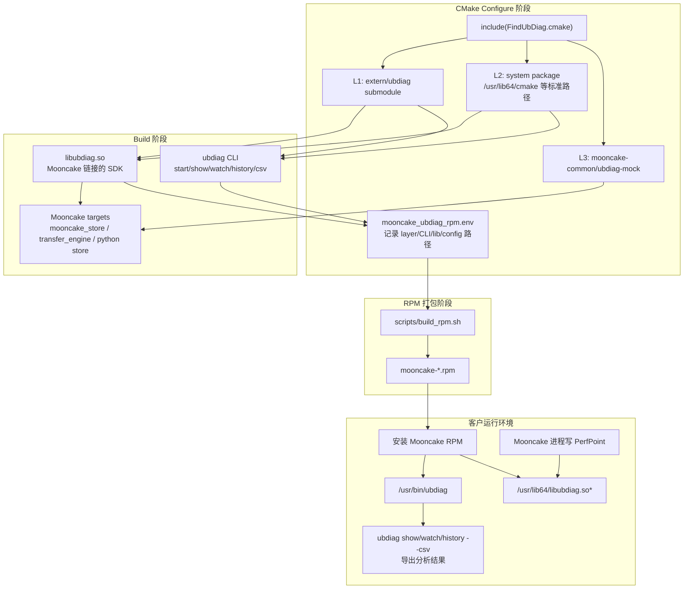
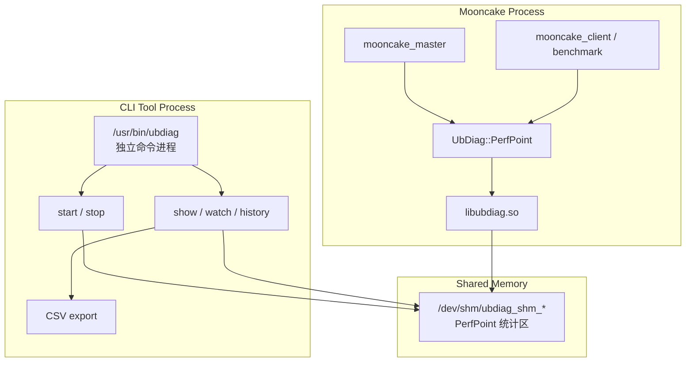

# Mooncake × UbDiag 三层分发 CLI/RPM 集成技术交付文档

本文档描述本次基于 Mooncake UbDiag 三层分发机制继续开发的增量：在 L1 submodule 模式中补齐 UbDiag CLI 与 `libubdiag.so` 同源构建和 RPM 打包能力，并为 L2 system package 模式保留“从客户本地系统路径自动捞取 UbDiag CLI/lib 并打进 Mooncake RPM”的非侵入式接口。

> 交付目标：客户只拿一个 Mooncake RPM 时，在 L1 submodule 场景下无需额外 UbDiag CLI 包，即可安装 Mooncake 后直接使用 `ubdiag` 对 Mooncake 打点进行 `show`、`watch`、`history`、P99/P999/P9999、PerfLog 和 CSV 落盘分析。
>
> 三层边界保持不变：L1 使用 Mooncake submodule 自带 UbDiag；L2 只消费客户机本地系统路径已有 UbDiag，不由 Mooncake 提供 L2 system package；L3 仍是 no-op mock，保障无 UbDiag 环境也能编译 Mooncake。

***

## 1. 整体架构总览

本次改动将原来的“Mooncake 只链接 UbDiag SDK”的构建链路，补成“SDK + CLI + RPM manifest”的闭环：



核心变化有三点：

| 变化 | 旧行为 | 新行为 |
|---|---|---|
| L1 submodule | 只把 `ubdiag_lib` 给 Mooncake 链接，默认构建不保证 CLI 出来 | 同步构建 `libubdiag.so` 和 `ubdiag` CLI，且两者来自同一个 submodule build tree |
| RPM 打包 | Mooncake RPM 不包含 UbDiag CLI，客户还要额外拿匹配的 UbDiag CLI 包 | Mooncake RPM 内置 `/usr/bin/ubdiag` 和 `/usr/lib64/libubdiag.so*` |
| L2 system package | 只链接系统 `UbDiag::ubdiag_lib`，CLI/RPM 没有闭环 | 自动识别系统 `ubdiag` CLI、`libubdiag.so*`、配置文件，并打入 Mooncake RPM |

***

## 2. 构建与运行数据流

本节按一次完整交付链路追踪：从开发者编译 Mooncake，到客户安装 RPM，再到用 UbDiag 对 Mooncake 打点分析。

### 2.1 数据流总览

下方流程里的关键源文件可以从这里直接跳转到深色代码导读页；导读页已经按行号标出本次新增内容和三层分发关键逻辑。

| 流程节点 | 代码导读 | 覆盖源码与行号 |
|---|---|---|
| 三层分发决策、L1/L2/L3 选择、CLI target 接入、RPM manifest 输出 | [FindUbDiag.cmake 三层分发与 CLI 集成](file:///D:/Code/Mooncake/docs/code_docs/findubdiag_three_layer_cli.html) | `mooncake-common/FindUbDiag.cmake`：L13-L24、L26-L36、L81-L102、L137-L155、L160-L228、L233-L239 |
| Mooncake RPM 打包 UbDiag CLI、`libubdiag.so*`、配置文件 | [build_rpm.sh UbDiag Runtime 打包](file:///D:/Code/Mooncake/docs/code_docs/rpm_ubdiag_runtime_packaging.html) | `scripts/build_rpm.sh`：L80-L82、L184-L199、L201-L236、L237-L285、L428-L440 |
| UbDiag 子模块如何承接 shared SDK、P99、PerfLog、CSV CLI | [UbDiag 子模块构建 target](file:///D:/Code/Mooncake/docs/code_docs/ubdiag_submodule_build_targets.html) | `extern/ubdiag/CMakeLists.txt`、`extern/ubdiag/src/sdk/CMakeLists.txt`、`extern/ubdiag/src/cli/CMakeLists.txt` |
| Mooncake 业务模块如何无感消费三层分发 target | [Mooncake UbDiag Consumer Targets](file:///D:/Code/Mooncake/docs/code_docs/mooncake_ubdiag_consumers.html) | `mooncake-store/src/CMakeLists.txt`、`mooncake-transfer-engine/src/CMakeLists.txt`、`mooncake-integration/CMakeLists.txt` |

```
Mooncake cmake configure
    │
    └── mooncake-common/FindUbDiag.cmake
            │
            ├── L1: extern/ubdiag 存在
            │       ├── 强制 UBDIAG_BUILD_SHARED=ON
            │       ├── 强制 ENABLE_PERCENTILE=ON
            │       ├── 强制 ENABLE_PERFLOG=ON
            │       ├── 关闭 OB/MemPoint/CachePoint 扩展
            │       ├── add_subdirectory(extern/ubdiag ... EXCLUDE_FROM_ALL)
            │       ├── 生成 ubdiag_lib -> libubdiag.so
            │       ├── 生成 ubdiag CLI
            │       ├── add_custom_target(mooncake_ubdiag_cli ALL DEPENDS ubdiag)
            │       └── 写 mooncake_ubdiag_rpm.env: layer=submodule
            │
            ├── L2: 无 submodule，但系统路径找到 UbDiag
            │       ├── find_package(UbDiag QUIET NO_DEFAULT_PATH PATHS ...)
            │       ├── 从 imported target 解析 libubdiag.so 路径
            │       ├── find_program 找系统 ubdiag CLI
            │       ├── add_executable(UbDiag::ubdiag_cli IMPORTED)
            │       ├── add_custom_target(mooncake_ubdiag_cli ALL DEPENDS 系统 CLI)
            │       └── 写 mooncake_ubdiag_rpm.env: layer=system
            │
            └── L3: L1/L2 都不可用
                    ├── 使用 ubdiag_mock INTERFACE target
                    └── 写 mooncake_ubdiag_rpm.env: layer=mock

make / ninja
    │
    ├── Mooncake targets 链接统一 target: UbDiag::ubdiag_lib
    └── L1/L2 下 mooncake_ubdiag_cli 进入 ALL target

scripts/build_rpm.sh
    │
    ├── 读取 build/mooncake_ubdiag_rpm.env
    ├── L1: 拷贝 build tree 中的 ubdiag CLI + libubdiag.so* + config
    ├── L2: 拷贝客户本地系统路径中的 ubdiag CLI + libubdiag.so* + config
    └── L3: 不打包 UbDiag 运行态

客户安装 Mooncake RPM
    │
    ├── /usr/bin/ubdiag
    ├── /usr/lib64/libubdiag.so*
    └── /etc/ubdiag/ubdiag.conf

客户运行
    │
    ├── ubdiag start --perflog
    ├── Mooncake benchmark / 业务进程写 PerfPoint
    └── ubdiag show/watch/history --csv <dir>
```

### 2.2 运行时进程关系



关键点：

- `ubdiag` CLI 不是守护进程，每次 `ubdiag <command>` 都是一次独立进程调用。
- `ubdiag start` 创建共享内存，Mooncake 进程中的 `PerfPoint` 通过 `libubdiag.so` 写入共享内存。
- `ubdiag show/watch/history --csv` 读取共享内存或历史数据，并使用 CLI 内置的 `CsvWriter` 落盘。
- L1 下 CLI 和 `.so` 来自同一个 `extern/ubdiag` 构建目录，避免 feature flag 和 SHM layout 不一致。

***

## 3. 详细文件路径与关键对象

### 3.1 Mooncake 侧新增和变更文件

| 文件 | 作用 | 关键代码 |
|---|---|---|
| [mooncake-common/FindUbDiag.cmake](file:///D:/Code/Mooncake/docs/code_docs/findubdiag_three_layer_cli.html) | 三层分发主逻辑，新增 CLI 构建、L2 CLI 导入、RPM manifest 输出 | L13-L24 选项，L26-L36 manifest，L68-L158 L1，L160-L231 L2，L233-L239 L3 |
| [scripts/build_rpm.sh](file:///D:/Code/Mooncake/docs/code_docs/rpm_ubdiag_runtime_packaging.html) | Mooncake RPM 打包，读取 manifest 后按 layer 打包 UbDiag CLI/lib/config | L184-L285 UbDiag 打包逻辑，L428-L440 `%files` |
| [mooncake-store/src/CMakeLists.txt](file:///D:/Code/Mooncake/docs/code_docs/mooncake_ubdiag_consumers.html) | Mooncake Store 链接 `UbDiag::ubdiag_lib` | L250-L252 |
| [mooncake-transfer-engine/src/CMakeLists.txt](file:///D:/Code/Mooncake/docs/code_docs/mooncake_ubdiag_consumers.html) | Transfer Engine 链接 `UbDiag::ubdiag_lib` | L2、L50-L64 |
| [mooncake-integration/CMakeLists.txt](file:///D:/Code/Mooncake/docs/code_docs/mooncake_ubdiag_consumers.html) | Python store 模块链接 `UbDiag::ubdiag_lib` | L104-L106 |

### 3.2 UbDiag submodule 侧承接能力

| 文件 | 作用 | 关键代码 |
|---|---|---|
| [extern/ubdiag/CMakeLists.txt](file:///D:/Code/Mooncake/docs/code_docs/ubdiag_submodule_build_targets.html) | UbDiag 顶层开关、install 规则 | L11-L18 P99/PerfLog/shared 选项，L44-L49 宏定义，L179-L187 CLI/config install |
| [extern/ubdiag/src/sdk/CMakeLists.txt](file:///D:/Code/Mooncake/docs/code_docs/ubdiag_submodule_build_targets.html) | SDK 库构建，`UBDIAG_BUILD_SHARED` 控制 `.so` | L9-L20 |
| [extern/ubdiag/src/cli/CMakeLists.txt](file:///D:/Code/Mooncake/docs/code_docs/ubdiag_submodule_build_targets.html) | CLI target，包含 `csv_writer.cpp` | L1-L16 |
| [extern/ubdiag/src/cli/cli_config.cpp](file:///D:/Code/Mooncake/docs/code_docs/ubdiag_cli_runtime_features.html) | CLI 参数解析，支持 `--perflog`、`--csv` | L458-L464、L768-L780 |
| [extern/ubdiag/src/cli/display_engine.cpp](file:///D:/Code/Mooncake/docs/code_docs/ubdiag_cli_runtime_features.html) | CLI 展示层，P99/P999/P9999 和 CSV 输出承接 | 多处 `UBDIAG_ENABLE_PERCENTILE` 和 CSV writer 调用 |

当前 submodule 指针为：

```text
extern/ubdiag -> 6ebaad32b0be8f8ecb7c746866c96c372228d07f
```

该版本已经包含 CSV export 相关代码，`src/cli/CMakeLists.txt` 中 `CLI_SOURCES` 明确包含 `csv_writer.cpp`。

***

## 4. CMake 集成细节

### 4.1 顶层开关

> 源码：[FindUbDiag.cmake#L13-L24](file:///D:/Code/Mooncake/docs/code_docs/findubdiag_three_layer_cli.html#L13-L24)

```cmake
option(MOONCAKE_UBDIAG_BUILD_CLI
  "Enable UbDiag CLI integration for vendored or system UbDiag" ON)
option(MOONCAKE_UBDIAG_L1_SHARED
  "Build vendored UbDiag as libubdiag.so so Mooncake and the CLI use one SDK" ON)
option(MOONCAKE_UBDIAG_ENABLE_PERCENTILE
  "Enable vendored UbDiag P99/P999/P9999 percentile calculation for Mooncake PerfPoint" ON)
option(MOONCAKE_UBDIAG_ENABLE_PERFLOG
  "Enable vendored UbDiag PerfLog timestamp logging for Mooncake PerfPoint" ON)
option(MOONCAKE_UBDIAG_PERFPOINT_ONLY
  "Disable vendored UbDiag OB/MemPoint/CachePoint extensions; keep Mooncake PerfPoint/P99/PerfLog/CSV" ON)
option(MOONCAKE_UBDIAG_DISABLE_SYSTEM
  "Skip Layer 2 system-package lookup, used only for forced mock verification" OFF)
```

含义说明：

| 选项 | 默认值 | 作用 |
|---|---:|---|
| `MOONCAKE_UBDIAG_BUILD_CLI` | ON | 控制 L1/L2 是否把 `ubdiag` CLI 纳入默认构建和 RPM 闭环 |
| `MOONCAKE_UBDIAG_L1_SHARED` | ON | L1 下强制构建 `libubdiag.so`，让 Mooncake 和 CLI 运行时使用同一份 SDK |
| `MOONCAKE_UBDIAG_ENABLE_PERCENTILE` | ON | L1 下打开 P99/P999/P9999 |
| `MOONCAKE_UBDIAG_ENABLE_PERFLOG` | ON | L1 下编译 PerfLog 能力 |
| `MOONCAKE_UBDIAG_PERFPOINT_ONLY` | ON | 关闭 OB/MemPoint/CachePoint 等非 Mooncake 必需扩展，但保留 PerfPoint/P99/PerfLog/CSV |
| `MOONCAKE_UBDIAG_DISABLE_SYSTEM` | OFF | 只用于验证强制走 L3 mock，正常客户场景不需要设置 |

注意：`PERFPOINT_ONLY` 不是“只保留全局 PerfPoint”，而是“只保留 Mooncake 打点分析所需能力”。当前交付承诺的是 Mooncake PerfPoint、P99/P999/P9999、PerfLog 和 CSV 落盘，不承诺 L1 Mooncake RPM 内置 UbDiag 的 OB/MemPoint/CachePoint 诊断扩展。

### 4.2 RPM manifest

> 源码：[FindUbDiag.cmake#L26-L36](file:///D:/Code/Mooncake/docs/code_docs/findubdiag_three_layer_cli.html#L26-L36)

```cmake
function(_mooncake_ubdiag_write_rpm_manifest layer cli_path library_path config_path)
  set(_manifest "${CMAKE_BINARY_DIR}/mooncake_ubdiag_rpm.env")
  file(WRITE "${_manifest}" "MOONCAKE_UBDIAG_LAYER=${layer}\n")
  file(APPEND "${_manifest}" "MOONCAKE_UBDIAG_CLI_PATH=${cli_path}\n")
  file(APPEND "${_manifest}" "MOONCAKE_UBDIAG_LIBRARY_PATH=${library_path}\n")
  file(APPEND "${_manifest}" "MOONCAKE_UBDIAG_CONFIG_PATH=${config_path}\n")
endfunction()
```

这个 manifest 是 CMake 和 RPM 打包脚本之间的协议文件，避免 `build_rpm.sh` 用猜路径方式判断当前命中了哪一层。

manifest 内容示例：

```bash
MOONCAKE_UBDIAG_LAYER=submodule
MOONCAKE_UBDIAG_CLI_PATH=/path/to/build/extern/ubdiag_build/src/cli/ubdiag
MOONCAKE_UBDIAG_LIBRARY_PATH=/path/to/build/extern/ubdiag_build/src/sdk/libubdiag.so
MOONCAKE_UBDIAG_CONFIG_PATH=/path/to/Mooncake/extern/ubdiag/config/ubdiag.conf.example
```

***

## 5. Layer 1: Submodule 集成

### 5.1 L1 触发条件

> 源码：[FindUbDiag.cmake#L68](file:///D:/Code/Mooncake/docs/code_docs/findubdiag_three_layer_cli.html#L68)

```cmake
if(EXISTS "${CMAKE_SOURCE_DIR}/extern/ubdiag/CMakeLists.txt")
```

只要客户拉取了 submodule，L1 优先命中。这里用 `CMakeLists.txt` 判断，而不是仅判断目录存在，避免 `.gitmodules` 创建空目录时误判。

### 5.2 临时关闭 UbDiag examples/tests

> 源码：[FindUbDiag.cmake#L69-L84](file:///D:/Code/Mooncake/docs/code_docs/findubdiag_three_layer_cli.html#L69-L84)、[FindUbDiag.cmake#L104-L117](file:///D:/Code/Mooncake/docs/code_docs/findubdiag_three_layer_cli.html#L104-L117)

```cmake
set(BUILD_EXAMPLES OFF CACHE BOOL "Disable UbDiag examples when vendored by Mooncake" FORCE)
set(BUILD_TESTS OFF CACHE BOOL "Disable UbDiag tests when vendored by Mooncake" FORCE)
```

原因：

- UbDiag 自身使用通用 CMake 选项 `BUILD_EXAMPLES`、`BUILD_TESTS`。
- Mooncake 顶层也可能使用同名选项。
- 作为 submodule 被 `add_subdirectory()` 引入时，如果不隔离这些选项，可能把 UbDiag examples/tests 带进 Mooncake 默认构建，或和 Mooncake 顶层选项产生冲突。

实现方式是：进入 UbDiag 前保存原值，临时改成 OFF，`add_subdirectory()` 完成后恢复原值。

### 5.3 强制同源共享库、P99、PerfLog

> 源码：[FindUbDiag.cmake#L85-L99](file:///D:/Code/Mooncake/docs/code_docs/findubdiag_three_layer_cli.html#L85-L99)

```cmake
if(MOONCAKE_UBDIAG_L1_SHARED)
  set(UBDIAG_BUILD_SHARED ON CACHE BOOL "Build vendored UbDiag as a shared library" FORCE)
endif()
if(MOONCAKE_UBDIAG_ENABLE_PERCENTILE)
  set(ENABLE_PERCENTILE ON CACHE BOOL "Enable vendored UbDiag percentile calculation" FORCE)
endif()
if(MOONCAKE_UBDIAG_ENABLE_PERFLOG)
  set(ENABLE_PERFLOG ON CACHE BOOL "Enable vendored UbDiag PerfLog support" FORCE)
endif()
if(MOONCAKE_UBDIAG_PERFPOINT_ONLY)
  set(ENABLE_OB_MEMORY OFF CACHE BOOL "Disable vendored UbDiag eBPF memory observation" FORCE)
  set(ENABLE_OB_CACHE OFF CACHE BOOL "Disable vendored UbDiag cache observation" FORCE)
  set(ENABLE_MEMPOINT OFF CACHE BOOL "Disable vendored UbDiag MemPoint observation" FORCE)
  set(UBDIAG_ENABLE_CACHEPOINT OFF CACHE BOOL "Disable vendored UbDiag CachePoint observation" FORCE)
endif()
```

这段是 L1 能力边界的核心：

- `UBDIAG_BUILD_SHARED=ON`：让 L1 产出 `libubdiag.so`，RPM 安装后 Mooncake 和 CLI 通过动态库保持运行时一致。
- `ENABLE_PERCENTILE=ON`：打开 P99/P999/P9999 统计链路。
- `ENABLE_PERFLOG=ON`：编译 PerfLog 能力，运行时由 `ubdiag start --perflog` 控制是否启用。
- 关闭 OB/MemPoint/CachePoint：降低 L1 对 eBPF、perf_event 等非 Mooncake 打点分析能力的依赖。

UbDiag 子模块自身承接这些开关：

> 源码：[extern/ubdiag/CMakeLists.txt#L11-L18](file:///D:/Code/Mooncake/docs/code_docs/ubdiag_submodule_build_targets.html#L11-L18)、[extern/ubdiag/CMakeLists.txt#L44-L49](file:///D:/Code/Mooncake/docs/code_docs/ubdiag_submodule_build_targets.html#L44-L49)

```cmake
option(ENABLE_PERCENTILE "Enable P99/P999/P9999 percentile calculation" OFF)
option(ENABLE_PERFLOG "Enable PerfLog timestamp logging" OFF)
option(UBDIAG_BUILD_SHARED "Build ubdiag_lib as shared library (.so) instead of static (.a)" OFF)

if(ENABLE_PERCENTILE)
    add_compile_definitions(UBDIAG_ENABLE_PERCENTILE)
endif()
if(ENABLE_PERFLOG)
    add_compile_definitions(UBDIAG_ENABLE_PERFLOG)
endif()
```

### 5.4 引入 UbDiag 子模块

> 源码：[FindUbDiag.cmake#L101-L102](file:///D:/Code/Mooncake/docs/code_docs/findubdiag_three_layer_cli.html#L101-L102)

```cmake
add_subdirectory(${CMAKE_SOURCE_DIR}/extern/ubdiag
                 ${CMAKE_BINARY_DIR}/extern/ubdiag_build EXCLUDE_FROM_ALL)
```

这里保留原三层分发的设计思路：

- L1 的 UbDiag 作为源码 submodule 引入。
- build tree 固定在 `${CMAKE_BINARY_DIR}/extern/ubdiag_build`，方便 RPM 脚本找产物。
- 使用 `EXCLUDE_FROM_ALL` 控制 UbDiag 非必要 target 不进入 Mooncake 默认构建。

### 5.5 include path 修正

> 源码：[FindUbDiag.cmake#L119-L141](file:///D:/Code/Mooncake/docs/code_docs/findubdiag_three_layer_cli.html#L119-L141)

```cmake
set(_MOONCAKE_UBDIAG_SOURCE_DIR "${CMAKE_SOURCE_DIR}/extern/ubdiag")
target_include_directories(ubdiag_lib PUBLIC
  $<BUILD_INTERFACE:${_MOONCAKE_UBDIAG_SOURCE_DIR}/include>
  $<INSTALL_INTERFACE:include>)

foreach(_MOONCAKE_UBDIAG_LIB_TARGET
        ubdiag_manager_lib ubdiag_runtime_lib ubdiag_bpf_loader)
  if(TARGET ${_MOONCAKE_UBDIAG_LIB_TARGET})
    target_include_directories(${_MOONCAKE_UBDIAG_LIB_TARGET} PUBLIC
      $<BUILD_INTERFACE:${_MOONCAKE_UBDIAG_SOURCE_DIR}/include>
      $<BUILD_INTERFACE:${_MOONCAKE_UBDIAG_SOURCE_DIR}/src>)
  endif()
endforeach()

if(TARGET ubdiag)
  target_include_directories(ubdiag PRIVATE
    ${_MOONCAKE_UBDIAG_SOURCE_DIR}/include
    ${_MOONCAKE_UBDIAG_SOURCE_DIR}/src
    ${_MOONCAKE_UBDIAG_SOURCE_DIR}/src/cli)
endif()
```

原因：

- UbDiag 原生 CMake 中部分 include 路径使用 `CMAKE_SOURCE_DIR`。
- 当 UbDiag 被 Mooncake `add_subdirectory()` 引入时，`CMAKE_SOURCE_DIR` 指向 Mooncake 根目录，而不是 `extern/ubdiag`。
- 这里统一补充真实 UbDiag source dir，保证 SDK、manager/runtime、CLI 都能在 Mooncake 子目录消费场景下正确编译。

### 5.6 CLI 纳入默认构建

> 源码：[FindUbDiag.cmake#L137-L144](file:///D:/Code/Mooncake/docs/code_docs/findubdiag_three_layer_cli.html#L137-L144)

```cmake
if(TARGET ubdiag)
  target_include_directories(ubdiag PRIVATE
    ${_MOONCAKE_UBDIAG_SOURCE_DIR}/include
    ${_MOONCAKE_UBDIAG_SOURCE_DIR}/src
    ${_MOONCAKE_UBDIAG_SOURCE_DIR}/src/cli)
  if(MOONCAKE_UBDIAG_BUILD_CLI AND NOT TARGET mooncake_ubdiag_cli)
    add_custom_target(mooncake_ubdiag_cli ALL DEPENDS ubdiag)
  endif()
endif()
```

这是本次 L1 CLI 集成的关键代码。

为什么需要 `mooncake_ubdiag_cli ALL DEPENDS ubdiag`：

- `EXCLUDE_FROM_ALL` 会避免 UbDiag 全部 target 自动进入 Mooncake 默认构建。
- 但本次交付要求 L1 下 Mooncake RPM 必须带 `ubdiag` CLI。
- 因此新增一个 Mooncake 侧自定义 target，显式依赖 UbDiag 子模块里的 `ubdiag` 可执行文件，并把这个 target 放入 `ALL`。
- 这样普通 `make` 或 `ninja` 构建 Mooncake 时，会同步构建 CLI，不需要客户手动进入 build tree 执行额外 target。

UbDiag CLI 自身的 target：

> 源码：[extern/ubdiag/src/cli/CMakeLists.txt#L1-L16](file:///D:/Code/Mooncake/docs/code_docs/ubdiag_submodule_build_targets.html#L1-L16)

```cmake
set(CLI_SOURCES
    "${CMAKE_CURRENT_SOURCE_DIR}/main.cpp"
    "${CMAKE_CURRENT_SOURCE_DIR}/cli_config.cpp"
    "${CMAKE_CURRENT_SOURCE_DIR}/csv_writer.cpp"
    "${CMAKE_CURRENT_SOURCE_DIR}/display_engine.cpp"
    "${CMAKE_CURRENT_SOURCE_DIR}/sort_spec.cpp"
    "${CMAKE_CURRENT_SOURCE_DIR}/memstat_display.cpp"
    "${CMAKE_CURRENT_SOURCE_DIR}/mempoint_display.cpp"
    "${CMAKE_CURRENT_SOURCE_DIR}/cache_display.cpp"
)

add_executable(ubdiag ${CLI_SOURCES})
target_link_libraries(ubdiag PRIVATE ubdiag_manager_lib)
```

CSV 能力来自 `csv_writer.cpp` 被编入 CLI；P99/PerfLog 能力由 `ENABLE_PERCENTILE`、`ENABLE_PERFLOG` 对应的宏控制。

### 5.7 L1 RPM manifest

> 源码：[FindUbDiag.cmake#L149-L155](file:///D:/Code/Mooncake/docs/code_docs/findubdiag_three_layer_cli.html#L149-L155)

```cmake
add_library(UbDiag::ubdiag_lib ALIAS ubdiag_lib)
_mooncake_ubdiag_write_rpm_manifest(
  "submodule"
  "${CMAKE_BINARY_DIR}/extern/ubdiag_build/src/cli/ubdiag"
  "${CMAKE_BINARY_DIR}/extern/ubdiag_build/src/sdk/libubdiag.so"
  "${CMAKE_SOURCE_DIR}/extern/ubdiag/config/ubdiag.conf.example")
message(STATUS "UbDiag: using submodule (extern/ubdiag, CLI=${MOONCAKE_UBDIAG_BUILD_CLI})")
```

这里同时完成两件事：

- 对 Mooncake 其它模块继续导出统一 target：`UbDiag::ubdiag_lib`。
- 对 RPM 脚本输出 L1 产物路径：CLI、`.so`、配置文件。

***

## 6. Layer 2: System Package 集成

### 6.1 L2 设计边界

L2 的来源必须是客户机本地系统路径。Mooncake 不负责提供、下载或编译 L2 UbDiag system package。

因此 L2 的实现目标不是“帮客户安装 UbDiag”，而是：

1. 客户已经在本机系统路径安装好了 UbDiag。
2. 客户拉 Mooncake 源码时不带 `extern/ubdiag`，L1 失效。
3. Mooncake CMake 自动在标准系统路径发现 `UbDiagConfig.cmake`。
4. Mooncake 自动定位同一系统来源的 `ubdiag` CLI 和 `libubdiag.so*`。
5. 客户执行 Mooncake RPM 打包时，RPM 内包含客户本地系统 UbDiag 的 CLI/lib。

这满足项目组提出的“客户不想下载 Mooncake extern，也不想侵入式修改 build/cmake 文件”的诉求。

### 6.2 L2 查找系统 UbDiag

> 源码：[FindUbDiag.cmake#L160-L170](file:///D:/Code/Mooncake/docs/code_docs/findubdiag_three_layer_cli.html#L160-L170)

```cmake
if(NOT MOONCAKE_UBDIAG_DISABLE_SYSTEM)
  find_package(UbDiag QUIET
      NO_DEFAULT_PATH
      PATHS
        /usr/lib64/cmake
        /usr/local/lib64/cmake
        /usr/lib/cmake
        /usr/local/lib/cmake)
```

这里保留 `NO_DEFAULT_PATH` 是为了避免误扫用户 home 目录、备份目录、旧 build 残留里的 `UbDiagConfig.cmake`。L2 只认标准系统安装位置。

### 6.3 从 imported target 解析 libubdiag.so

> 源码：[FindUbDiag.cmake#L38-L63](file:///D:/Code/Mooncake/docs/code_docs/findubdiag_three_layer_cli.html#L38-L63)、[FindUbDiag.cmake#L171-L180](file:///D:/Code/Mooncake/docs/code_docs/findubdiag_three_layer_cli.html#L171-L180)

```cmake
_mooncake_ubdiag_get_imported_location(UbDiag::ubdiag_lib _MOONCAKE_UBDIAG_SYSTEM_LIBRARY)

get_filename_component(_MOONCAKE_UBDIAG_SYSTEM_LIB_DIR
                       "${_MOONCAKE_UBDIAG_SYSTEM_LIBRARY}" DIRECTORY)
get_filename_component(_MOONCAKE_UBDIAG_SYSTEM_PREFIX
                       "${_MOONCAKE_UBDIAG_SYSTEM_LIB_DIR}/.." ABSOLUTE)
```

这段逻辑从 `UbDiag::ubdiag_lib` imported target 的属性中解析真实库路径，例如：

```text
/usr/lib64/libubdiag.so
/usr/local/lib64/libubdiag.so
```

随后反推出 prefix，用于找同源 CLI 和配置文件：

```text
lib:    /usr/local/lib64/libubdiag.so
prefix: /usr/local
cli:    /usr/local/bin/ubdiag
config: /usr/local/etc/ubdiag/ubdiag.conf
```

### 6.4 导入系统 CLI target

> 源码：[FindUbDiag.cmake#L187-L203](file:///D:/Code/Mooncake/docs/code_docs/findubdiag_three_layer_cli.html#L187-L203)

```cmake
find_program(MOONCAKE_UBDIAG_SYSTEM_CLI
             NAMES ubdiag
             HINTS ${_MOONCAKE_UBDIAG_CLI_HINTS}
             PATHS /usr/bin /usr/local/bin
             NO_DEFAULT_PATH)

if(MOONCAKE_UBDIAG_SYSTEM_CLI
   AND NOT MOONCAKE_UBDIAG_SYSTEM_CLI MATCHES "-NOTFOUND$")
  set(_MOONCAKE_UBDIAG_SYSTEM_CLI "${MOONCAKE_UBDIAG_SYSTEM_CLI}")
  if(MOONCAKE_UBDIAG_BUILD_CLI AND NOT TARGET UbDiag::ubdiag_cli)
    add_executable(UbDiag::ubdiag_cli IMPORTED GLOBAL)
    set_target_properties(UbDiag::ubdiag_cli PROPERTIES
                          IMPORTED_LOCATION "${_MOONCAKE_UBDIAG_SYSTEM_CLI}")
  endif()
  if(MOONCAKE_UBDIAG_BUILD_CLI AND NOT TARGET mooncake_ubdiag_cli)
    add_custom_target(mooncake_ubdiag_cli ALL
                      DEPENDS "${_MOONCAKE_UBDIAG_SYSTEM_CLI}")
  endif()
endif()
```

L2 下并不编译 CLI，而是把系统已有 CLI 作为 imported executable target 记录下来。

这里的 `mooncake_ubdiag_cli` target 仍然存在，目的有两个：

- 让 L1/L2 在 Mooncake 顶层都有统一 target 名，后续脚本和验证逻辑不需要分叉。
- 如果系统 CLI 不存在，CMake 能给出 warning，RPM 打包阶段会 fail fast，避免产出“有 lib 但没 CLI”的不完整 RPM。

### 6.5 L2 RPM manifest

> 源码：[FindUbDiag.cmake#L211-L228](file:///D:/Code/Mooncake/docs/code_docs/findubdiag_three_layer_cli.html#L211-L228)

```cmake
find_file(MOONCAKE_UBDIAG_SYSTEM_CONFIG
          NAMES ubdiag.conf
          HINTS ${_MOONCAKE_UBDIAG_CONFIG_HINTS}
          PATHS /etc/ubdiag /usr/local/etc/ubdiag
          NO_DEFAULT_PATH)

_mooncake_ubdiag_write_rpm_manifest(
  "system"
  "${_MOONCAKE_UBDIAG_SYSTEM_CLI}"
  "${_MOONCAKE_UBDIAG_SYSTEM_LIBRARY}"
  "${_MOONCAKE_UBDIAG_SYSTEM_CONFIG}")
message(STATUS "UbDiag: using system package (CLI=${_MOONCAKE_UBDIAG_SYSTEM_CLI})")
```

这保证了 L2 RPM 打包时拿到的是客户本机 CMake 选中的那份 system UbDiag，而不是 Mooncake 自己构造出来的 L2 包。

***

## 7. Layer 3: Mock fallback

> 源码：[FindUbDiag.cmake#L233-L239](file:///D:/Code/Mooncake/docs/code_docs/findubdiag_three_layer_cli.html#L233-L239)

```cmake
add_library(ubdiag_mock INTERFACE)
target_include_directories(
  ubdiag_mock INTERFACE ${CMAKE_SOURCE_DIR}/mooncake-common/ubdiag-mock)
add_library(UbDiag::ubdiag_lib ALIAS ubdiag_mock)
_mooncake_ubdiag_write_rpm_manifest("mock" "" "" "")
message(STATUS "UbDiag: using mock (no-op PerfPoint)")
```

L3 没有 CLI、没有 `.so`、没有共享内存运行态。它的唯一职责是保障：

- 客户轻量 clone Mooncake，不拉 submodule。
- 客户本地也没有系统 UbDiag。
- Mooncake 仍然可以编译通过。

因此 L3 下 `scripts/build_rpm.sh` 会跳过 UbDiag CLI/lib 打包，这符合三层分发设计，不是功能缺失。

***

## 8. RPM 打包实现

### 8.1 打包目录

> 源码：[scripts/build_rpm.sh#L80-L82](file:///D:/Code/Mooncake/docs/code_docs/rpm_ubdiag_runtime_packaging.html#L80-L82)

```bash
mkdir -p rpmbuild/BUILDROOT/${PACKAGE_NAME}-${PACKAGE_VERSION}-${PACKAGE_RELEASE}.${PLATFORM}/{usr/{bin,${LIB_DIR},include},etc/{mooncake,ubdiag}}
```

新增 `/etc/ubdiag` 目录，用于打包 UbDiag 配置文件。

### 8.2 读取 manifest

> 源码：[scripts/build_rpm.sh#L184-L199](file:///D:/Code/Mooncake/docs/code_docs/rpm_ubdiag_runtime_packaging.html#L184-L199)

```bash
local UBDIAG_BUILD_DIR="${PLATFORM_BUILD_DIR}/extern/ubdiag_build"
local UBDIAG_RPM_MANIFEST="${PLATFORM_BUILD_DIR}/mooncake_ubdiag_rpm.env"
local MOONCAKE_UBDIAG_LAYER=""
local MOONCAKE_UBDIAG_CLI_PATH=""
local MOONCAKE_UBDIAG_LIBRARY_PATH=""
local MOONCAKE_UBDIAG_CONFIG_PATH=""

if [ -f "${UBDIAG_RPM_MANIFEST}" ]; then
    echo "Reading UbDiag RPM manifest: ${UBDIAG_RPM_MANIFEST}"
    . "${UBDIAG_RPM_MANIFEST}"
fi
```

### 8.3 L1 打包 vendored CLI 和 SDK

> 源码：[scripts/build_rpm.sh#L201-L236](file:///D:/Code/Mooncake/docs/code_docs/rpm_ubdiag_runtime_packaging.html#L201-L236)

```bash
if { [ -z "${MOONCAKE_UBDIAG_LAYER}" ] || [ "${MOONCAKE_UBDIAG_LAYER}" = "submodule" ]; } && [ -d "${UBDIAG_BUILD_DIR}" ]; then
    echo "Copying vendored UbDiag CLI and SDK runtime library..."

    cp "${UBDIAG_BUILD_DIR}/src/cli/ubdiag" \
       rpmbuild/BUILDROOT/${PACKAGE_NAME}-${PACKAGE_VERSION}-${PACKAGE_RELEASE}.${PLATFORM}/usr/bin/

    for ubdiag_lib in "${UBDIAG_BUILD_DIR}"/src/sdk/libubdiag.so*; do
        cp "${ubdiag_lib}" \
           rpmbuild/BUILDROOT/${PACKAGE_NAME}-${PACKAGE_VERSION}-${PACKAGE_RELEASE}.${PLATFORM}/usr/${LIB_DIR}/
    done

    cp extern/ubdiag/config/ubdiag.conf.example \
       rpmbuild/BUILDROOT/${PACKAGE_NAME}-${PACKAGE_VERSION}-${PACKAGE_RELEASE}.${PLATFORM}/etc/ubdiag/ubdiag.conf
fi
```

实现效果：

| RPM 内路径 | 来源 |
|---|---|
| `/usr/bin/ubdiag` | `${BUILD_DIR}/extern/ubdiag_build/src/cli/ubdiag` |
| `/usr/lib64/libubdiag.so*` | `${BUILD_DIR}/extern/ubdiag_build/src/sdk/libubdiag.so*` |
| `/etc/ubdiag/ubdiag.conf` | `extern/ubdiag/config/ubdiag.conf.example` |

### 8.4 L2 打包系统 CLI 和 SDK

> 源码：[scripts/build_rpm.sh#L237-L282](file:///D:/Code/Mooncake/docs/code_docs/rpm_ubdiag_runtime_packaging.html#L237-L282)

```bash
elif [ "${MOONCAKE_UBDIAG_LAYER}" = "system" ]; then
    echo "Copying system UbDiag CLI and SDK runtime library selected by Layer 2..."

    cp "${MOONCAKE_UBDIAG_CLI_PATH}" \
       rpmbuild/BUILDROOT/${PACKAGE_NAME}-${PACKAGE_VERSION}-${PACKAGE_RELEASE}.${PLATFORM}/usr/bin/ubdiag

    UBDIAG_SYSTEM_LIB_DIR="$(dirname "${MOONCAKE_UBDIAG_LIBRARY_PATH}")"
    for ubdiag_lib in "${UBDIAG_SYSTEM_LIB_DIR}"/libubdiag.so*; do
        cp -P "${ubdiag_lib}" \
           rpmbuild/BUILDROOT/${PACKAGE_NAME}-${PACKAGE_VERSION}-${PACKAGE_RELEASE}.${PLATFORM}/usr/${LIB_DIR}/
    done

    if [ -n "${MOONCAKE_UBDIAG_CONFIG_PATH}" ] && [ -f "${MOONCAKE_UBDIAG_CONFIG_PATH}" ]; then
        cp "${MOONCAKE_UBDIAG_CONFIG_PATH}" \
           rpmbuild/BUILDROOT/${PACKAGE_NAME}-${PACKAGE_VERSION}-${PACKAGE_RELEASE}.${PLATFORM}/etc/ubdiag/ubdiag.conf
    fi
fi
```

L2 的关键边界：

- RPM 打包的是客户系统里已经存在的 `ubdiag` CLI 和 `libubdiag.so*`。
- Mooncake 不把 UbDiag headers 或 CMake metadata 打进 RPM。
- 这样不会把 Mooncake RPM 变成 L2 system package 的提供者，也不会污染客户后续自行维护的系统 UbDiag。

### 8.5 RPM `%files`

> 源码：[scripts/build_rpm.sh#L428-L440](file:///D:/Code/Mooncake/docs/code_docs/rpm_ubdiag_runtime_packaging.html#L428-L440)

```spec
%files
/usr/bin/mooncake_master
/usr/bin/mooncake_client
/usr/bin/stress_cluster_bench
/usr/bin/transfer_engine_bench
/usr/${LIB_DIR}/libmooncake_store.so
/usr/${LIB_DIR}/libtransfer_engine.so
/usr/${LIB_DIR}/libmooncake_common.so
${UBDIAG_RPM_FILES}
```

`UBDIAG_RPM_FILES` 在 L1/L2 打包逻辑中动态追加：

```spec
/usr/bin/ubdiag
/usr/lib64/libubdiag.so*
%config(noreplace) /etc/ubdiag/ubdiag.conf
```

L3 时该变量为空，所以 RPM 不包含 UbDiag 运行态。

***

## 9. Mooncake 模块如何消费 UbDiag

三层分发对 Mooncake 业务代码保持无感。所有层最终都导出同一个 target：

```cmake
UbDiag::ubdiag_lib
```

### 9.1 Store

> 源码：[mooncake-store/src/CMakeLists.txt#L250-L252](file:///D:/Code/Mooncake/docs/code_docs/mooncake_ubdiag_consumers.html#L250-L252)

```cmake
# UbDiag instrumentation (resolved by FindUbDiag.cmake: submodule > system > mock)
include(${CMAKE_SOURCE_DIR}/mooncake-common/FindUbDiag.cmake)
target_link_libraries(mooncake_store PRIVATE UbDiag::ubdiag_lib)
```

### 9.2 Transfer Engine

> 源码：[mooncake-transfer-engine/src/CMakeLists.txt#L2](file:///D:/Code/Mooncake/docs/code_docs/mooncake_ubdiag_consumers.html#L2)、[mooncake-transfer-engine/src/CMakeLists.txt#L50-L64](file:///D:/Code/Mooncake/docs/code_docs/mooncake_ubdiag_consumers.html#L50-L64)

```cmake
include(${CMAKE_SOURCE_DIR}/mooncake-common/FindUbDiag.cmake)

target_link_libraries(
  transfer_engine
  PUBLIC base
         transport
         rdma_transport
         mooncake_common
         ...
         UbDiag::ubdiag_lib)
```

### 9.3 Python store binding

> 源码：[mooncake-integration/CMakeLists.txt#L104-L106](file:///D:/Code/Mooncake/docs/code_docs/mooncake_ubdiag_consumers.html#L104-L106)

```cmake
include(${CMAKE_SOURCE_DIR}/mooncake-common/FindUbDiag.cmake)
target_include_directories(store PRIVATE ${CMAKE_CURRENT_SOURCE_DIR}/store)
target_link_libraries(store PRIVATE UbDiag::ubdiag_lib)
```

### 9.4 打点代码无需改动

Mooncake 原有打点继续使用：

```cpp
#include "ubdiag/auto_perf.h"

UbDiag::PerfPoint pt(PerfKey::GET_SINGLE_FIND_REPLICA,
                     UbDiag::PerfLevel::MODULE);
```

L1/L2 下是真实 UbDiag SDK，L3 下是 `mooncake-common/ubdiag-mock` 的 no-op PerfPoint。

***

## 10. 能力矩阵

| 能力 | L1 submodule | L2 system package | L3 mock |
|---|---|---|---|
| Mooncake 编译通过 | 支持 | 支持 | 支持 |
| 真实 PerfPoint 写 SHM | 支持 | 支持，取决于系统 UbDiag | 不支持，空操作 |
| `ubdiag` CLI 进入默认构建 | 支持，构建 submodule target | 支持，导入系统 CLI target | 不适用 |
| Mooncake RPM 内置 `/usr/bin/ubdiag` | 支持 | 支持，拷贝客户系统 CLI | 不支持 |
| Mooncake RPM 内置 `libubdiag.so*` | 支持 | 支持，拷贝客户系统 lib | 不支持 |
| P99/P999/P9999 | L1 强制打开 | 取决于客户系统 UbDiag 编译方式 | 不支持 |
| PerfLog | L1 强制编译，运行时 `--perflog` 开启 | 取决于客户系统 UbDiag 编译方式 | 不支持 |
| CSV export | 支持，CLI 包含 `csv_writer.cpp` | 取决于客户系统 CLI 版本 | 不支持 |
| OB/MemPoint/CachePoint | L1 默认关闭 | 取决于客户系统 UbDiag | 不支持 |

***

## 11. 客户视角使用方式

### 11.1 L1: 客户使用 Mooncake submodule 出 RPM

```bash
git clone --recursive <mooncake_repo>
cd Mooncake

cmake -S . -B build
cmake --build build -j

./scripts/build_rpm.sh build rpm-output aarch64
sudo rpm -ivh rpm-output/mooncake-*.rpm
```

安装后可直接使用：

```bash
ubdiag stop || true
ubdiag start --perflog

# 启动 Mooncake master/client/benchmark

ubdiag show
ubdiag show --detail
ubdiag show --perflog
ubdiag history
ubdiag show --csv /tmp/mooncake_ubdiag_csv
ubdiag history --csv /tmp/mooncake_ubdiag_csv
ubdiag stop
```

### 11.2 L2: 客户不拉 submodule，但本地已有系统 UbDiag

客户前置条件：

```text
/usr/lib64/cmake/UbDiag/UbDiagConfig.cmake
/usr/lib64/libubdiag.so*
/usr/bin/ubdiag
/etc/ubdiag/ubdiag.conf
```

或对应 `/usr/local` 路径。

客户只需要正常构建 Mooncake：

```bash
git clone <mooncake_repo>
cd Mooncake

cmake -S . -B build
cmake --build build -j
./scripts/build_rpm.sh build rpm-output aarch64
```

CMake 输出应出现：

```text
UbDiag: using system package (CLI=/usr/bin/ubdiag)
```

打出来的 Mooncake RPM 会包含系统路径中的 `ubdiag` CLI 和 `libubdiag.so*`。

### 11.3 L3: 无 UbDiag 环境

```bash
git clone <mooncake_repo>
cd Mooncake

cmake -S . -B build -DMOONCAKE_UBDIAG_DISABLE_SYSTEM=ON
cmake --build build -j
```

CMake 输出：

```text
UbDiag: using mock (no-op PerfPoint)
```

该模式只保障 Mooncake 编译和基本运行，不提供 UbDiag 运行时分析能力。

***

## 12. 关键设计决策

### 12.1 为什么 CLI 必须和 `.so` 同源

UbDiag 的 CLI 和 SDK 共享以下隐式 ABI/数据协议：

- SHM layout：`ShmHeader`、`PerfStat`、perflog 字段、percentile 字段。
- feature flag：`UBDIAG_ENABLE_PERCENTILE`、`UBDIAG_ENABLE_PERFLOG`。
- CLI 展示逻辑：P99/P999/P9999、PerfLog、CSV writer。

如果 Mooncake 链接的是一版 `libubdiag.so`，客户手里另装的是另一版 `ubdiag` CLI，就可能出现：

- CLI 看不到 `.so` 写入的新字段。
- CLI 读取共享内存 layout 错位。
- `--perflog`、`--csv` 参数存在性和 SDK 写入能力不匹配。

本次 L1 通过同一个 `extern/ubdiag_build` 同时产出 CLI 和 `.so`，并一起进入 RPM，从根上消除这类版本错配。

### 12.2 为什么不把 UbDiag headers/CMake metadata 打进 Mooncake RPM

Mooncake RPM 的目标是运行 Mooncake，并携带打点分析所需的 runtime：

- `/usr/bin/ubdiag`
- `/usr/lib64/libubdiag.so*`
- `/etc/ubdiag/ubdiag.conf`

它不是 UbDiag 开发包，也不是 L2 system package 的提供者。因此不打包：

- `/usr/include/ubdiag`
- `/usr/lib64/cmake/UbDiag`

这样可以避免客户机器上系统 UbDiag 的开发环境被 Mooncake RPM 覆盖或污染。

### 12.3 为什么 L2 找不到 CLI 时要失败

L2 只找到 `UbDiag::ubdiag_lib` 但找不到 `ubdiag` CLI 时，理论上 Mooncake 仍能链接成功。但如果继续打 RPM，会得到一个不完整交付物：

- Mooncake 进程能写 PerfPoint。
- 客户却没有对应 CLI 去 `show/watch/history/csv`。

本次任务目标正是“一个 Mooncake RPM 完成打点分析闭环”，所以 L2 打包阶段找不到 CLI 时选择 fail fast。

### 12.4 为什么 `MOONCAKE_UBDIAG_PERFPOINT_ONLY` 仍然保留 CSV/P99/PerfLog

项目组需要的是 Mooncake 打点分析能力，不是 UbDiag 的全部观测插件。对应关系如下：

| 能力 | 是否保留 | 原因 |
|---|---|---|
| PerfPoint | 保留 | Mooncake 当前打点主路径 |
| P99/P999/P9999 | 保留 | 用于延迟尾部分析 |
| PerfLog | 保留 | 用于最近样本 timestamp/cost/tid 排查 |
| CSV export | 保留 | 验证结果落盘和离线分析 |
| OB memory/cache | L1 默认关闭 | 依赖 eBPF/perf_event，不是 Mooncake 当前交付必需项 |
| MemPoint/CachePoint | L1 默认关闭 | 不是 Mooncake PerfPoint 打点分析闭环必需项 |

***

## 13. 风险与对项目组说明口径

| 风险点 | 说明 | 建议口径 |
|---|---|---|
| L2 能力取决于客户系统 UbDiag | L2 不由 Mooncake 编译 UbDiag，因此 P99/PerfLog/CSV 是否存在取决于客户系统安装的版本和编译开关 | L2 只保证“同一系统来源 CLI/lib 被一起打包”，不承诺补齐客户系统 UbDiag 未编译的功能 |
| L1 默认关闭 OB/MemPoint/CachePoint | 为降低依赖和集成复杂度，L1 Mooncake RPM 聚焦 Mooncake PerfPoint 打点 | 本次交付范围是 Mooncake PerfPoint/P99/PerfLog/CSV，不是完整 UbDiag 全插件发行包 |
| PerfLog 是编译能力 + 运行时开关 | L1 已编译 `UBDIAG_ENABLE_PERFLOG`，但运行时需要 `ubdiag start --perflog` 才写 perflog | 验证脚本必须用 `ubdiag start --perflog` |
| 共享内存版本错配 | 如果机器上残留旧版 `/dev/shm/ubdiag_shm_*`，新 CLI 读取旧 SHM 可能异常 | 验证前先 `ubdiag stop`，必要时清理 `/dev/shm/ubdiag_shm_*` |
| WSL2 无法完整验证 benchmark | 本地 WSL2 没有 URMA/RDMA，Mooncake benchmark 不能代表 245/247 真机结果 | 本地只做静态和脚本语法检查，功能闭环必须在 245/247 容器或真机验证 |
| `MOONCAKE_UBDIAG_BUILD_CLI=OFF` | 用户显式关闭会不构建/不导入 CLI | 默认是 ON；客户不要关闭该选项 |

***

## 14. 验证口径

### 14.1 本地已完成的低成本验证

已完成：

- `git diff --check`
- `scripts/build_rpm.sh` bash 语法检查
- 代码路径和 manifest/RPM 打包逻辑静态检查

未在本机完成：

- Mooncake benchmark 功能验证。
- L1/L2/L3 RPM 安装后端到端验证。

原因：本机 WSL2 openEuler 没有 URMA/RDMA 环境，Mooncake benchmark 依赖 245/247 真实环境。

### 14.2 245/247 上会后建议验收清单

L1：

```bash
git clone --recursive <repo>
cmake -S . -B build
cmake --build build -j
./scripts/build_rpm.sh build rpm-output aarch64

rpm -qpl rpm-output/mooncake-*.rpm | grep -E 'ubdiag|libubdiag'
```

期望：

```text
/usr/bin/ubdiag
/usr/lib64/libubdiag.so*
/etc/ubdiag/ubdiag.conf
```

L2：

```bash
# 前提：客户机系统路径已有 UbDiag
git clone <repo>
cmake -S . -B build
cmake --build build -j
./scripts/build_rpm.sh build rpm-output aarch64
```

期望 CMake 输出：

```text
UbDiag: using system package (CLI=/usr/bin/ubdiag)
```

L3：

```bash
cmake -S . -B build_mock -DMOONCAKE_UBDIAG_DISABLE_SYSTEM=ON
cmake --build build_mock -j
```

期望 CMake 输出：

```text
UbDiag: using mock (no-op PerfPoint)
```

端到端功能：

```bash
ubdiag stop || true
ubdiag start --perflog

# 启动 Mooncake master/client/read/write benchmark

ubdiag show
ubdiag show --detail
ubdiag show --perflog
ubdiag history
ubdiag show --csv /tmp/mooncake_ubdiag_csv
ubdiag history --csv /tmp/mooncake_ubdiag_csv

find /tmp/mooncake_ubdiag_csv -maxdepth 2 -type f -name '*.csv' -print
ubdiag stop
```

验收标准：

- Mooncake benchmark 功能正常。
- UbDiag 能看到 Mooncake PerfPoint 数据。
- P99/P999/P9999 字段存在且随 benchmark 更新。
- `ubdiag show --perflog` 能输出最近样本。
- CSV 文件成功落盘。
- L1/L2 的 CLI 和 `libubdiag.so*` 均来自同一层。

***

## 15. 一句话汇报口径

本次交付把 Mooncake 的 UbDiag 三层分发从“只解决编译期 SDK 依赖”推进到“解决客户 RPM 运行时诊断闭环”：L1 下 Mooncake submodule 会同步构建 `libubdiag.so` 和 `ubdiag` CLI，并在 Mooncake RPM 中内置 CLI、动态库和配置；L2 下不提供 system package，但能自动识别客户本地系统 UbDiag 并把同源 CLI/lib 打进 Mooncake RPM；L3 继续保留 mock fallback，保障无 UbDiag 环境也能编译。最终客户只安装 Mooncake RPM，就可以用 `ubdiag start/show/watch/history --csv` 对 Mooncake PerfPoint、P99、PerfLog 数据做分析。
