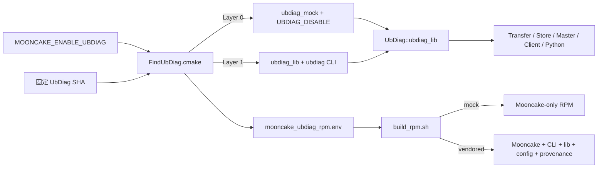
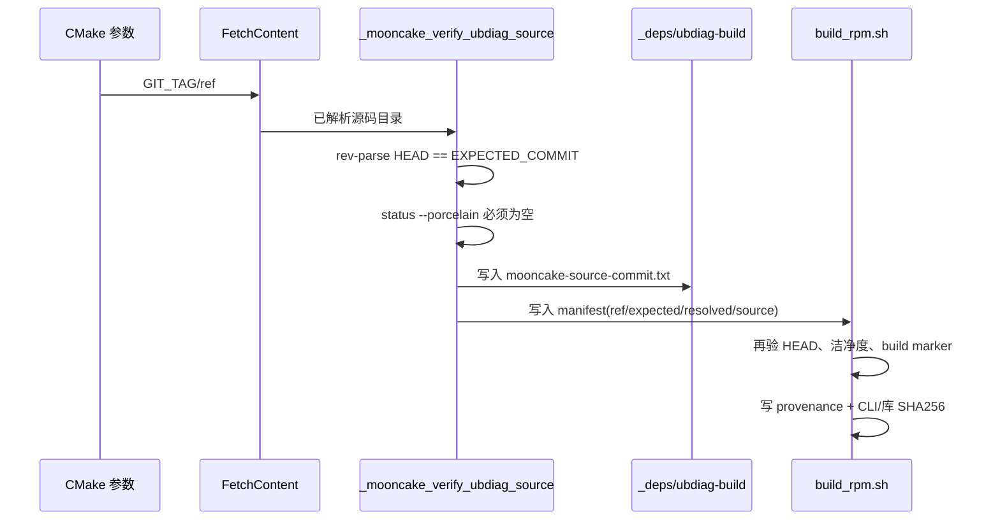

# Mooncake UbDiag 两层分发当前代码逐行解读

> 生成日期：2026-07-28  
> 正式实现基线：`0af129d83fe87f0fffdd6902bb96c850206be25a`  
> 本文所在 backup 分支提交：`816c350214a9d1697985b358468dce8ad3317e1b`（文档提交后该值会再前进）

本文只解释两层分发的实现代码，不重复用户手册和验证日志。表格中每一条所选源码物理行都有独立说明；纯空行省略。

## 1. 先看懂七组关联

| 编号 | 跨文件含义 | 从哪里到哪里 |
|---|---|---|
| `[S]` | 源码身份链 | CMake 选择 ref → 校验完整 SHA/洁净工作树 → RPM 再校验 HEAD |
| `[T]` | 统一目标链 | Layer 0 alias 到 `ubdiag_mock`；Layer 1 alias 到 `ubdiag_lib`；所有消费者只写 `UbDiag::ubdiag_lib` |
| `[L]` | 层状态链 | `MOONCAKE_ENABLE_UBDIAG` → `MOONCAKE_UBDIAG_ACTIVE_LAYER`/manifest → P2P 与 RPM 按 `mock`/`vendored` 分支 |
| `[M]` | CMake/RPM 交接链 | `FindUbDiag.cmake` 生成 `mooncake_ubdiag_rpm.env` → `build_rpm.sh` 白名单解析 |
| `[B]` | 子构建身份链 | `_deps/ubdiag-build/mooncake-source-commit.txt` 防止旧 build 目录与新源码混用 |
| `[P]` | 单 RPM 产物链 | 当前 build 的 CLI、SDK、配置 → BUILDROOT → `%files` → 一个 Mooncake RPM |
| `[R]` | 可迁移运行链 | 暂存 CLI 和 Mooncake 消费者清除 build RPATH，再对最终字节计算 SHA256 |

核心关系不是“多个地方各自判断层”，而是：入口只判断一次，统一 target 传播编译行为，manifest 把同一判断传给打包。



### 1.1 身份识别码：tag/ref 校验和 SHA 校验

| 身份字段 | 作用 | 是否可单独作为可信身份 |
|---|---|---|
| `MOONCAKE_UBDIAG_GIT_TAG` | 交给 FetchContent 选择 tag、branch 或 commit；名字保留在 RPM provenance 中，便于人阅读 | 否，tag/branch 可能移动 |
| `MOONCAKE_UBDIAG_EXPECTED_COMMIT` | Mooncake 允许使用的完整 40 位 SHA | 是，前提是实际 HEAD 和工作树都通过校验 |
| `MOONCAKE_UBDIAG_RESOLVED_COMMIT` | 对所选源码执行 `git rev-parse HEAD` 得到的实际 SHA | 与 expected 相等后才可信 |
| `mooncake-source-commit.txt` | 把已验证 SHA 绑定到 `_deps/ubdiag-build` | 防止旧子构建目录被新源码误用 |
| `ubdiag-provenance.txt` | RPM 内记录 ref、实际 commit、CLI SHA256、真实库 SHA256 | 用于安装包追溯和最终字节核验 |

所谓“tag 校验”不是只比较 tag 字符串，而是：FetchContent 先用 `MOONCAKE_UBDIAG_GIT_TAG` 解析源码；随后对解析结果执行 `git rev-parse HEAD`，要求它必须等于 `MOONCAKE_UBDIAG_EXPECTED_COMMIT`。因此 tag 即使被移动，也会因为实际 SHA 不匹配而在 CMake 配置阶段失败。当前默认配置更严格，`GIT_TAG` 本身就填写固定完整 SHA。

如果以后改用发布 tag，两项必须成对配置，不能只改 tag：

```bash
cmake .. \
  -DMOONCAKE_UBDIAG_GIT_TAG=<tag-or-ref> \
  -DMOONCAKE_UBDIAG_EXPECTED_COMMIT=<full-40-character-SHA>
```

CLI 打印的 `ubdiag version 0.6.0` 是语义版本，`build: 8df2c284` 是便于人工观察的短构建身份；Mooncake 构建和 RPM 门禁仍以完整 SHA `8df2c2844d402e2e4dcd5ceab2424e8d36c5f99f` 为准。



## 2. `mooncake-common/FindUbDiag.cmake`

作用：两层选择、源码身份和统一 CMake 目标。

| 行号 | 源码原文 | 这一行做什么 | 关联 |
|---:|---|---|---|
| 1 | `# FindUbDiag.cmake v2 — 基于 UBDIAG_DISABLE 的两层集成` | 声明本文件是 Mooncake 的 UbDiag 两层集成入口，核心机制是编译期宏 `UBDIAG_DISABLE`。 | [L] |
| 2 | `#` | 注释分隔行。 | — |
| 3 | `# Layer 0 (默认): FetchContent 拉源码 + 定义 UBDIAG_DISABLE → constexpr 空函数` | 说明 Layer 0 仍取得指定 UbDiag 源码，但只使用头文件中的空实现。 | [L] |
| 4 | `# Layer 1 (可选): FetchContent 拉源码 + 编译 ubdiag 库 + CLI` | 说明 Layer 1 从同一来源同时构建 SDK 动态库和 CLI。 | — |
| 5 | `#` | 注释分隔行。 | — |
| 6 | `# Usage:` | 开始给出其他 CMake 文件的调用方法。 | — |
| 7 | `#   include(${CMAKE_SOURCE_DIR}/mooncake-common/FindUbDiag.cmake)` | 消费模块先 include 本文件，让两层选择只发生一次。 | — |
| 8 | `#   target_link_libraries(your_target PRIVATE UbDiag::ubdiag_lib)` | 消费模块统一链接 `UbDiag::ubdiag_lib`，不在业务侧分别判断 Layer 0/1。 | [T] |
| 9 | `#` | 注释分隔行。 | — |
| 10 | `# Options:` | 开始列出用户可覆盖的 CMake 参数。 | — |
| 11 | `#   -DMOONCAKE_ENABLE_UBDIAG=ON   编译真实 ubdiag (库 + CLI)` | 打开主开关时进入 Layer 1，构建真实库与 CLI。 | [L] |
| 12 | `#   -DMOONCAKE_ENABLE_UBDIAG=OFF  (默认) 使用 UBDIAG_DISABLE 空函数` | 关闭主开关时进入默认 Layer 0，PerfPoint 编译为空实现。 | [L] |
| 13 | `#   -DMOONCAKE_UBDIAG_GIT_TAG=<tag/branch/commit>  指定 ubdiag 版本` | 允许覆盖人可读的源码 ref；真正可信身份还要由下一行的完整 SHA 校验。 | [S] |
| 14 | `#   -DMOONCAKE_UBDIAG_EXPECTED_COMMIT=<40-char SHA>  指定允许的精确提交` | 要求另传完整 40 位提交 SHA，避免可移动 tag/branch 成为最终身份。 | [S] |
| 15 | `#   -DMOONCAKE_UBDIAG_SOURCE_DIR=/path/to/ubdiag  离线模式指定本地源码` | 允许离线环境显式指定一份本地 UbDiag Git 工作树。 | — |
| 17 | `if(TARGET UbDiag::ubdiag_lib)` | 如果统一目标已经存在，先判断它是不是当前 Mooncake 构建创建的。 | [T] |
| 18 | `  get_property(_MOONCAKE_UBDIAG_TARGET_OWNER GLOBAL` | 开始读取全局目标所有者标记。 | [T] |
| 19 | `               PROPERTY MOONCAKE_UBDIAG_TARGET_OWNER)` | 读取的属性名是 `MOONCAKE_UBDIAG_TARGET_OWNER`。 | [T] |
| 20 | `  if(NOT _MOONCAKE_UBDIAG_TARGET_OWNER STREQUAL "${CMAKE_BINARY_DIR}")` | 将目标所有者与当前顶层二进制目录比较，识别系统包或父工程注入的同名目标。 | [T] |
| 21 | `    message(FATAL_ERROR` | 发现外来目标时进入立即失败分支。 | — |
| 22 | `      "UbDiag::ubdiag_lib already exists but was not created by Mooncake's "` | 错误第一段指出同名目标已经存在，但不是 Mooncake FetchContent 创建的。 | [T] |
| 23 | `      "FetchContent integration. Remove any find_package(UbDiag), system "` | 错误第二段提示清理 `find_package(UbDiag)`、系统目标或父工程注入。 | — |
| 24 | `      "UbDiag target, or injected parent-project target before configuring.")` | 结束错误文本并终止 CMake 配置，防止链接到机器上已有的其他 UbDiag。 | — |
| 25 | `  endif()` | 结束外来目标判断。 | — |
| 26 | `  return()` | 目标属于当前构建时直接返回，实现多模块重复 include 的幂等性。 | — |
| 27 | `endif()` | 结束“统一目标已存在”的外层判断。 | — |
| 29 | `option(MOONCAKE_ENABLE_UBDIAG "编译 ubdiag 真实库(否则用 UBDIAG_DISABLE 空函数)" OFF)` | 定义总开关，默认 `OFF`，因此默认交付是零运行时依赖的 Layer 0。 | [L] |
| 30 | `set(MOONCAKE_UBDIAG_GIT_REPOSITORY` | 开始定义 UbDiag 源码仓地址。 | [S] |
| 31 | `    "https://github.com/LinQuickDev/ubdiag.git"` | 默认只从 LinQuickDev 的 GitHub 镜像取源码，绕开其他仓认证问题。 | — |
| 32 | `    CACHE STRING "ubdiag Git repository")` | 把仓地址放入 CMake cache，允许构建者显式覆盖。 | — |
| 33 | `set(MOONCAKE_UBDIAG_GIT_TAG` | 开始定义 FetchContent 选择的 ref。 | [S] |
| 34 | `    "8df2c2844d402e2e4dcd5ceab2424e8d36c5f99f"` | 默认 ref 直接使用固定提交 `8df2c284...`，避免 tag 漂移。 | — |
| 35 | `    CACHE STRING "ubdiag 版本(tag/branch/commit)")` | 把 ref 放入 cache；它用于拉取，但不是唯一的身份门禁。 | — |
| 36 | `set(MOONCAKE_UBDIAG_EXPECTED_COMMIT` | 开始定义 Mooncake 允许使用的精确提交。 | [S] |
| 37 | `    "8df2c2844d402e2e4dcd5ceab2424e8d36c5f99f"` | 默认期望 SHA 与上一处拉取 ref 相同，形成“拉取值 + 校验值”双锁。 | — |
| 38 | `    CACHE STRING "Mooncake 允许使用的 ubdiag 精确提交 SHA")` | 把期望 SHA 放入 cache，便于离线验证或升级时成对覆盖。 | — |
| 39 | `set(MOONCAKE_UBDIAG_SOURCE_DIR "" CACHE PATH "本地 ubdiag 源码目录(离线用,为空则 FetchContent)")` | 定义离线源码目录；为空才允许 FetchContent 在线拉取。 | — |
| 41 | `include(FetchContent)` | 加载 CMake 的 FetchContent 能力。 | — |
| 43 | `function(_mooncake_verify_ubdiag_source source_dir)` | 定义源码身份校验函数，两层都会在分流前调用它。 | [S] |
| 44 | `  get_filename_component(_source_dir "${source_dir}" REALPATH)` | 把传入路径规范化为真实绝对路径，消除相对路径和符号链接歧义。 | — |
| 45 | `  string(TOLOWER "${MOONCAKE_UBDIAG_EXPECTED_COMMIT}" _expected_commit)` | 把期望 SHA 转为小写，后续比较不受十六进制大小写影响。 | [S] |
| 46 | `  string(LENGTH "${_expected_commit}" _expected_commit_length)` | 计算期望 SHA 的字符长度。 | [S] |
| 47 | `  if(NOT _expected_commit_length EQUAL 40 OR` | 第一项门禁要求长度必须正好为 40。 | [S] |
| 48 | `     NOT _expected_commit MATCHES "^[0-9a-f]+$")` | 第二项门禁要求全部字符都是十六进制数字。 | [S] |
| 49 | `    message(FATAL_ERROR` | 任一格式条件不满足就进入致命错误。 | — |
| 50 | `      "MOONCAKE_UBDIAG_EXPECTED_COMMIT must be a full 40-character Git SHA, "` | 错误信息说明必须使用完整 40 位 Git SHA。 | [S] |
| 51 | `      "got: ${MOONCAKE_UBDIAG_EXPECTED_COMMIT}")` | 同时打印用户实际传入值，便于定位配置错误。 | [S] |
| 52 | `  endif()` | 结束 SHA 格式门禁。 | — |
| 54 | `  find_program(_MOONCAKE_UBDIAG_GIT_EXECUTABLE NAMES git)` | 查找 Git 可执行文件，后续用它读取 HEAD 和工作树状态。 | — |
| 55 | `  if(NOT _MOONCAKE_UBDIAG_GIT_EXECUTABLE OR` | 如果找不到 Git，源码身份无法建立。 | — |
| 56 | `     NOT EXISTS "${_source_dir}/CMakeLists.txt")` | 或者规范化后的源码目录缺少顶层 `CMakeLists.txt`，也视为不完整。 | — |
| 57 | `    message(FATAL_ERROR` | 进入致命错误。 | — |
| 58 | `      "UbDiag source is incomplete or git is unavailable: ${_source_dir}")` | 打印不完整源码或缺失 Git 的具体路径。 | — |
| 59 | `  endif()` | 结束源码完整性门禁。 | — |
| 61 | `  execute_process(` | 开始执行 Git 命令读取源码工作树当前 HEAD。 | — |
| 62 | `    COMMAND "${_MOONCAKE_UBDIAG_GIT_EXECUTABLE}" -C "${_source_dir}"` | 指定在选中的 UbDiag 工作树中执行 Git。 | — |
| 63 | `            rev-parse --verify HEAD` | 要求解析并验证 `HEAD`。 | [S] |
| 64 | `    RESULT_VARIABLE _git_result` | 保存 Git 命令退出码。 | — |
| 65 | `    OUTPUT_VARIABLE _resolved_commit` | 保存解析出的提交 SHA。 | [S] |
| 66 | `    OUTPUT_STRIP_TRAILING_WHITESPACE)` | 去掉命令输出末尾换行，便于精确字符串比较。 | — |
| 67 | `  string(TOLOWER "${_resolved_commit}" _resolved_commit)` | 把实际提交也转成小写。 | [S] |
| 68 | `  if(NOT _git_result EQUAL 0 OR` | Git 命令失败时判定来源不可信。 | — |
| 69 | `     NOT _resolved_commit STREQUAL _expected_commit)` | 实际 HEAD 与期望 SHA 不同时同样判定失败。 | [S] |
| 70 | `    message(FATAL_ERROR` | 进入致命错误。 | — |
| 71 | `      "UbDiag source commit mismatch.\\n"` | 错误标题明确是 UbDiag 源码提交不匹配。 | — |
| 72 | `      "  expected: ${_expected_commit}\\n"` | 打印期望提交。 | [S] |
| 73 | `      "  resolved: ${_resolved_commit}\\n"` | 打印实际解析出的提交。 | [S] |
| 74 | `      "  source:   ${_source_dir}\\n"` | 打印被检查的源码目录。 | — |
| 75 | `      "Remove the stale _deps/ubdiag-src directory or select the matching "` | 提示可能是 `_deps/ubdiag-src` 残留旧源码。 | — |
| 76 | `      "MOONCAKE_UBDIAG_EXPECTED_COMMIT.")` | 或者需要显式选择与源码匹配的期望提交。 | [S] |
| 77 | `  endif()` | 结束提交一致性门禁。 | — |
| 79 | `  execute_process(` | 开始检查源码工作树是否洁净。 | — |
| 80 | `    COMMAND "${_MOONCAKE_UBDIAG_GIT_EXECUTABLE}" -C "${_source_dir}"` | 仍在同一个已验证源码目录中执行 Git。 | — |
| 81 | `            status --porcelain --untracked-files=all` | 读取已跟踪修改和全部未跟踪文件。 | [S] |
| 82 | `    RESULT_VARIABLE _git_result` | 保存命令退出码。 | — |
| 83 | `    OUTPUT_VARIABLE _git_status` | 保存工作树状态文本。 | — |
| 84 | `    OUTPUT_STRIP_TRAILING_WHITESPACE)` | 去掉末尾换行。 | — |
| 85 | `  if(NOT _git_result EQUAL 0 OR NOT _git_status STREQUAL "")` | Git 失败或状态非空都表示 HEAD 不能完整描述将被编译的代码。 | — |
| 86 | `    message(FATAL_ERROR` | 进入致命错误。 | — |
| 87 | `      "UbDiag source worktree is not clean, so its HEAD SHA does not fully "` | 解释为什么脏工作树不可接受：同一个 SHA 可能对应不同构建内容。 | — |
| 88 | `      "describe the code that would be built:\\n${_git_status}")` | 输出具体修改列表，便于清理。 | — |
| 89 | `  endif()` | 结束洁净工作树门禁。 | — |
| 91 | `  set(MOONCAKE_UBDIAG_RESOLVED_SOURCE_DIR "${_source_dir}"` | 把已验证的真实源码路径写入 CMake cache。 | — |
| 92 | `      CACHE PATH "Verified UbDiag source selected by Mooncake" FORCE)` | 说明该 cache 值是 Mooncake 选中的可信来源，并强制刷新旧值。 | — |
| 93 | `  set(MOONCAKE_UBDIAG_RESOLVED_COMMIT "${_resolved_commit}"` | 把实际解析出的提交写入 CMake cache。 | [S] |
| 94 | `      CACHE STRING "Verified UbDiag source commit selected by Mooncake" FORCE)` | 说明该值是已验证提交，并强制覆盖旧配置。 | — |
| 95 | `  set(MOONCAKE_UBDIAG_RESOLVED_SOURCE_DIR "${_source_dir}" PARENT_SCOPE)` | 把真实源码路径返回给调用函数外层作用域。 | — |
| 96 | `  set(MOONCAKE_UBDIAG_RESOLVED_COMMIT "${_resolved_commit}" PARENT_SCOPE)` | 把真实提交返回给调用函数外层作用域。 | [S] |
| 97 | `endfunction()` | 结束源码身份校验函数。 | — |
| 99 | `function(_mooncake_write_ubdiag_rpm_manifest layer)` | 定义 CMake 到 RPM 的身份交接函数。 | [M] |
| 100 | `  set(_manifest "${CMAKE_BINARY_DIR}/mooncake_ubdiag_rpm.env")` | 清单固定写入当前顶层 build 目录。 | [M] |
| 101 | `  file(WRITE "${_manifest}" "MOONCAKE_UBDIAG_LAYER=${layer}\\n")` | 先创建清单并写入当前层 `mock` 或 `vendored`。 | [L] |
| 102 | `  file(APPEND "${_manifest}"` | 开始追加其余来源字段。 | — |
| 103 | `    "MOONCAKE_UBDIAG_GIT_REPOSITORY=${MOONCAKE_UBDIAG_GIT_REPOSITORY}\\n"` | 记录源码仓地址。 | [S] |
| 104 | `    "MOONCAKE_UBDIAG_GIT_TAG=${MOONCAKE_UBDIAG_GIT_TAG}\\n"` | 记录拉取使用的 ref。 | [S] |
| 105 | `    "MOONCAKE_UBDIAG_EXPECTED_COMMIT=${MOONCAKE_UBDIAG_EXPECTED_COMMIT}\\n"` | 记录配置期望的完整 SHA。 | [S] |
| 106 | `    "MOONCAKE_UBDIAG_RESOLVED_COMMIT=${MOONCAKE_UBDIAG_RESOLVED_COMMIT}\\n"` | 记录 CMake 实际验证通过的提交。 | [S] |
| 107 | `    "MOONCAKE_UBDIAG_SOURCE_DIR=${MOONCAKE_UBDIAG_RESOLVED_SOURCE_DIR}\\n")` | 记录实际验证通过的源码目录，打包阶段只从这里取配置文件。 | — |
| 108 | `  set(MOONCAKE_UBDIAG_RPM_MANIFEST "${_manifest}"` | 把清单路径写入 cache，便于其他 CMake 或工具读取。 | [M] |
| 109 | `      CACHE FILEPATH "Verified UbDiag RPM packaging manifest" FORCE)` | 说明该 cache 项代表可信 RPM 清单，并强制刷新。 | — |
| 110 | `  set(MOONCAKE_UBDIAG_ACTIVE_LAYER "${layer}"` | 把当前层写入共享 cache，供 P2P 的外部 Go 构建读取。 | [L] |
| 111 | `      CACHE STRING "Active UbDiag integration layer: mock or vendored" FORCE)` | 限定合法语义为 `mock` 或 `vendored`。 | [L] |
| 112 | `endfunction()` | 结束清单写入函数。 | — |
| 114 | `set(ubdiag_BINARY_DIR "${FETCHCONTENT_BASE_DIR}/ubdiag-build")` | 统一规定 UbDiag 二进制目录为 `_deps/ubdiag-build`。 | [B] |
| 115 | `if(MOONCAKE_UBDIAG_SOURCE_DIR)` | 用户只要显式传了离线目录，就必须使用该目录。 | — |
| 116 | `  if(NOT EXISTS "${MOONCAKE_UBDIAG_SOURCE_DIR}/CMakeLists.txt")` | 检查显式目录是否包含顶层 CMake 文件。 | — |
| 117 | `    message(FATAL_ERROR` | 无效时立即失败，不允许悄悄退回在线 FetchContent。 | — |
| 118 | `      "MOONCAKE_UBDIAG_SOURCE_DIR does not contain CMakeLists.txt: "` | 错误第一段指出参数本身无效。 | — |
| 119 | `      "${MOONCAKE_UBDIAG_SOURCE_DIR}")` | 错误第二段打印具体目录。 | — |
| 120 | `  endif()` | 结束显式路径门禁。 | — |
| 121 | `  set(ubdiag_SOURCE_DIR "${MOONCAKE_UBDIAG_SOURCE_DIR}")` | 把有效离线路径选为统一 `ubdiag_SOURCE_DIR`。 | — |
| 122 | `else()` | 只有没有传离线路径时才进入在线拉取。 | — |
| 123 | `  FetchContent_Populate(ubdiag` | 开始只拉取 UbDiag 源码，不立即添加子工程。 | — |
| 124 | `    GIT_REPOSITORY ${MOONCAKE_UBDIAG_GIT_REPOSITORY}` | 使用前面配置的固定仓地址。 | [S] |
| 125 | `    GIT_TAG ${MOONCAKE_UBDIAG_GIT_TAG}` | 使用前面配置的固定 ref。 | [S] |
| 126 | `    SOURCE_DIR "${FETCHCONTENT_BASE_DIR}/ubdiag-src"` | 把源码落到可预期的 `_deps/ubdiag-src`。 | — |
| 127 | `    BINARY_DIR "${ubdiag_BINARY_DIR}"` | 指定后续真实构建使用的二进制目录。 | — |
| 128 | `    SUBBUILD_DIR "${FETCHCONTENT_BASE_DIR}/ubdiag-subbuild")` | 指定 FetchContent 下载辅助工程目录并结束调用。 | — |
| 129 | `endif()` | 结束离线/在线来源选择。 | — |
| 130 | `_mooncake_verify_ubdiag_source("${ubdiag_SOURCE_DIR}")` | 在 Layer 0/1 分流前统一执行 SHA 和洁净度校验。 | [S] |
| 132 | `# ===== Layer 0: UBDIAG_DISABLE 模式(默认) =====` | 标记默认 Layer 0 逻辑开始。 | [L] |
| 133 | `if(NOT MOONCAKE_ENABLE_UBDIAG)` | 主开关关闭时进入 mock 分支。 | [L] |
| 134 | `  set(_MOONCAKE_UBDIAG_PERF_POINT_HEADER` | 开始构造 PerfPoint 头文件路径。 | — |
| 135 | `      "${ubdiag_SOURCE_DIR}/include/ubdiag/perf_point.h")` | 路径指向已验证源码中的 `include/ubdiag/perf_point.h`。 | — |
| 136 | `  if(NOT EXISTS "${_MOONCAKE_UBDIAG_PERF_POINT_HEADER}")` | 检查该头文件存在。 | — |
| 137 | `    message(FATAL_ERROR` | 缺失时立即终止配置。 | — |
| 138 | `      "UbDiag ${MOONCAKE_UBDIAG_GIT_TAG} is missing include/ubdiag/perf_point.h")` | 错误中给出所选 ref 和缺失文件。 | [S] |
| 139 | `  endif()` | 结束头文件存在性检查。 | — |
| 140 | `  file(STRINGS "${_MOONCAKE_UBDIAG_PERF_POINT_HEADER}"` | 按行读取 PerfPoint 头文件。 | — |
| 141 | `       _MOONCAKE_UBDIAG_DISABLE_LINES REGEX "UBDIAG_DISABLE")` | 只收集包含 `UBDIAG_DISABLE` 的行，用于能力探测。 | [L] |
| 142 | `  if(NOT _MOONCAKE_UBDIAG_DISABLE_LINES)` | 没有匹配行说明该 UbDiag 版本不支持编译期空实现。 | [L] |
| 143 | `    message(FATAL_ERROR` | 进入致命错误。 | — |
| 144 | `      "UbDiag ${MOONCAKE_UBDIAG_GIT_TAG} does not support UBDIAG_DISABLE. "` | 错误第一段指出当前版本不支持禁用宏。 | [S] [L] |
| 145 | `      "Select an UbDiag release that contains the compile-time disabled PerfPoint implementation.")` | 要求更换为具备空实现能力的 UbDiag 版本。 | — |
| 146 | `  endif()` | 结束能力门禁。 | — |
| 148 | `  # Consumers inherit both the source include path and the compile-time switch.` | 注释说明 INTERFACE 目标会把头文件路径和宏一起传给消费者。 | — |
| 149 | `  add_library(ubdiag_mock INTERFACE)` | 创建不产生 `.so` 的接口库 `ubdiag_mock`。 | [T] [L] |
| 150 | `  target_include_directories(ubdiag_mock INTERFACE ${ubdiag_SOURCE_DIR}/include)` | 把已验证源码的公共头文件目录传播给所有消费者。 | [T] [L] |
| 151 | `  target_compile_definitions(ubdiag_mock INTERFACE UBDIAG_DISABLE)` | 把 `UBDIAG_DISABLE` 宏传播给消费者，使 PerfPoint 调用编译为空。 | [T] [L] |
| 152 | `  add_library(UbDiag::ubdiag_lib ALIAS ubdiag_mock)` | 把统一目标名映射到 mock 接口库；业务 CMake 不需要分支。 | [T] [L] |
| 154 | `  set_property(GLOBAL PROPERTY MOONCAKE_UBDIAG_TARGET_OWNER` | 开始写统一目标的所有者标记。 | [T] |
| 155 | `               "${CMAKE_BINARY_DIR}")` | 所有者取当前顶层 build 目录，供文件开头的外来目标门禁使用。 | — |
| 156 | `  _mooncake_write_ubdiag_rpm_manifest("mock")` | 生成 Layer 0 的 RPM 清单，并把活动层写成 `mock`。 | [L] [M] |
| 157 | `  message(STATUS` | 开始打印配置状态。 | — |
| 158 | `    "UbDiag: UBDIAG_DISABLE(空函数,零依赖), verified ${MOONCAKE_UBDIAG_RESOLVED_COMMIT}")` | 日志明确说明空函数、零依赖和已验证提交。 | [S] [L] |
| 159 | `  return()` | Layer 0 到此结束，阻止继续执行真实库构建代码。 | — |
| 160 | `endif()` | 结束 Layer 0 条件块。 | — |
| 162 | `# ===== Layer 1: 编译真实 ubdiag =====` | 标记 Layer 1 真实构建逻辑开始。 | — |
| 163 | `set(_MOONCAKE_UBDIAG_BUILD_COMMIT_FILE` | 开始定义二进制目录中的源码提交标记文件。 | [B] |
| 164 | `    "${ubdiag_BINARY_DIR}/mooncake-source-commit.txt")` | 标记固定为 `_deps/ubdiag-build/mooncake-source-commit.txt`。 | [B] |
| 165 | `set(_MOONCAKE_UBDIAG_REUSE_BINARY_DIR TRUE)` | 默认假设旧二进制目录可以复用，随后用标记证明。 | [B] |
| 166 | `if(EXISTS "${_MOONCAKE_UBDIAG_BUILD_COMMIT_FILE}")` | 如果标记文件存在就读取它。 | [B] |
| 167 | `  file(READ "${_MOONCAKE_UBDIAG_BUILD_COMMIT_FILE}"` | 开始读取标记内容。 | [B] |
| 168 | `       _MOONCAKE_UBDIAG_PREVIOUS_BUILD_COMMIT)` | 保存上一轮构建对应的 UbDiag 提交。 | [B] |
| 169 | `  string(STRIP "${_MOONCAKE_UBDIAG_PREVIOUS_BUILD_COMMIT}"` | 开始去掉标记中的空白。 | [B] |
| 170 | `         _MOONCAKE_UBDIAG_PREVIOUS_BUILD_COMMIT)` | 得到可直接比较的旧提交值。 | [B] |
| 171 | `  if(NOT _MOONCAKE_UBDIAG_PREVIOUS_BUILD_COMMIT STREQUAL` | 旧构建提交与本次验证提交不同时进入失配分支。 | [B] |
| 172 | `         MOONCAKE_UBDIAG_RESOLVED_COMMIT)` | 比较对象是本次已验证的 `MOONCAKE_UBDIAG_RESOLVED_COMMIT`。 | [S] |
| 173 | `    set(_MOONCAKE_UBDIAG_REUSE_BINARY_DIR FALSE)` | 标记旧二进制目录不可复用。 | [B] |
| 174 | `  endif()` | 结束提交失配判断。 | — |
| 175 | `elseif(EXISTS "${ubdiag_BINARY_DIR}")` | 没有标记但二进制目录已存在时，检查是否有残留文件。 | — |
| 176 | `  file(GLOB _MOONCAKE_UBDIAG_EXISTING_BUILD_FILES` | 开始枚举旧目录内容。 | — |
| 177 | `       "${ubdiag_BINARY_DIR}/*")` | 匹配目录内所有已有构建文件。 | — |
| 178 | `  if(_MOONCAKE_UBDIAG_EXISTING_BUILD_FILES)` | 只要存在文件，就说明来源未经标记证明。 | — |
| 179 | `    set(_MOONCAKE_UBDIAG_REUSE_BINARY_DIR FALSE)` | 标记该目录不可复用。 | [B] |
| 180 | `  endif()` | 结束残留内容判断。 | — |
| 181 | `endif()` | 结束旧标记/无标记两种分支。 | — |
| 182 | `if(NOT _MOONCAKE_UBDIAG_REUSE_BINARY_DIR)` | 如果不可复用，开始清理旧构建。 | [B] |
| 183 | `  message(STATUS` | 打印为何删除旧目录。 | — |
| 184 | `    "UbDiag: removing binary directory from a different or unverified source")` | 说明旧目录来自不同或未经验证的源码。 | — |
| 185 | `  file(REMOVE_RECURSE "${ubdiag_BINARY_DIR}")` | 只删除 UbDiag 子构建目录，不动 Mooncake 其他产物。 | — |
| 186 | `endif()` | 结束清理分支。 | — |
| 187 | `file(MAKE_DIRECTORY "${ubdiag_BINARY_DIR}")` | 确保新的 UbDiag 二进制目录存在。 | — |
| 188 | `file(WRITE "${_MOONCAKE_UBDIAG_BUILD_COMMIT_FILE}"` | 开始写入本次源码提交标记。 | [B] |
| 189 | `     "${MOONCAKE_UBDIAG_RESOLVED_COMMIT}\\n")` | 把已验证提交写入标记文件，为构建和 RPM 复核建立连接。 | [S] |
| 191 | `set(UBDIAG_BUILD_SHARED ON CACHE BOOL "" FORCE)` | 强制 UbDiag SDK 构建共享库，供 Mooncake ELF 和 CLI 同时链接。 | — |
| 192 | `set(ENABLE_PERCENTILE ON CACHE BOOL "" FORCE)` | 开启 P99/P999/P9999 分位数功能。 | — |
| 193 | `set(ENABLE_PERFLOG ON CACHE BOOL "" FORCE)` | 开启 PerfLog 功能。 | — |
| 194 | `set(ENABLE_OB_MEMORY OFF CACHE BOOL "" FORCE)` | 关闭本需求不需要的内存 eBPF 观测，降低依赖。 | — |
| 195 | `set(ENABLE_OB_CACHE OFF CACHE BOOL "" FORCE)` | 关闭本需求不需要的 cache 观测。 | — |
| 196 | `set(ENABLE_MEMPOINT OFF CACHE BOOL "" FORCE)` | 关闭 MemPoint 扩展。 | — |
| 197 | `set(UBDIAG_ENABLE_CACHEPOINT OFF CACHE BOOL "" FORCE)` | 关闭 CachePoint 扩展；两层交付聚焦 PerfPoint、分位数、PerfLog 和 CSV。 | — |
| 199 | `function(_mooncake_make_ubdiag_available)` | 定义隔离 UbDiag 通用 BUILD 选项的函数作用域。 | — |
| 200 | `  # UbDiag still exposes generic BUILD_* options. Keep the overrides inside a` | 注释第一行说明 UbDiag 暴露了容易与父工程冲突的通用选项。 | — |
| 201 | `  # function scope so Mooncake's own BUILD_EXAMPLES value is not changed.` | 注释第二行说明函数作用域避免污染 Mooncake 自己的 `BUILD_EXAMPLES`。 | — |
| 202 | `  set(BUILD_TESTS OFF)` | 只在函数内部关闭 UbDiag 自测。 | — |
| 203 | `  set(BUILD_EXAMPLES OFF)` | 只在函数内部关闭 UbDiag 示例。 | — |
| 204 | `  add_subdirectory("${ubdiag_SOURCE_DIR}" "${ubdiag_BINARY_DIR}")` | 把已验证 UbDiag 源码加入当前 CMake 图，并指定受控二进制目录。 | — |
| 205 | `endfunction()` | 结束隔离函数。 | — |
| 206 | `_mooncake_make_ubdiag_available()` | 调用函数，真正创建 SDK、Manager、Runtime 和 CLI targets。 | — |
| 208 | `if(NOT TARGET ubdiag_lib OR NOT TARGET ubdiag)` | 检查真实 SDK target 和 CLI target 是否同时存在。 | [T] |
| 209 | `  message(FATAL_ERROR` | 任一缺失就进入致命错误。 | — |
| 210 | `    "UbDiag ${MOONCAKE_UBDIAG_GIT_TAG} did not create both ubdiag_lib and CLI targets")` | 错误明确要求库与 CLI 必须在同一构建图中同时产生。 | [S] [T] |
| 211 | `endif()` | 结束产物完整性门禁。 | — |
| 213 | `# UbDiag master still uses CMAKE_SOURCE_DIR internally. When consumed by` | 注释说明被嵌入的 UbDiag 仍有顶层目录变量兼容问题。 | — |
| 214 | `# FetchContent that variable points at Mooncake, so add the real source paths` | FetchContent 场景中 `CMAKE_SOURCE_DIR` 指向 Mooncake 而非 UbDiag。 | — |
| 215 | `# to every UbDiag target without modifying the mirrored upstream sources.` | 因此 Mooncake 给各 UbDiag target 补真实源码 include，不改镜像源码。 | — |
| 216 | `foreach(_MOONCAKE_UBDIAG_LIB_TARGET` | 开始遍历可能存在的 UbDiag 库 targets。 | [T] |
| 217 | `        ubdiag_logger ubdiag_lib ubdiag_runtime_lib ubdiag_manager_lib` | 列出 logger、SDK、runtime 和 manager。 | [T] |
| 218 | `        ubdiag_bpf_loader)` | 补充可选的 BPF loader target。 | — |
| 219 | `  if(TARGET ${_MOONCAKE_UBDIAG_LIB_TARGET})` | 只处理当前构建实际创建的 target。 | [T] |
| 220 | `    target_include_directories(${_MOONCAKE_UBDIAG_LIB_TARGET} PUBLIC` | 开始为该 target 补公共 include 路径。 | [T] |
| 221 | `      $<BUILD_INTERFACE:${ubdiag_SOURCE_DIR}/include>` | 构建阶段加入 UbDiag 公共头文件目录。 | — |
| 222 | `      $<BUILD_INTERFACE:${ubdiag_SOURCE_DIR}/src>)` | 构建阶段加入 UbDiag 内部源码头文件目录。 | — |
| 223 | `  endif()` | 结束 target 存在性判断。 | — |
| 224 | `endforeach()` | 结束所有 UbDiag 库 target 的遍历。 | — |
| 225 | `target_include_directories(ubdiag PRIVATE` | CLI target 另外使用 PRIVATE include 路径。 | [T] |
| 226 | `  ${ubdiag_SOURCE_DIR}/include` | CLI 可见公共头文件。 | — |
| 227 | `  ${ubdiag_SOURCE_DIR}/src` | CLI 可见内部源码头文件。 | — |
| 228 | `  ${ubdiag_SOURCE_DIR}/src/cli)` | CLI 可见自身目录头文件并结束调用。 | — |
| 230 | `add_library(UbDiag::ubdiag_lib ALIAS ubdiag_lib)` | 把统一目标名映射到真实 `ubdiag_lib`；这与 Layer 0 的同名 alias 对应。 | [T] |
| 231 | `set_property(GLOBAL PROPERTY MOONCAKE_UBDIAG_TARGET_OWNER` | 开始写真实目标的所有者标记。 | [T] |
| 232 | `             "${CMAKE_BINARY_DIR}")` | 所有者仍是当前 Mooncake build，用于多模块幂等复用。 | — |
| 233 | `_mooncake_write_ubdiag_rpm_manifest("vendored")` | 生成 Layer 1 RPM 清单，并把活动层写成 `vendored`。 | [L] [M] |
| 234 | `message(STATUS` | 开始打印 Layer 1 配置状态。 | — |
| 235 | `  "UbDiag: FetchContent 编译 ${MOONCAKE_UBDIAG_GIT_TAG}(库+CLI), "` | 日志第一段打印所选 ref，并说明库与 CLI 同时构建。 | [S] |
| 236 | `  "verified ${MOONCAKE_UBDIAG_RESOLVED_COMMIT}")` | 日志第二段打印真正验证通过的完整提交。 | [S] |

## 3. `mooncake-transfer-engine/src/CMakeLists.txt`

作用：Transfer Engine 消费统一目标。

| 行号 | 源码原文 | 这一行做什么 | 关联 |
|---:|---|---|---|
| 1 | `file(GLOB ENGINE_SOURCES "*.cpp")` | 收集 Transfer Engine 当前目录的 C++ 源文件。 | — |
| 2 | `include(${CMAKE_SOURCE_DIR}/mooncake-common/FindUbDiag.cmake)` | 加载统一两层入口；它替代系统 `find_package(UbDiag)`，并创建同名统一 target。 | — |
| 50 | `target_link_libraries(` | 开始声明 `transfer_engine` 的链接依赖。 | [T] |
| 51 | `  transfer_engine` | 指定被配置的目标是 `transfer_engine`。 | — |
| 52 | `  PUBLIC base` | 原有公共依赖从 `base` 开始。 | — |
| 53 | `         transport` | 保留该目标原有构建或链接上下文；与相邻 UbDiag 行共同完成接入。 | — |
| 54 | `         rdma_transport` | 保留该目标原有构建或链接上下文；与相邻 UbDiag 行共同完成接入。 | — |
| 55 | `         mooncake_common` | 保留该目标原有构建或链接上下文；与相邻 UbDiag 行共同完成接入。 | — |
| 56 | `         ibverbs` | 保留该目标原有构建或链接上下文；与相邻 UbDiag 行共同完成接入。 | — |
| 57 | `         glog::glog` | 保留该目标原有构建或链接上下文；与相邻 UbDiag 行共同完成接入。 | — |
| 58 | `         gflags::gflags` | 保留该目标原有构建或链接上下文；与相邻 UbDiag 行共同完成接入。 | — |
| 59 | `         pthread` | 保留该目标原有构建或链接上下文；与相邻 UbDiag 行共同完成接入。 | — |
| 60 | `         JsonCpp::JsonCpp` | 保留该目标原有构建或链接上下文；与相邻 UbDiag 行共同完成接入。 | — |
| 61 | `         numa` | 保留该目标原有构建或链接上下文；与相邻 UbDiag 行共同完成接入。 | — |
| 62 | `         asio_shared` | 保留该目标原有构建或链接上下文；与相邻 UbDiag 行共同完成接入。 | — |
| 63 | `         yalantinglibs::yalantinglibs` | 保留该目标原有构建或链接上下文；与相邻 UbDiag 行共同完成接入。 | — |
| 64 | `         UbDiag::ubdiag_lib)` | 链接统一 UbDiag target：Layer 0 传播空实现宏，Layer 1 链接真实库。 | [T] |

## 4. `mooncake-store/src/CMakeLists.txt`

作用：Store、Master 和 Client 消费统一目标。

| 行号 | 源码原文 | 这一行做什么 | 关联 |
|---:|---|---|---|
| 247 | `target_link_libraries(` | 开始声明 `mooncake_store` 的基础链接依赖。 | [T] |
| 248 | `  mooncake_store` | 指定被配置目标。 | — |
| 249 | `  PUBLIC cachelib_memory_allocator ${ETCD_WRAPPER_LIB} glog::glog gflags::gflags` | 保留原有公共依赖。 | — |
| 250 | `         ${EXTRA_LIBS} ${SPDK_STATIC_LIBS} asio_shared mooncake_common` | 继续原有公共依赖列表。 | — |
| 251 | `  PRIVATE transfer_engine)` | Transfer Engine 仍是 PRIVATE 依赖。 | — |
| 253 | `# UbDiag instrumentation (FetchContent + UBDIAG_DISABLE 两层集成)` | 注释指出下面接入 FetchContent + 编译期禁用两层模式。 | [L] |
| 254 | `include(${CMAKE_SOURCE_DIR}/mooncake-common/FindUbDiag.cmake)` | 加载统一两层入口；重复 include 会由目标所有者机制幂等返回。 | — |
| 255 | `target_link_libraries(mooncake_store PRIVATE UbDiag::ubdiag_lib)` | Store 链接统一 target，在两个层下保持相同业务 CMake 写法。 | [T] |
| 275 | `# Master binary` | 标记 master 可执行文件配置开始。 | — |
| 276 | `add_executable(mooncake_master master.cpp)` | 创建 `mooncake_master`，它包含本次实际观测的 Master PerfPoint。 | — |
| 278 | `set(MASTER_EXTRA_INCS)` | 保留该目标原有构建或链接上下文；与相邻 UbDiag 行共同完成接入。 | — |
| 279 | `set(MASTER_EXTRA_LIBS)` | 保留该目标原有构建或链接上下文；与相邻 UbDiag 行共同完成接入。 | — |
| 281 | `if(STORE_USE_JEMALLOC)` | 开始或继续一个条件判断，具体条件见左侧代码。 | — |
| 282 | `  find_package(PkgConfig REQUIRED)` | 保留该目标原有构建或链接上下文；与相邻 UbDiag 行共同完成接入。 | — |
| 283 | `  pkg_check_modules(JEMALLOC REQUIRED jemalloc)` | 保留该目标原有构建或链接上下文；与相邻 UbDiag 行共同完成接入。 | — |
| 284 | `  list(APPEND MASTER_EXTRA_INCS ${JEMALLOC_INCLUDE_DIRS})` | 保留该目标原有构建或链接上下文；与相邻 UbDiag 行共同完成接入。 | — |
| 285 | `  list(APPEND MASTER_EXTRA_LIBS ${JEMALLOC_STATIC_LIBRARIES})` | 保留该目标原有构建或链接上下文；与相邻 UbDiag 行共同完成接入。 | — |
| 286 | `endif()` | 结束前述条件块。 | — |
| 288 | `target_include_directories(mooncake_master PRIVATE ${MASTER_EXTRA_INCS})` | 保留该目标原有构建或链接上下文；与相邻 UbDiag 行共同完成接入。 | [T] |
| 289 | `target_link_libraries(` | 开始声明 master 链接依赖。 | [T] |
| 290 | `  mooncake_master` | 指定目标是 `mooncake_master`。 | — |
| 291 | `  PRIVATE mooncake_store` | master 首先链接 `mooncake_store`。 | — |
| 292 | `          cachelib_memory_allocator` | 保留该目标原有构建或链接上下文；与相邻 UbDiag 行共同完成接入。 | — |
| 293 | `          pthread` | 保留该目标原有构建或链接上下文；与相邻 UbDiag 行共同完成接入。 | — |
| 294 | `          ibverbs` | 保留该目标原有构建或链接上下文；与相邻 UbDiag 行共同完成接入。 | — |
| 295 | `          mooncake_common` | 保留该目标原有构建或链接上下文；与相邻 UbDiag 行共同完成接入。 | — |
| 296 | `          ${ETCD_WRAPPER_LIB}` | 保留该目标原有构建或链接上下文；与相邻 UbDiag 行共同完成接入。 | — |
| 297 | `          ${MASTER_EXTRA_LIBS}` | 保留该目标原有构建或链接上下文；与相邻 UbDiag 行共同完成接入。 | — |
| 298 | `          asio_shared` | 保留该目标原有构建或链接上下文；与相邻 UbDiag 行共同完成接入。 | — |
| 299 | `          UbDiag::ubdiag_lib)` | master 直接链接统一 UbDiag target，确保静态库场景下依赖不会丢失。 | [T] |
| 305 | `# Client server binary` | 标记 client 可执行文件配置开始。 | — |
| 306 | `add_executable(mooncake_client real_client_main.cpp)` | 创建 `mooncake_client`。 | — |
| 307 | `# Client needs transfer_engine for data transfer operations` | 注释说明 client 还需要 Transfer Engine。 | — |
| 308 | `target_link_libraries(mooncake_client PRIVATE mooncake_store transfer_engine` | client 链接 Store 和 Transfer Engine。 | [T] |
| 309 | `                                              asio_shared UbDiag::ubdiag_lib)` | client 同时直接链接统一 UbDiag target，保证 Layer 1 有明确真实消费者。 | [T] |

## 5. `mooncake-integration/CMakeLists.txt`

作用：Python Store 模块消费统一目标。

| 行号 | 源码原文 | 这一行做什么 | 关联 |
|---:|---|---|---|
| 104 | `if(WITH_STORE)` | 只有构建 Store Python 模块时进入该段。 | — |
| 105 | `  pybind11_add_module(store ${SOURCES} ${CACHE_ALLOCATOR_SOURCES}` | 开始创建 Python `store` 扩展模块。 | — |
| 106 | `                      store/store_py.cpp store/buffer_pool.cpp` | 加入 Store 绑定实现源文件。 | — |
| 107 | `                      store/engram_store_py.cpp integration_utils.h)` | 加入其余绑定源文件并结束目标创建。 | — |
| 108 | `  set_target_properties(store PROPERTIES INSTALL_RPATH "$ORIGIN")` | 保留 Python 模块原有 `$ORIGIN` 安装 RPATH。 | [R] |
| 110 | `  include(${CMAKE_SOURCE_DIR}/mooncake-common/FindUbDiag.cmake)` | 加载统一两层入口，替代系统包查找。 | — |
| 111 | `  target_include_directories(store PRIVATE ${CMAKE_CURRENT_SOURCE_DIR}/store)` | 加入 Python Store 自身头文件路径。 | [T] |
| 112 | `  target_link_libraries(store PRIVATE UbDiag::ubdiag_lib)` | Python Store 模块链接统一 UbDiag target。 | [T] |

## 6. `mooncake-p2p-store/CMakeLists.txt`

作用：把层状态传给 P2P 外部构建脚本。

| 行号 | 源码原文 | 这一行做什么 | 关联 |
|---:|---|---|---|
| 1 | `# Currently you have to manually execute makefile in the src subdirectory.` | 说明 P2P Store 仍通过子目录中的外部 build 脚本构建。 | — |
| 2 | `add_custom_target(build_p2p_store DEPENDS transfer_engine)` | 创建依赖 Transfer Engine 的自定义目标。 | — |
| 3 | `add_custom_command(` | 开始定义该目标的构建命令。 | — |
| 4 | `    TARGET build_p2p_store` | 把命令挂到 `build_p2p_store`。 | — |
| 5 | `    COMMAND bash build.sh` | 调用 Bash 构建脚本。 | — |
| 6 | `            ${CMAKE_CURRENT_BINARY_DIR}` | 传入 P2P 输出目录。 | — |
| 7 | `            ${USE_ETCD}` | 传入 ETCD 开关。 | — |
| 8 | `            ${USE_REDIS}` | 传入 Redis 开关。 | — |
| 9 | `            ${USE_HTTP}` | 传入 HTTP 开关。 | — |
| 10 | `            ${USE_ETCD_LEGACY}` | 传入旧版 ETCD 开关。 | — |
| 11 | `            ${CMAKE_BINARY_DIR}` | 传入 Mooncake 顶层 build 目录。 | — |
| 12 | `            ${MOONCAKE_UBDIAG_ACTIVE_LAYER}` | 传入 FindUbDiag 写入 cache 的活动层，这是 CMake 与外部 Go 链接命令的连接点。 | [L] |
| 13 | `    WORKING_DIRECTORY ${CMAKE_CURRENT_SOURCE_DIR}` | 规定脚本在 P2P Store 源码目录执行。 | — |
| 14 | `)` | 结束自定义命令。 | — |
| 15 | `set_property(TARGET build_p2p_store PROPERTY EXCLUDE_FROM_ALL FALSE)` | 让 P2P Store 自定义目标参与默认构建。 | — |

## 7. `mooncake-p2p-store/build.sh`

作用：P2P 按层决定是否链接真实库。

| 行号 | 源码原文 | 这一行做什么 | 关联 |
|---:|---|---|---|
| 16 | `if [ "$#" -ne 7 ]; then` | 脚本现在必须收到七个参数，新增的第七个就是活动层。 | — |
| 17 | `    echo "Usage: $0 TARGET_PATH USE_ETCD USE_REDIS USE_HTTP USE_ETCD_LEGACY BUILD_DIR UBDIAG_LAYER"` | 参数数量错误时打印包含 `UBDIAG_LAYER` 的完整用法。 | [L] |
| 18 | `    exit 1` | 立即失败，避免用缺省层继续链接。 | — |
| 19 | `fi` | 结束参数门禁。 | — |
| 21 | `TARGET=$1` | 读取输出目录。 | — |
| 22 | `USE_ETCD=$2` | 读取 ETCD 开关。 | — |
| 23 | `USE_REDIS=$3` | 读取 Redis 开关。 | — |
| 24 | `USE_HTTP=$4` | 读取 HTTP 开关。 | — |
| 25 | `USE_ETCD_LEGACY=$5` | 读取旧版 ETCD 开关。 | — |
| 26 | `BUILD_DIR=$6` | 读取顶层 build 目录。 | — |
| 27 | `UBDIAG_LAYER=$7` | 读取 CMake 传来的 `mock`/`vendored` 层值。 | [L] |
| 29 | `cd "src/p2pstore"` | 进入 P2P Go/CGo 源码目录。 | — |
| 30 | `if [ $? -ne 0 ]; then` | 检查目录切换是否成功。 | — |
| 31 | `    echo "Error: Directory src/p2pstore does not exist."` | 失败时打印目录不存在。 | — |
| 32 | `    exit 1` | 立即退出。 | — |
| 33 | `fi` | 结束目录门禁。 | — |
| 35 | `EXT_LDFLAGS="-L$BUILD_DIR/mooncake-transfer-engine/src"` | 初始化外部链接参数，指向当前 Mooncake Transfer Engine。 | — |
| 36 | `EXT_LDFLAGS+=" -L$BUILD_DIR/mooncake-transfer-engine/src/common/base"` | 加入 Transfer Engine base 库目录。 | — |
| 37 | `EXT_LDFLAGS+=" -L$BUILD_DIR/mooncake-common"` | 加入 Mooncake Common build 目录。 | — |
| 38 | `EXT_LDFLAGS+=" -L$BUILD_DIR/mooncake-common/src"` | 兼容 Common 共享库位于 `src` 子目录的布局。 | — |
| 39 | `EXT_LDFLAGS+=" -ltransfer_engine -lbase -lasio -lstdc++ -lnuma -lglog -libverbs -lmlx5 -ljsoncpp -lmooncake_common -lm"` | 加入原有 Mooncake 和系统依赖；这里不再无条件写 `-lubdiag`。 | — |
| 41 | `# ubdiag 链接: vendored 模式链接真实库, mock 模式跳过(空函数无库)` | 注释明确真实库只在 vendored 模式链接。 | [L] |
| 42 | `case "$UBDIAG_LAYER" in` | 开始按活动层分支。 | [L] |
| 43 | `    vendored)` | Layer 1 进入 vendored 分支。 | [L] |
| 44 | `        UBDIAG_LIB_DIR="$BUILD_DIR/_deps/ubdiag-build/src/sdk"` | 真实库路径固定指向当前 Mooncake `_deps/ubdiag-build/src/sdk`。 | [T] [B] |
| 45 | `        EXT_LDFLAGS+=" -L$UBDIAG_LIB_DIR -lubdiag"` | 把同一子构建目录和 `-lubdiag` 加入 CGo 外部链接参数。 | [T] |
| 46 | `        ;;` | 结束 vendored 分支。 | — |
| 47 | `    mock)` | Layer 0 进入 mock 分支。 | [L] |
| 48 | `        echo "P2P Store: ubdiag DISABLE 模式,跳过 -lubdiag"` | 打印跳过真实库链接；PerfPoint 已由头文件宏编译为空。 | — |
| 49 | `        ;;` | 结束 mock 分支。 | — |
| 50 | `    *)` | 任何其他层值都进入拒绝分支。 | — |
| 51 | `        echo "P2P Store: 未知 ubdiag layer: $UBDIAG_LAYER" >&2` | 把未知层写到 stderr。 | [L] |
| 52 | `        exit 1` | 立即失败，避免静默生成缺少 UbDiag 的错误产物。 | — |
| 53 | `        ;;` | 结束非法层分支。 | — |
| 54 | `esac` | 结束按层选择。 | — |

## 8. `cmake/RemoveRpath.cmake`

作用：清除最终 RPM 中的构建目录 RPATH。

| 行号 | 源码原文 | 这一行做什么 | 关联 |
|---:|---|---|---|
| 1 | `if(NOT DEFINED INPUT_FILE OR INPUT_FILE STREQUAL "")` | 要求调用方显式传入待处理 ELF；未定义或空值都不接受。 | — |
| 2 | `    message(FATAL_ERROR "INPUT_FILE is required")` | 缺少参数时立即报错。 | — |
| 3 | `endif()` | 结束参数门禁。 | — |
| 5 | `if(NOT EXISTS "${INPUT_FILE}")` | 检查传入 ELF 确实存在。 | — |
| 6 | `    message(FATAL_ERROR "ELF file does not exist: ${INPUT_FILE}")` | 不存在时打印具体路径并终止。 | — |
| 7 | `endif()` | 结束文件存在性门禁。 | — |
| 9 | `file(RPATH_REMOVE FILE "${INPUT_FILE}")` | 调用 CMake 原生 `RPATH_REMOVE` 修改暂存 ELF，清除构建目录路径。 | [R] |

## 9. `scripts/build_rpm.sh`

作用：清单校验、同源产物打包和最终 RPM 门禁。

| 行号 | 源码原文 | 这一行做什么 | 关联 |
|---:|---|---|---|
| 11 | `SCRIPT_DIR="$(cd "$(dirname "${BASH_SOURCE[0]}")" && pwd)"` | 解析打包脚本自身目录，使后续辅助 CMake 脚本不依赖当前工作目录。 | — |
| 12 | `MOONCAKE_SOURCE_DIR="$(cd "${SCRIPT_DIR}/.." && pwd)"` | 由脚本目录反推出 Mooncake 源码根目录。 | — |
| 14 | `# Get build directory from environment variable or argument` | 代码注释：Get build directory from environment variable or argument | — |
| 15 | `BUILD_DIR="${BUILD_DIR:-${1:-build}}"` | 构建目录优先取环境变量，其次取第一个参数，最后默认 `build`。 | — |
| 16 | `if [[ "${BUILD_DIR}" = /* ]]; then` | 判断构建目录是否已经是绝对路径。 | — |
| 17 | `    BUILD_DIR_ABS="${BUILD_DIR}"` | 绝对路径直接保留，避免再次拼接当前目录。 | — |
| 18 | `else` | 相对路径进入规范化分支。 | — |
| 19 | `    BUILD_DIR_ABS="$(pwd)/${BUILD_DIR}"` | 相对路径才与当前目录拼接成绝对路径。 | — |
| 20 | `fi` | 结束构建目录规范化。 | — |
| 22 | `# Get output directory from environment variable or argument` | 代码注释：Get output directory from environment variable or argument | — |
| 23 | `OUTPUT_DIR="${OUTPUT_DIR:-${2:-rpm-output}}"` | 输出目录同样支持环境变量、参数和默认值。 | — |
| 24 | `if [[ "${OUTPUT_DIR}" != /* ]]; then` | 只对相对输出目录执行拼接。 | — |
| 25 | `    OUTPUT_DIR="$(pwd)/${OUTPUT_DIR}"` | 生成输出目录绝对路径。 | — |
| 26 | `fi` | 结束输出目录规范化。 | — |
| 59 | `fail_ubdiag_packaging() {` | 定义所有 UbDiag 打包门禁共用的失败函数。 | — |
| 60 | `    echo "Error: UbDiag RPM provenance check failed: $*" >&2` | 错误统一写到 stderr，并带上 provenance 前缀。 | — |
| 61 | `    return 1` | 返回失败码，让 `set -e` 中止打包。 | — |
| 62 | `}` | 结束失败函数。 | — |
| 64 | `remove_staged_rpath() {` | 定义清除暂存 ELF 构建 RPATH 的函数。 | [R] |
| 65 | `    local staged_elf="$1"` | 读取待检查 ELF 路径。 | — |
| 67 | `    if readelf -d "${staged_elf}" 2>/dev/null \|` | 先读取 ELF 动态段。 | — |
| 68 | `       grep -Eq '\\((RPATH\|RUNPATH)\\)'; then` | 只有发现 RPATH 或 RUNPATH 时才需要修改。 | [R] |
| 69 | `        cmake -DINPUT_FILE="${staged_elf}" \\` | 把 ELF 路径传给 CMake 辅助脚本。 | — |
| 70 | `            -P "${MOONCAKE_SOURCE_DIR}/cmake/RemoveRpath.cmake"` | 调用仓内 `RemoveRpath.cmake` 执行清除。 | [R] |
| 71 | `    fi` | 结束首次检测。 | — |
| 72 | `    if readelf -d "${staged_elf}" 2>/dev/null \|` | 修改后再次读取动态段。 | — |
| 73 | `       grep -Eq '\\((RPATH\|RUNPATH)\\)'; then` | 如果 RPATH/RUNPATH 仍存在，说明清理没有生效。 | [R] |
| 74 | `        fail_ubdiag_packaging \\` | 进入统一失败函数。 | — |
| 75 | `            "staged ELF still contains RPATH/RUNPATH: ${staged_elf}"` | 打印仍泄漏构建路径的 ELF。 | [R] |
| 76 | `        return 1` | 返回失败，禁止生成不可迁移 RPM。 | — |
| 77 | `    fi` | 结束复检。 | — |
| 78 | `}` | 结束 RPATH 清理函数。 | — |
| 80 | `load_ubdiag_rpm_manifest() {` | 定义安全读取 CMake 生成清单的函数。 | [M] |
| 81 | `    local manifest=$1` | 接收清单文件路径。 | — |
| 82 | `    local key=""` | 初始化键变量。 | — |
| 83 | `    local value=""` | 初始化值变量。 | — |
| 85 | `    if [ ! -f "${manifest}" ]; then` | 清单不存在时不能判断构建层和来源。 | — |
| 86 | `        fail_ubdiag_packaging "manifest not found: ${manifest}"` | 打印缺失清单路径。 | — |
| 87 | `        return 1` | 返回失败。 | — |
| 88 | `    fi` | 结束存在性检查。 | — |
| 90 | `    while IFS='=' read -r key value \|\| [ -n "${key}" ]; do` | 逐行按第一个等号拆成 key/value，不执行清单内容。 | — |
| 91 | `        value="${value%$'\\r'}"` | 兼容 CRLF，去掉值末尾的回车。 | — |
| 92 | `        case "${key}" in` | 开始白名单匹配清单键。 | — |
| 93 | `            MOONCAKE_UBDIAG_LAYER\|MOONCAKE_UBDIAG_GIT_REPOSITORY\|\\` | 允许层、仓地址两类字段。 | [S] [L] |
| 94 | `            MOONCAKE_UBDIAG_GIT_TAG\|MOONCAKE_UBDIAG_EXPECTED_COMMIT\|\\` | 允许 ref 和期望提交字段。 | [S] |
| 95 | `            MOONCAKE_UBDIAG_RESOLVED_COMMIT\|MOONCAKE_UBDIAG_SOURCE_DIR)` | 允许实际提交和源码目录字段。 | [S] |
| 96 | `                printf -v "${key}" '%s' "${value}"` | 只把白名单字段赋给同名局部变量，不使用 `source` 执行任意代码。 | — |
| 97 | `                ;;` | 结束合法键分支。 | — |
| 98 | `            "")` | 允许空行。 | — |
| 99 | `                ;;` | 空行不执行动作。 | — |
| 100 | `            *)` | 其他任何键进入拒绝分支。 | — |
| 101 | `                fail_ubdiag_packaging \\` | 调用统一失败函数。 | — |
| 102 | `                    "unknown key '${key}' in ${manifest}"` | 打印未知键和清单路径。 | — |
| 103 | `                return 1` | 返回失败。 | — |
| 104 | `                ;;` | 结束未知键分支。 | — |
| 105 | `        esac` | 结束 case。 | — |
| 106 | `    done < "${manifest}"` | 循环输入来自指定清单文件。 | — |
| 107 | `}` | 结束清单读取函数。 | — |
| 109 | `verify_ubdiag_source_provenance() {` | 定义打包时二次验证源码身份的函数。 | [S] |
| 110 | `    local source_dir=""` | 初始化规范化源码路径。 | — |
| 111 | `    local current_commit=""` | 初始化当前 HEAD。 | — |
| 112 | `    local dirty=""` | 初始化工作树状态。 | — |
| 113 | `    local required_tool=""` | 初始化工具名变量。 | — |
| 115 | `    for required_tool in git readelf readlink sha256sum; do` | 枚举身份校验、ELF 检查和哈希需要的工具。 | — |
| 116 | `        if ! command -v "${required_tool}" >/dev/null 2>&1; then` | 逐个确认工具在 PATH 中可用。 | — |
| 117 | `            fail_ubdiag_packaging \\` | 缺失时调用统一失败函数。 | — |
| 118 | `                "required tool is unavailable: ${required_tool}"` | 打印缺失工具名。 | — |
| 119 | `            return 1` | 返回失败。 | — |
| 120 | `        fi` | 结束单个工具检查。 | — |
| 121 | `    done` | 结束工具枚举。 | — |
| 123 | `    case "${MOONCAKE_UBDIAG_LAYER}" in` | 开始校验清单中的层值。 | [L] |
| 124 | `        mock\|vendored)` | 只接受 `mock` 或 `vendored`。 | [L] |
| 125 | `            ;;` | 两个合法值无需额外动作。 | — |
| 126 | `        *)` | 其他值进入失败分支。 | — |
| 127 | `            fail_ubdiag_packaging \\` | 调用统一失败函数。 | — |
| 128 | `                "unsupported layer '${MOONCAKE_UBDIAG_LAYER:-unset}'"` | 打印未知层；空值显示为 `unset`。 | [L] |
| 129 | `            return 1` | 返回失败。 | — |
| 130 | `            ;;` | 结束非法层分支。 | — |
| 131 | `    esac` | 结束层值校验。 | — |
| 133 | `    if [[ ! "${MOONCAKE_UBDIAG_EXPECTED_COMMIT}" =~ ^[0-9a-fA-F]{40}$ ]]; then` | 再次要求期望提交是完整 40 位十六进制 SHA。 | [S] |
| 134 | `        fail_ubdiag_packaging \\` | 格式错误时调用统一失败函数。 | — |
| 135 | `            "expected commit is not a full SHA: ${MOONCAKE_UBDIAG_EXPECTED_COMMIT}"` | 打印错误的期望提交。 | [S] |
| 136 | `        return 1` | 返回失败。 | — |
| 137 | `    fi` | 结束 SHA 格式检查。 | — |
| 138 | `    if [ "${MOONCAKE_UBDIAG_EXPECTED_COMMIT,,}" != \\` | 比较 CMake 期望提交和 CMake 实际解析提交。 | [S] |
| 139 | `         "${MOONCAKE_UBDIAG_RESOLVED_COMMIT,,}" ]; then` | 比较跨两行完成，并忽略十六进制大小写。 | [S] |
| 140 | `        fail_ubdiag_packaging \\` | 不相等时进入失败函数。 | — |
| 141 | `            "configured commit ${MOONCAKE_UBDIAG_RESOLVED_COMMIT} does not match expected ${MOONCAKE_UBDIAG_EXPECTED_COMMIT}"` | 打印两个提交值，拒绝被篡改的清单。 | [S] |
| 142 | `        return 1` | 返回失败。 | — |
| 143 | `    fi` | 结束清单内部一致性检查。 | — |
| 145 | `    source_dir="$(readlink -f "${MOONCAKE_UBDIAG_SOURCE_DIR}" 2>/dev/null \|\| true)"` | 把清单记录的源码目录解析为真实绝对路径。 | — |
| 146 | `    if [ -z "${source_dir}" ] \|\| [ ! -f "${source_dir}/CMakeLists.txt" ]; then` | 路径为空或缺少顶层 CMake 文件时判定不可用。 | — |
| 147 | `        fail_ubdiag_packaging \\` | 调用统一失败函数。 | — |
| 148 | `            "verified source directory is unavailable: ${MOONCAKE_UBDIAG_SOURCE_DIR}"` | 打印原始源码目录值。 | — |
| 149 | `        return 1` | 返回失败。 | — |
| 150 | `    fi` | 结束源码目录检查。 | — |
| 152 | `    current_commit="$(` | 开始重新读取打包时的源码 HEAD。 | — |
| 153 | `        git -C "${source_dir}" rev-parse --verify HEAD 2>/dev/null \|\| true` | 在规范化后的源码目录执行 `rev-parse HEAD`。 | [S] |
| 154 | `    )"` | 命令失败时用空值收口，而不是继续使用旧清单值。 | — |
| 155 | `    if [ "${current_commit,,}" != "${MOONCAKE_UBDIAG_EXPECTED_COMMIT,,}" ]; then` | 比较当前 HEAD 和期望提交。 | [S] |
| 156 | `        fail_ubdiag_packaging \\` | 不一致时调用统一失败函数。 | — |
| 157 | `            "source changed after CMake configure: expected ${MOONCAKE_UBDIAG_EXPECTED_COMMIT}, found ${current_commit}"` | 说明源码在 CMake 配置后发生了变化。 | [S] |
| 158 | `        return 1` | 返回失败。 | — |
| 159 | `    fi` | 结束 HEAD 复核。 | — |
| 160 | `    dirty="$(git -C "${source_dir}" status --porcelain --untracked-files=all)"` | 读取打包时工作树状态，包含未跟踪文件。 | [S] |
| 161 | `    if [ -n "${dirty}" ]; then` | 非空表示源码在配置后被修改。 | — |
| 162 | `        fail_ubdiag_packaging \\` | 调用统一失败函数。 | — |
| 163 | `            "source worktree changed after CMake configure: ${source_dir}"` | 打印发生变化的源码目录。 | — |
| 164 | `        printf '%s\\n' "${dirty}" >&2` | 把具体脏文件列表写到 stderr。 | — |
| 165 | `        return 1` | 返回失败。 | — |
| 166 | `    fi` | 结束洁净度复核。 | — |
| 168 | `    MOONCAKE_UBDIAG_SOURCE_DIR="${source_dir}"` | 用规范化真实路径覆盖清单原值，后续只使用可信路径。 | — |
| 169 | `    MOONCAKE_UBDIAG_RESOLVED_COMMIT="${current_commit,,}"` | 用当前重新解析的 HEAD 覆盖实际提交值。 | [S] |
| 170 | `}` | 结束打包时来源复核函数。 | — |
| 172 | `# Function to build RPM for a specific platform` | 注释说明下面按目标平台构建一个 RPM。 | — |
| 173 | `build_rpm_for_platform() {` | 定义单平台打包函数。 | — |
| 174 | `    local PLATFORM=$1` | 读取目标平台参数。 | — |
| 175 | `    local LIB_DIR="lib64"` | 默认库目录为 `lib64`。 | — |
| 176 | `    local UBDIAG_RPM_FILES=""` | 初始化按层动态写入 `%files` 的 UbDiag 文件列表。 | — |
| 177 | `    local MOONCAKE_UBDIAG_LAYER=""` | 初始化清单中的活动层。 | [L] |
| 178 | `    local MOONCAKE_UBDIAG_GIT_REPOSITORY=""` | 初始化清单中的仓地址。 | [S] |
| 179 | `    local MOONCAKE_UBDIAG_GIT_TAG=""` | 初始化清单中的 ref。 | [S] |
| 180 | `    local MOONCAKE_UBDIAG_EXPECTED_COMMIT=""` | 初始化清单中的期望提交。 | [S] |
| 181 | `    local MOONCAKE_UBDIAG_RESOLVED_COMMIT=""` | 初始化清单中的实际提交。 | [S] |
| 182 | `    local MOONCAKE_UBDIAG_SOURCE_DIR=""` | 初始化清单中的已验证源码目录。 | — |
| 196 | `    # Create RPM build directory structure for this platform` | 开始创建 RPM 工作目录。 | — |
| 197 | `    mkdir -p rpmbuild/{BUILD,RPMS,SOURCES,SPECS,SRPMS}` | 创建 rpmbuild 的标准目录树。 | — |
| 198 | `    mkdir -p rpmbuild/BUILDROOT/${PACKAGE_NAME}-${PACKAGE_VERSION}-${PACKAGE_RELEASE}.${PLATFORM}` | 创建当前包、版本、release 和平台对应的 BUILDROOT。 | — |
| 200 | `    # Create target directories in BUILDROOT` | 注释说明下面创建暂存目录。 | — |
| 201 | `    mkdir -p rpmbuild/BUILDROOT/${PACKAGE_NAME}-${PACKAGE_VERSION}-${PACKAGE_RELEASE}.${PLATFORM}/{usr/{bin,${LIB_DIR},include,share/doc/mooncake},etc/{mooncake,ubdiag}}` | 一次创建 Mooncake、UbDiag 配置、库、命令和来源证明目录。 | — |
| 203 | `    # -------------------------------------------------------------------------` | 分隔注释。 | — |
| 204 | `    # Copy executables` | 说明下面先复制可执行文件。 | — |
| 205 | `    # -------------------------------------------------------------------------` | 分隔注释。 | — |
| 206 | `    echo "Copying executables..."` | 打印当前阶段。 | — |
| 208 | `    # Determine build subdirectory based on platform` | 注释说明下面解析当前平台 build 目录。 | — |
| 209 | `    local PLATFORM_BUILD_DIR="${BUILD_DIR_ABS}"` | 默认使用规范化后的当前架构 build 目录。 | — |
| 210 | `    if [ "${PLATFORM}" != "${HOST_ARCH}" ]; then` | 目标平台不是宿主架构时进入交叉编译目录分支。 | — |
| 211 | `        # Cross-compilation path` | 注释说明这是交叉编译路径。 | — |
| 212 | `        PLATFORM_BUILD_DIR="${BUILD_DIR_ABS}-${PLATFORM}"` | 交叉编译目录由绝对 build 根加平台后缀组成。 | — |
| 213 | `        echo "Cross-compilation detected, looking in ${PLATFORM_BUILD_DIR}"` | 打印最终选中的平台构建目录。 | — |
| 214 | `    fi` | 结束平台目录选择。 | — |
| 216 | `    local UBDIAG_RPM_MANIFEST="${PLATFORM_BUILD_DIR}/mooncake_ubdiag_rpm.env"` | 清单必须位于同一平台 build 根目录。 | [M] |
| 217 | `    echo "Reading verified UbDiag RPM manifest: ${UBDIAG_RPM_MANIFEST}"` | 打印将读取的清单。 | [M] |
| 218 | `    load_ubdiag_rpm_manifest "${UBDIAG_RPM_MANIFEST}"` | 按白名单读取清单。 | [M] |
| 219 | `    verify_ubdiag_source_provenance` | 在复制任何 UbDiag 产物前二次验证源码身份。 | [S] |
| 309 | `    # -------------------------------------------------------------------------` | 分隔注释。 | [P] |
| 310 | `    # Copy the verified UbDiag runtime selected by Mooncake` | 说明下面只复制 Mooncake 当前构建验证过的 UbDiag runtime。 | [P] |
| 311 | `    # -------------------------------------------------------------------------` | 分隔注释。 | [P] |
| 312 | `    local BUILDROOT="rpmbuild/BUILDROOT/${PACKAGE_NAME}-${PACKAGE_VERSION}-${PACKAGE_RELEASE}.${PLATFORM}"` | 保存当前平台 BUILDROOT，后续所有检查都限定在这个暂存根。 | [P] |
| 313 | `    if [ "${MOONCAKE_UBDIAG_LAYER}" = "vendored" ]; then` | 只有 `vendored` 层才允许打入 UbDiag CLI、库和配置。 | [L] [P] |
| 314 | `        local ubdiag_binary_dir` | 声明 UbDiag 子构建目录变量。 | [P] |
| 315 | `        local ubdiag_cli` | 声明 CLI 路径变量。 | [P] |
| 316 | `        local ubdiag_library_dir` | 声明 SDK 库目录变量。 | [T] [P] |
| 317 | `        local ubdiag_config` | 声明配置文件路径变量。 | [P] |
| 318 | `        local ubdiag_library_real` | 声明真实共享库路径变量。 | [T] [P] |
| 319 | `        local staged_library_real` | 声明暂存后真实共享库路径变量。 | [P] |
| 320 | `        local build_source_commit` | 声明子构建来源标记变量。 | [P] |
| 321 | `        local ubdiag_cli_sha256=""` | 初始化最终 CLI 哈希。 | [P] |
| 322 | `        local ubdiag_library_sha256=""` | 初始化最终真实共享库哈希。 | [T] [P] |
| 324 | `        ubdiag_binary_dir="$(` | 开始解析当前 Mooncake build 下的 UbDiag 子构建目录。 | [P] |
| 325 | `            readlink -f "${PLATFORM_BUILD_DIR}/_deps/ubdiag-build" 2>/dev/null \|\|` | 路径固定来自当前平台 `_deps/ubdiag-build`，不搜索系统目录。 | [B] [P] |
| 326 | `                true` | 解析失败时返回空值。 | [P] |
| 327 | `        )"` | 结束命令替换。 | [P] |
| 328 | `        ubdiag_cli="${ubdiag_binary_dir}/src/cli/ubdiag"` | CLI 固定取该子构建的 `src/cli/ubdiag`。 | [P] |
| 329 | `        ubdiag_library_dir="${ubdiag_binary_dir}/src/sdk"` | 共享库固定取同一子构建的 `src/sdk`。 | [T] [P] |
| 330 | `        ubdiag_config="${MOONCAKE_UBDIAG_SOURCE_DIR}/config/ubdiag.conf.example"` | 配置固定取已验证源码树的示例配置。 | [P] |
| 331 | `        build_source_commit="$(` | 开始读取 CMake 写入的子构建来源标记。 | [P] |
| 332 | `            tr -d '[:space:]' \\` | 去掉标记中的全部空白。 | [P] |
| 333 | `                < "${ubdiag_binary_dir}/mooncake-source-commit.txt" \\` | 只读取当前 `_deps/ubdiag-build/mooncake-source-commit.txt`。 | [B] [P] |
| 334 | `                2>/dev/null \|\| true` | 读取失败时得到空值。 | [P] |
| 335 | `        )"` | 结束命令替换。 | [P] |
| 337 | `        if [ -z "${ubdiag_binary_dir}" ] \|\|` | 子构建路径为空时拒绝打包。 | [P] |
| 338 | `           [ "${build_source_commit}" != "${MOONCAKE_UBDIAG_RESOLVED_COMMIT}" ]; then` | 或者子构建标记与 CMake 已验证提交不同，也拒绝打包。 | [S] [P] |
| 339 | `            fail_ubdiag_packaging \\` | 调用统一失败函数。 | [P] |
| 340 | `                "current _deps/ubdiag-build has no matching source-commit marker"` | 说明当前 `_deps/ubdiag-build` 没有匹配的来源标记。 | [B] [P] |
| 341 | `            return 1` | 返回失败。 | [P] |
| 342 | `        fi` | 结束构建标记门禁。 | [P] |
| 343 | `        if [ ! -x "${ubdiag_cli}" ] \|\|` | 检查同源 CLI 已生成且可执行。 | [P] |
| 344 | `           [ ! -f "${ubdiag_config}" ] \|\|` | 检查同源配置文件存在。 | [P] |
| 345 | `           ! compgen -G "${ubdiag_library_dir}/libubdiag.so*" >/dev/null \|\|` | 检查同源 SDK 目录至少包含一个 `libubdiag.so*`。 | [T] [P] |
| 346 | `           ! readelf -d "${ubdiag_cli}" 2>/dev/null \|` | 读取 CLI 动态段。 | [P] |
| 347 | `             grep -q 'Shared library:.*libubdiag\\.so'; then` | 确认 CLI 自身声明依赖 `libubdiag.so`，证明不是无关程序。 | [P] |
| 348 | `            fail_ubdiag_packaging \\` | 任一产物条件失败就调用统一失败函数。 | [P] |
| 349 | `                "Mooncake-built CLI, library, or config is missing/inconsistent"` | 错误指出 CLI、库或配置缺失/不一致。 | [P] |
| 350 | `            return 1` | 返回失败。 | [P] |
| 351 | `        fi` | 结束同源产物完整性门禁。 | [P] |
| 352 | `        ubdiag_library_real="$(readlink -f "${ubdiag_library_dir}/libubdiag.so")"` | 解析 `libubdiag.so` 符号链接最终指向的真实库文件。 | [T] [P] |
| 353 | `        case "${ubdiag_library_real}" in` | 开始检查真实库是否仍位于同一 SDK 构建目录。 | [T] [P] |
| 354 | `            "${ubdiag_library_dir}"/*)` | 真实路径以受控 SDK 目录开头时合法。 | [T] [P] |
| 355 | `                ;;` | 合法分支无需额外动作。 | [P] |
| 356 | `            *)` | 其他路径进入拒绝分支。 | [P] |
| 357 | `                fail_ubdiag_packaging "libubdiag.so escapes its build directory"` | 拒绝指向系统库或构建目录外文件的符号链接。 | [P] |
| 358 | `                return 1` | 返回失败。 | [P] |
| 359 | `                ;;` | 结束非法路径分支。 | [P] |
| 360 | `        esac` | 结束共享库路径约束。 | [P] |
| 362 | `        cp "${ubdiag_cli}" "${BUILDROOT}/usr/bin/ubdiag"` | 把同源 CLI 复制到 RPM 的 `/usr/bin/ubdiag`。 | [P] |
| 363 | `        chmod 755 "${BUILDROOT}/usr/bin/ubdiag"` | 设置 CLI 可执行权限。 | [P] |
| 364 | `        cp -a "${ubdiag_library_dir}"/libubdiag.so* \\` | 复制同一 SDK 目录生成的全部 SONAME 链接和真实库。 | [T] [P] |
| 365 | `            "${BUILDROOT}/usr/${LIB_DIR}/"` | 目标目录是 RPM 的 `/usr/lib64`。 | [P] |
| 366 | `        cp "${ubdiag_config}" "${BUILDROOT}/etc/ubdiag/ubdiag.conf"` | 把同源配置安装为 `/etc/ubdiag/ubdiag.conf`。 | [P] |
| 368 | `        cmp -s "${ubdiag_cli}" "${BUILDROOT}/usr/bin/ubdiag" \|\|` | 逐字节比较构建 CLI 和暂存 CLI。 | [P] |
| 369 | `            {` | 比较失败时进入错误块。 | [P] |
| 370 | `                fail_ubdiag_packaging "staged CLI differs from build output"` | 说明暂存 CLI 已不同于构建产物。 | [P] |
| 371 | `                return 1` | 返回失败。 | [P] |
| 372 | `            }` | 结束 CLI 比较错误块。 | [P] |
| 373 | `        staged_library_real="$(` | 开始解析暂存目录中 `libubdiag.so` 的真实目标。 | [P] |
| 374 | `            readlink -f "${BUILDROOT}/usr/${LIB_DIR}/libubdiag.so"` | 解析 RPM 暂存库目录中的符号链接。 | [P] |
| 375 | `        )"` | 结束命令替换。 | [P] |
| 376 | `        cmp -s "${ubdiag_library_real}" "${staged_library_real}" \|\|` | 逐字节比较构建真实库和暂存真实库。 | [T] [P] |
| 377 | `            {` | 比较失败时进入错误块。 | [P] |
| 378 | `                fail_ubdiag_packaging "staged library differs from build output"` | 说明暂存共享库已不同于构建产物。 | [P] |
| 379 | `                return 1` | 返回失败。 | [P] |
| 380 | `            }` | 结束共享库比较错误块。 | [P] |
| 381 | `        remove_staged_rpath "${BUILDROOT}/usr/bin/ubdiag"` | 清除暂存 CLI 指向 `_deps/ubdiag-build` 的构建 RPATH。 | [P] [R] |
| 382 | `        ubdiag_cli_sha256="$(` | 开始计算清理后的最终 CLI SHA256。 | [P] |
| 383 | `            sha256sum "${BUILDROOT}/usr/bin/ubdiag" \| awk '{print $1}'` | 哈希对象是最终 RPM 暂存字节，而不是修改前构建字节。 | [P] |
| 384 | `        )"` | 结束 CLI 哈希命令替换。 | [P] |
| 385 | `        ubdiag_library_sha256="$(` | 开始计算最终真实共享库 SHA256。 | [T] [P] |
| 386 | `            sha256sum "${staged_library_real}" \| awk '{print $1}'` | 哈希对象是暂存目录中 SONAME 最终指向的真实库。 | [P] |
| 387 | `        )"` | 结束共享库哈希命令替换。 | [P] |
| 388 | `        cat > "${BUILDROOT}/usr/share/doc/mooncake/ubdiag-provenance.txt" << EOF` | 开始生成随 RPM 交付的来源证明文件。 | [P] |
| 389 | `layer=vendored` | 记录这是 `vendored` 层。 | [L] [P] |
| 390 | `repository=${MOONCAKE_UBDIAG_GIT_REPOSITORY}` | 记录源码仓地址。 | [S] [P] |
| 391 | `tag=${MOONCAKE_UBDIAG_GIT_TAG}` | 记录拉取 ref。 | [S] [P] |
| 392 | `commit=${MOONCAKE_UBDIAG_RESOLVED_COMMIT}` | 记录实际验证和构建的完整提交。 | [S] [P] |
| 393 | `cli_sha256=${ubdiag_cli_sha256}` | 记录最终 CLI 的 SHA256。 | [P] |
| 394 | `library_file=$(basename "${ubdiag_library_real}")` | 记录真实共享库文件名，例如 `libubdiag.so.0.6.0`。 | [T] [P] |
| 395 | `library_sha256=${ubdiag_library_sha256}` | 记录最终真实共享库的 SHA256。 | [T] [P] |
| 396 | `EOF` | 结束来源证明文件。 | [P] |
| 397 | `        UBDIAG_RPM_FILES="` | 开始构造 Layer 1 专属的 RPM `%files` 列表。 | [P] |
| 398 | `/usr/bin/ubdiag` | 把 CLI 列入 RPM。 | [P] |
| 399 | `/usr/${LIB_DIR}/libubdiag.so*` | 把全部 UbDiag SONAME 链接和真实库列入 RPM。 | [P] |
| 400 | `%config(noreplace) /etc/ubdiag/ubdiag.conf` | 把配置作为 `noreplace` 配置文件列入 RPM，升级时保留用户修改。 | [P] |
| 401 | `/usr/share/doc/mooncake/ubdiag-provenance.txt"` | 把来源证明列入 RPM 并结束多行变量。 | [P] |
| 402 | `        echo "UbDiag RPM source verified: ${MOONCAKE_UBDIAG_RESOLVED_COMMIT}"` | 日志打印最终确认的 UbDiag 提交。 | [S] [P] |
| 403 | `    else` | 非 vendored 即进入 mock 打包分支。 | [P] |
| 404 | `        if compgen -G "${BUILDROOT}/usr/${LIB_DIR}/libubdiag.so*" >/dev/null \|\|` | mock 暂存区如果出现任何 `libubdiag.so*` 就判定污染。 | [P] |
| 405 | `           [ -e "${BUILDROOT}/usr/bin/ubdiag" ]; then` | mock 暂存区如果出现 `/usr/bin/ubdiag` 也判定污染。 | [P] |
| 406 | `            fail_ubdiag_packaging \\` | 调用统一失败函数。 | [P] |
| 407 | `                "mock layer must not stage any UbDiag CLI or shared library"` | 说明 Layer 0 禁止打入 CLI 和共享库。 | [L] [P] |
| 408 | `            return 1` | 返回失败。 | [P] |
| 409 | `        fi` | 结束 mock 污染门禁。 | [P] |
| 410 | `    fi` | 结束 Layer 1/Layer 0 打包分支。 | [P] |
| 516 | `    local staged_elf=""` | 初始化遍历暂存 ELF 的变量。 | [P] |
| 517 | `    local staged_ubdiag_dependency_count=0` | 初始化“依赖 libubdiag 的 Mooncake ELF”计数器。 | [P] |
| 518 | `    while IFS= read -r -d '' staged_elf; do` | 以 NUL 分隔遍历 BUILDROOT 中所有普通文件，兼容路径空格。 | [P] |
| 519 | `        case "${staged_elf}" in` | 开始排除 UbDiag 自身文件。 | [P] |
| 520 | `            */usr/bin/ubdiag\|*/usr/${LIB_DIR}/libubdiag.so*)` | CLI 和 `libubdiag.so*` 不是 Mooncake 消费者，不计入业务 ELF 数量。 | [P] |
| 521 | `                continue` | 跳过这类文件。 | [P] |
| 522 | `                ;;` | 结束合法排除分支。 | [P] |
| 523 | `        esac` | 结束 case。 | [P] |
| 524 | `        if readelf -d "${staged_elf}" 2>/dev/null \|` | 读取当前暂存文件的 ELF 动态段。 | [P] |
| 525 | `           grep -q 'Shared library:.*libubdiag\\.so'; then` | 检查它是否声明依赖 `libubdiag.so`。 | [P] |
| 526 | `            remove_staged_rpath "${staged_elf}"` | 对真实消费者清除构建 RPATH，避免安装后回到构建目录找库。 | [P] [R] |
| 527 | `            staged_ubdiag_dependency_count=$((staged_ubdiag_dependency_count + 1))` | 消费者数量加一。 | [P] |
| 528 | `        fi` | 结束消费者判断。 | [P] |
| 529 | `    done < <(find "${BUILDROOT}" -type f -print0)` | 文件列表来自当前 BUILDROOT。 | [P] |
| 530 | `    if [ "${MOONCAKE_UBDIAG_LAYER}" = "mock" ] &&` | Layer 0 下开始检查消费者数量。 | [L] [P] |
| 531 | `       [ "${staged_ubdiag_dependency_count}" -ne 0 ]; then` | 只要有一个 ELF 依赖真实 UbDiag 就说明 mock 失效。 | [P] |
| 532 | `        fail_ubdiag_packaging \\` | 调用统一失败函数。 | [P] |
| 533 | `            "mock RPM contains ${staged_ubdiag_dependency_count} ELF file(s) linked to libubdiag"` | 打印被污染的消费者数量。 | [L] [P] |
| 534 | `        return 1` | 返回失败。 | [P] |
| 535 | `    fi` | 结束 Layer 0 消费者门禁。 | [P] |
| 536 | `    if [ "${MOONCAKE_UBDIAG_LAYER}" = "vendored" ] &&` | Layer 1 下开始检查消费者数量。 | [L] [P] |
| 537 | `       [ "${staged_ubdiag_dependency_count}" -eq 0 ]; then` | 一个消费者都没有说明只是把 UbDiag 塞进包，却没有 Mooncake 真正使用它。 | [P] |
| 538 | `        fail_ubdiag_packaging \\` | 调用统一失败函数。 | [P] |
| 539 | `            "vendored RPM has no ELF consumer linked to the packaged libubdiag"` | 说明 vendored RPM 缺少真实 Mooncake 消费者。 | [L] [P] |
| 540 | `        return 1` | 返回失败。 | [P] |
| 541 | `    fi` | 结束 Layer 1 消费者门禁。 | [P] |
| 543 | `    local OPTIONAL_RPM_FILES=""` | 初始化按实际存在情况生成的可选 RPM 文件列表。 | [P] |
| 544 | `    local optional_rpm_file=""` | 初始化单个可选文件变量。 | [P] |
| 545 | `    for optional_rpm_file in \\` | 开始枚举可选二进制和共享库。 | [P] |
| 546 | `        /usr/bin/transfer_engine_bench \\` | 可选加入 Transfer Engine benchmark。 | [P] |
| 547 | `        /usr/${LIB_DIR}/libmooncake_store.so \\` | 可选加入 Mooncake Store 共享库。 | [P] |
| 548 | `        /usr/${LIB_DIR}/libtransfer_engine.so \\` | 可选加入 Transfer Engine 共享库。 | [P] |
| 549 | `        /usr/${LIB_DIR}/libmooncake_common.so \\` | 可选加入 Mooncake Common 共享库。 | [P] |
| 550 | `        /usr/${LIB_DIR}/libetcd_wrapper.so \\` | 可选加入 etcd wrapper。 | [P] |
| 551 | `        /usr/${LIB_DIR}/libmooncake_engine.so \\` | 可选加入 Python engine 模块。 | [P] |
| 552 | `        /usr/${LIB_DIR}/libmooncake_store_python.so; do` | 可选加入 Python store 模块并开始循环体。 | [P] |
| 553 | `        if [ -e "${BUILDROOT}${optional_rpm_file}" ]; then` | 只有 BUILDROOT 中实际存在该文件时才写入 spec。 | [P] |
| 554 | `            OPTIONAL_RPM_FILES+="${optional_rpm_file}"$'\\n'` | 把存在的文件追加到 `%files` 动态列表。 | [P] |
| 555 | `        fi` | 结束存在性判断。 | [P] |
| 556 | `    done` | 结束可选文件枚举，避免 spec 引用未生成产物。 | [P] |
| 558 | `    # -------------------------------------------------------------------------` | 分隔注释。 | [P] |
| 559 | `    # Create RPM spec file` | 说明下面开始生成 RPM spec。 | [P] |
| 560 | `    # -------------------------------------------------------------------------` | 分隔注释。 | [P] |
| 561 | `    echo "Creating RPM spec file for ${PLATFORM}..."` | 打印当前平台的 spec 生成阶段。 | [P] |
| 563 | `    cat > rpmbuild/SPECS/${PACKAGE_NAME}-${PLATFORM}.spec << EOF` | 用 heredoc 创建当前平台的 RPM spec。 | [P] |
| 595 | `%files` | 开始 spec 的 `%files` 段。 | [P] |
| 596 | `/usr/bin/mooncake_master` | 固定包含 Mooncake master。 | [P] |
| 597 | `/usr/bin/mooncake_client` | 固定包含 Mooncake client。 | [P] |
| 598 | `/usr/bin/stress_cluster_bench` | 固定包含 benchmark。 | [P] |
| 599 | `/usr/${LIB_DIR}/libasio.so` | 固定包含 ASIO 共享库。 | [P] |
| 600 | `${OPTIONAL_RPM_FILES}` | 插入实际存在的 Mooncake 可选产物。 | [P] |
| 601 | `${UBDIAG_RPM_FILES}` | 按清单层插入 UbDiag 文件：mock 为空，vendored 包含 CLI/库/配置/证明。 | [P] |
| 629 | `    # Create platform-specific output directory` | 注释说明下面创建平台输出目录。 | [P] |
| 630 | `    mkdir -p ${OUTPUT_DIR}/${PLATFORM}` | 创建已经规范化的输出目录。 | [P] |
| 632 | `    # Build the RPM` | 注释说明下面调用 rpmbuild。 | [P] |
| 633 | `    rpmbuild -bb \\` | 以二进制包模式启动 rpmbuild。 | [P] |
| 634 | `        --define "_topdir $(pwd)/rpmbuild" \\` | 把 `_topdir` 指向当前 rpmbuild 工作目录。 | [P] |
| 635 | `        --define "_rpmdir ${OUTPUT_DIR}" \\` | 把 `_rpmdir` 指向已规范化绝对输出目录，避免重复拼接。 | [P] |
| 636 | `        rpmbuild/SPECS/${PACKAGE_NAME}-${PLATFORM}.spec` | 传入当前平台 spec。 | [P] |

## 10. 把多处代码连起来讲

### 入口与消费者

`FindUbDiag.cmake` 是唯一决策点。Transfer Engine、Store、Master、Client 和 Python Store 不直接判断层，只链接同一个 `UbDiag::ubdiag_lib`。Layer 0 时它是 INTERFACE mock；Layer 1 时它是真实共享库 alias。

### CMake 与 P2P

P2P Store 不完全由 CMake 原生 target 构建，所以统一 target 不能自动传播到它。入口把层写成 `MOONCAKE_UBDIAG_ACTIVE_LAYER`，P2P CMake 再把它作为第七个参数传给 `build.sh`；脚本只在 `vendored` 下追加当前 `_deps/ubdiag-build/src/sdk -lubdiag`。

### CMake 与 RPM

CMake 已经完成“选了哪份源码、实际 HEAD 是什么、工作树是否洁净”的判断，但 Bash 打包脚本是另一个阶段。因此入口把结果写入 manifest；打包脚本只白名单读取字段，并重新检查 HEAD、洁净度、子构建 marker、CLI 的 NEEDED、库真实路径和最终消费者。

### 为什么 Layer 0 仍然拉源码

Layer 0 不是 Mooncake 自己维护一套假头文件，而是使用固定 UbDiag 源码中的 `perf_point.h`，通过 `UBDIAG_DISABLE` 选择该版本自带的 constexpr 空实现。这样业务调用语法与 Layer 1 完全一致，同时不会产生 CLI、共享库、SHM 或运行时依赖。

### 为什么 Layer 1 必须同时构建 CLI 和库

CLI 读取 SDK 写入的共享内存布局。两者如果来自不同提交，结构和功能开关可能不一致。因此 Layer 1 在同一 `add_subdirectory` 图中要求 `ubdiag_lib` 和 `ubdiag` 两个 target 同时存在，RPM 也只从同一个 `_deps/ubdiag-build` 复制二者，并记录最终 SHA256。

### 最终一句话

这套实现把“编译层选择、源码身份、业务链接、P2P 外部链接和 RPM 内容”串成一条闭合链：默认 mock 零依赖；显式 vendored 时，同一提交生成的库与 CLI 随 Mooncake 一起进入单个 RPM。
