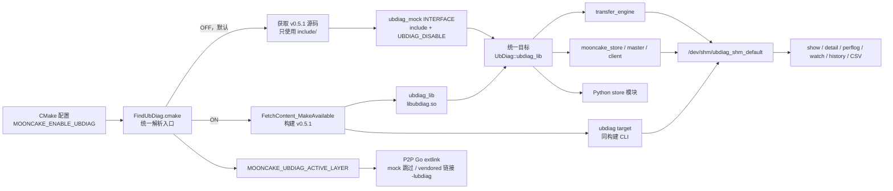
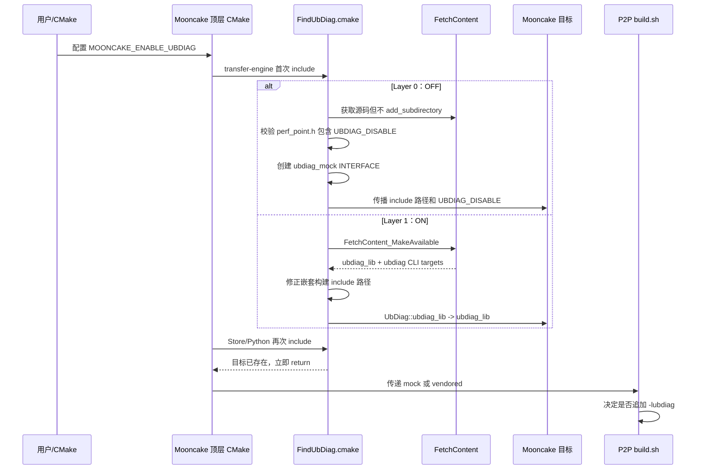
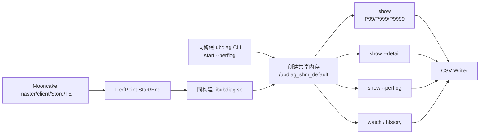

# Mooncake 集成 UbDiag 两层分发：逐行代码解读

> 文档基线
> Mooncake：`qinyufei63/Mooncake:supercache_dev_ubdiag`
> 当前 PR commit：`5c74cb5f04345213942771223c0aa22cd8f44e7f`
> 源码链接快照：`4b5f592b75012ff5760aff63cf47f219ccb76e8b`（与当前 PR 产品树一致，保存在 backup 分支）
> Backup：[backup/supercache_dev_ubdiag_with_verify_20260723](https://github.com/qinyufei63/Mooncake/tree/backup/supercache_dev_ubdiag_with_verify_20260723)
> UbDiag：`LinQuickDev/ubdiag:v0.5.1`
> UbDiag commit：`705c6c37da45df2be4bc64c134dca0b7f30b2113`
> 对应 PR：[LinQuickDev/Mooncake#13](https://github.com/LinQuickDev/Mooncake/pull/13)
> 更新时间：2026-07-23

本文只解释本次“两层分发”正式实现。大体量日志、符号表和 CSV 已移到 backup 分支，不进入正式 PR。

## 1. 先用一句话讲清设计

Mooncake 的所有消费目标始终链接同一个逻辑目标 `UbDiag::ubdiag_lib`：

- **Layer 0，默认关闭**：该目标指向一个 `INTERFACE` mock，只传播 UbDiag 头文件和 `UBDIAG_DISABLE`；`PerfPoint` 在编译期变成 `constexpr` 空函数，不生成、不链接 `libubdiag.so`，也没有 CLI。
- **Layer 1，显式启用**：该目标指向 FetchContent 同步构建出的真实 `ubdiag_lib`；同一源码、同一次构建同时生成 `libubdiag.so` 和 `ubdiag` CLI，具备 PerfPoint、P99/P999/P9999、PerfLog 和 CSV 能力。

用户只切换：

```text
-DMOONCAKE_ENABLE_UBDIAG=OFF   # Layer 0，默认
-DMOONCAKE_ENABLE_UBDIAG=ON    # Layer 1
```

Mooncake 业务目标不需要各自编写 `if/else`。

## 2. 框架图



### 2.1 编译时序



## 3. 源码地图

| 文件 | 本次作用 | 关键行 |
|---|---|---|
| [`mooncake-common/FindUbDiag.cmake`](https://github.com/qinyufei63/Mooncake/blob/4b5f592b75012ff5760aff63cf47f219ccb76e8b/mooncake-common/FindUbDiag.cmake) | 两层选择、源码获取、mock/真实目标、CLI 同步构建 | L1-L123 |
| [`mooncake-transfer-engine/src/CMakeLists.txt`](https://github.com/qinyufei63/Mooncake/blob/4b5f592b75012ff5760aff63cf47f219ccb76e8b/mooncake-transfer-engine/src/CMakeLists.txt) | 首次加载统一入口并链接别名 | L1-L4、L50-L64 |
| [`mooncake-store/src/CMakeLists.txt`](https://github.com/qinyufei63/Mooncake/blob/4b5f592b75012ff5760aff63cf47f219ccb76e8b/mooncake-store/src/CMakeLists.txt) | Store、master、client 链接统一别名 | L247-L255、L275-L309 |
| [`mooncake-integration/CMakeLists.txt`](https://github.com/qinyufei63/Mooncake/blob/4b5f592b75012ff5760aff63cf47f219ccb76e8b/mooncake-integration/CMakeLists.txt) | Python `store` 扩展链接统一别名 | L104-L112 |
| [`mooncake-p2p-store/CMakeLists.txt`](https://github.com/qinyufei63/Mooncake/blob/4b5f592b75012ff5760aff63cf47f219ccb76e8b/mooncake-p2p-store/CMakeLists.txt) | 把当前层传给 Go 外链脚本 | L1-L15 |
| [`mooncake-p2p-store/build.sh`](https://github.com/qinyufei63/Mooncake/blob/4b5f592b75012ff5760aff63cf47f219ccb76e8b/mooncake-p2p-store/build.sh) | 根据层决定是否追加 `-lubdiag` | L16-L53 |
| [`docs/ubdiag_integration_guide.md`](https://github.com/qinyufei63/Mooncake/blob/4b5f592b75012ff5760aff63cf47f219ccb76e8b/docs/ubdiag_integration_guide.md) | 面向使用者的正式构建和运行说明 | L1-L155 |

辅助理解、但本次没有修改的顶层顺序：

- [`CMakeLists.txt` L71-L82](https://github.com/qinyufei63/Mooncake/blob/4b5f592b75012ff5760aff63cf47f219ccb76e8b/CMakeLists.txt#L71-L82)：先加载 common、transfer-engine、store。
- [`CMakeLists.txt` L174-L188](https://github.com/qinyufei63/Mooncake/blob/4b5f592b75012ff5760aff63cf47f219ccb76e8b/CMakeLists.txt#L174-L188)：后加载 Python integration 和 P2P Store。

因此 `FindUbDiag.cmake` 会先在 transfer-engine 或 store 阶段确定全局层，P2P Store 随后可以直接读取 `MOONCAKE_UBDIAG_ACTIVE_LAYER`。

## 4. `FindUbDiag.cmake` 逐行解读

说明：空行和纯分隔注释不单独解释；每一条可执行 CMake 语句均在下面覆盖。

### 4.1 文件契约：L1-L14

源码：[L1-L14](https://github.com/qinyufei63/Mooncake/blob/4b5f592b75012ff5760aff63cf47f219ccb76e8b/mooncake-common/FindUbDiag.cmake#L1-L14)

| 行 | 代码/含义 | 解读 |
|---|---|---|
| L1 | `FindUbDiag.cmake v2` | 明确这是基于 `UBDIAG_DISABLE` 的新两层实现，与旧的“submodule/system/mock”三层方案不是同一套逻辑。 |
| L3 | Layer 0 注释 | 默认模式仍取得 UbDiag 源码头文件，但不构建 UbDiag 工程。 |
| L4 | Layer 1 注释 | 启用后同时构建 SDK 库与 CLI。 |
| L7 | `include(...)` | 所有 Mooncake 子模块通过同一入口解析 UbDiag。 |
| L8 | `target_link_libraries(... UbDiag::ubdiag_lib)` | 消费端永远链接统一别名，不感知当前层。 |
| L11-L12 | `MOONCAKE_ENABLE_UBDIAG` | 唯一主开关；默认 `OFF`。 |
| L13 | `MOONCAKE_UBDIAG_GIT_TAG` | 允许覆盖版本，可填 tag、branch 或 commit。 |
| L14 | `MOONCAKE_UBDIAG_SOURCE_DIR` | 无网络环境可直接指定本地源码。 |

### 4.2 防止重复创建目标：L16-L18

源码：[L16-L18](https://github.com/qinyufei63/Mooncake/blob/4b5f592b75012ff5760aff63cf47f219ccb76e8b/mooncake-common/FindUbDiag.cmake#L16-L18)

```cmake
if(TARGET UbDiag::ubdiag_lib)
  return()
endif()
```

| 行 | 解读 |
|---|---|
| L16 | 查询统一别名是否已经存在。 |
| L17 | 若已存在，说明前面的子目录已经完成两层解析，当前调用直接返回。 |
| L18 | 结束保护块。 |

Mooncake 的 transfer-engine、store 和 Python integration 都会 include 该文件。这个保护避免：

- 重复声明 FetchContent；
- 重复创建 `ubdiag_mock`；
- 重复执行 UbDiag 子工程；
- 后续子目录用不同设置覆盖首次决策。

其直接含义是：**一次 CMake configure 中，第一次 include 的结果就是全局结果**。开关必须在配置命令中预先给出，不能在后续子目录临时修改。

### 4.3 对外配置项：L20-L29

源码：[L20-L29](https://github.com/qinyufei63/Mooncake/blob/4b5f592b75012ff5760aff63cf47f219ccb76e8b/mooncake-common/FindUbDiag.cmake#L20-L29)

| 行 | 代码 | 解读 |
|---|---|---|
| L20 | `option(MOONCAKE_ENABLE_UBDIAG ... OFF)` | 默认进入 Layer 0。用户只有显式传 `ON` 才会构建真实 UbDiag。 |
| L21-L23 | `MOONCAKE_UBDIAG_GIT_REPOSITORY` | 默认源切到 `LinQuickDev/ubdiag` GitHub 镜像，规避原 AtomGit 认证/连通性问题。使用 `CACHE STRING`，允许客户覆盖仓地址。 |
| L24-L26 | `MOONCAKE_UBDIAG_GIT_TAG=v0.5.1` | 两层都默认使用同一个版本，防止 mock 头文件与真实 SDK API 漂移。 |
| L27 | `MOONCAKE_UBDIAG_SOURCE_DIR` | 本地源码入口；类型为 `CACHE PATH`，便于命令行、cmake-gui 和 CI 使用。 |
| L29 | `include(FetchContent)` | 加载 CMake 自带的源码获取/子工程管理能力。 |

### 4.4 Layer 0 入口和源码选择：L31-L45

源码：[L31-L45](https://github.com/qinyufei63/Mooncake/blob/4b5f592b75012ff5760aff63cf47f219ccb76e8b/mooncake-common/FindUbDiag.cmake#L31-L45)

| 行 | 代码/动作 | 解读 |
|---|---|---|
| L32 | `if(NOT MOONCAKE_ENABLE_UBDIAG)` | `OFF` 时进入默认 mock 分支。 |
| L35-L36 | 检查本地源码路径及 `CMakeLists.txt` | 只有用户给出的路径看起来像完整 UbDiag 源码树时才采用。 |
| L37 | 设置 `ubdiag_SOURCE_DIR` | 后续统一通过该变量取得 `include/ubdiag`。 |
| L38 | `else()` | 未提供有效本地路径时走远端 FetchContent。 |
| L39 | `FetchContent_Populate(ubdiag ...)` | **只下载/展开源码，不执行 UbDiag 的 `add_subdirectory`**。这是 Layer 0 零库依赖的关键。 |
| L40 | `GIT_REPOSITORY` | 使用上面可覆盖的仓库地址。 |
| L41 | `GIT_TAG` | 使用同一个可覆盖的版本值，默认 `v0.5.1`。 |
| L42 | `SOURCE_DIR` | 源码固定落到 `${FETCHCONTENT_BASE_DIR}/ubdiag-src`。 |
| L43 | `BINARY_DIR` | 显式保留标准二进制目录位置；Layer 0 不会真正构建其中目标。 |
| L44 | `SUBBUILD_DIR` | 指定 FetchContent 下载辅助工程目录，避免旧单参数接口的兼容问题。 |
| L45 | `endif()` | 结束本地/远端选择。 |

Layer 0 不是“完全不需要 UbDiag 源码”，而是“只需要同版本公共头文件，不需要 UbDiag 二进制”。因此：

- 在线构建仍需访问 GitHub；
- 离线构建必须传 `MOONCAKE_UBDIAG_SOURCE_DIR`；
- 运行时没有 UbDiag 依赖。

### 4.5 Layer 0 能力门禁：L47-L59

源码：[L47-L59](https://github.com/qinyufei63/Mooncake/blob/4b5f592b75012ff5760aff63cf47f219ccb76e8b/mooncake-common/FindUbDiag.cmake#L47-L59)

| 行 | 代码/动作 | 解读 |
|---|---|---|
| L47-L48 | 拼出 `perf_point.h` 路径 | `UBDIAG_DISABLE` 的空实现就在该公共头文件中。 |
| L49 | 检查文件是否存在 | 防止错误目录、残缺源码或不兼容版本静默继续。 |
| L50-L51 | `FATAL_ERROR` | 缺头文件时在配置阶段停止，而不是等到 C++ 编译时报难定位的 include 错误。 |
| L53-L54 | `file(STRINGS ... REGEX "UBDIAG_DISABLE")` | 直接检查所选源码是否包含禁用实现。 |
| L55 | 判断匹配结果是否为空 | 老版本 UbDiag 即使存在 `perf_point.h`，也可能没有 `UBDIAG_DISABLE`。 |
| L56-L58 | `FATAL_ERROR` | 明确要求选择带编译期空实现的 UbDiag 版本，避免所谓 mock 实际调用到未链接的真实函数。 |
| L59 | `endif()` | 能力门禁完成。 |

对应 UbDiag 源码：

- [`perf_point.h` L27-L33](https://github.com/LinQuickDev/ubdiag/blob/705c6c37da45df2be4bc64c134dca0b7f30b2113/include/ubdiag/perf_point.h#L27-L33)：进入 `#ifdef UBDIAG_DISABLE`。
- [`perf_point.h` L35-L46](https://github.com/LinQuickDev/ubdiag/blob/705c6c37da45df2be4bc64c134dca0b7f30b2113/include/ubdiag/perf_point.h#L35-L46)：保留枚举、本地和 global PerfPoint 的构造调用形式。
- [`perf_point.h` L48-L50](https://github.com/LinQuickDev/ubdiag/blob/705c6c37da45df2be4bc64c134dca0b7f30b2113/include/ubdiag/perf_point.h#L48-L50)：`Start()`、`End()`、`Abandon()` 全部是 `constexpr` 空函数。

所以 Mooncake 业务源码不用写：

```cpp
#ifdef ENABLE_UBDIAG
...
#endif
```

原有 `PerfPoint` 调用语法保持不变，编译器直接消除空对象和空操作。

### 4.6 Layer 0 mock 目标：L61-L65

源码：[L61-L65](https://github.com/qinyufei63/Mooncake/blob/4b5f592b75012ff5760aff63cf47f219ccb76e8b/mooncake-common/FindUbDiag.cmake#L61-L65)

| 行 | 代码 | 解读 |
|---|---|---|
| L62 | `add_library(ubdiag_mock INTERFACE)` | 创建只有“使用要求”、没有目标文件的 CMake 接口库。 |
| L63 | `target_include_directories(... INTERFACE ...)` | 所有链接 mock 的消费者自动获得 `ubdiag_SOURCE_DIR/include`。 |
| L64 | `target_compile_definitions(... INTERFACE UBDIAG_DISABLE)` | 所有消费者自动带上禁用宏。宏绑定在目标上，而不是目录级全局污染。 |
| L65 | `add_library(UbDiag::ubdiag_lib ALIAS ubdiag_mock)` | 把统一别名映射到 mock。消费端的链接语句无需分支。 |

这里 `target_link_libraries(target PRIVATE UbDiag::ubdiag_lib)` 在 Layer 0 的真实效果是：

```text
传播 include 路径
  + 传播 -DUBDIAG_DISABLE
  + 不向链接器追加任何 libubdiag
```

这也是判断 mock 成功的三个硬条件：

1. `ldd` 中没有 `libubdiag.so`；
2. `nm -C` 中没有真实 `UbDiag::PerfPoint` 实现符号；
3. 运行 Mooncake 不创建 `/dev/shm/ubdiag_shm*`。

### 4.7 Layer 0 结果发布：L67-L70

源码：[L67-L70](https://github.com/qinyufei63/Mooncake/blob/4b5f592b75012ff5760aff63cf47f219ccb76e8b/mooncake-common/FindUbDiag.cmake#L67-L70)

| 行 | 代码 | 解读 |
|---|---|---|
| L67 | `MOONCAKE_UBDIAG_ACTIVE_LAYER=mock` | 把层结果写入 CMake cache，供稍后配置的 P2P Store 使用。 |
| L68 | `message(STATUS ...)` | 配置日志给出可机器/人工检查的明确模式。 |
| L69 | `return()` | Layer 0 到此结束，绝不会继续执行真实库构建段。 |
| L70 | `endif()` | 关闭 Layer 0 条件。 |

### 4.8 Layer 1 源码声明：L72-L79

源码：[L72-L79](https://github.com/qinyufei63/Mooncake/blob/4b5f592b75012ff5760aff63cf47f219ccb76e8b/mooncake-common/FindUbDiag.cmake#L72-L79)

| 行 | 代码/动作 | 解读 |
|---|---|---|
| L73 | 再次检查本地源码 | Layer 1 同样支持完全离线构建。 |
| L74 | `FetchContent_Declare(... SOURCE_DIR ...)` | 声明直接使用客户提供的本地源码，不访问远端。 |
| L75 | `else()` | 没有本地源码时使用 Git。 |
| L76 | `FetchContent_Declare(ubdiag ...)` | 声明一个待加入构建图的 UbDiag 依赖。 |
| L77 | `GIT_REPOSITORY` | 默认从 `LinQuickDev/ubdiag` 获取。 |
| L78 | `GIT_TAG` | 默认获取 `v0.5.1`。 |
| L79 | `endif()` | 完成 Layer 1 源码来源声明。 |

与 Layer 0 的区别是：

```text
Layer 0：FetchContent_Populate  -> 只有源码
Layer 1：FetchContent_Declare + MakeAvailable -> 源码进入 CMake 构建图
```

### 4.9 Layer 1 功能开关：L81-L87

源码：[L81-L87](https://github.com/qinyufei63/Mooncake/blob/4b5f592b75012ff5760aff63cf47f219ccb76e8b/mooncake-common/FindUbDiag.cmake#L81-L87)

| 行 | 开关 | 解读 |
|---|---|---|
| L81 | `UBDIAG_BUILD_SHARED=ON` | 强制 SDK 产出共享库 `libubdiag.so`，便于 Mooncake 可执行文件、Python 扩展和 CLI 使用一致运行库。 |
| L82 | `ENABLE_PERCENTILE=ON` | 打开 P99/P999/P9999 统计。 |
| L83 | `ENABLE_PERFLOG=ON` | 编译 PerfLog 时间戳/单次探针记录能力；运行时仍需 `ubdiag start --perflog`。 |
| L84 | `ENABLE_OB_MEMORY=OFF` | 不构建 OB 内存分配 eBPF uprobe 扩展，减少依赖。 |
| L85 | `ENABLE_OB_CACHE=OFF` | 不构建 OB cachestat/perf_event 扩展，减少依赖。 |
| L86 | `ENABLE_MEMPOINT=OFF` | 不构建 MemPoint/SystemTap SDT 扩展。 |
| L87 | `UBDIAG_ENABLE_CACHEPOINT=OFF` | 兼容性预留开关；当前固定的 `v0.5.1@705c6c37` 源码没有声明或读取该变量，真正生效的裁剪由 L84-L86 完成。 |

UbDiag 上游对应声明见：

- [`CMakeLists.txt` L19-L27](https://github.com/LinQuickDev/ubdiag/blob/705c6c37da45df2be4bc64c134dca0b7f30b2113/CMakeLists.txt#L19-L27)。
- [`src/sdk/CMakeLists.txt` L19-L25](https://github.com/LinQuickDev/ubdiag/blob/705c6c37da45df2be4bc64c134dca0b7f30b2113/src/sdk/CMakeLists.txt#L19-L25)：`UBDIAG_BUILD_SHARED=ON` 选择 `add_library(ubdiag_lib SHARED ...)`，输出名为 `ubdiag`。

这里的能力边界是：**保留 Mooncake 所需 PerfPoint、分位数、PerfLog、CSV；关闭本任务不需要的观测插件**。CSV 是 CLI 展示/导出能力，不是单独的 CMake 开关。

### 4.10 隔离 UbDiag 通用构建选项：L89-L97

源码：[L89-L97](https://github.com/qinyufei63/Mooncake/blob/4b5f592b75012ff5760aff63cf47f219ccb76e8b/mooncake-common/FindUbDiag.cmake#L89-L97)

| 行 | 代码 | 解读 |
|---|---|---|
| L89 | 定义 `_mooncake_make_ubdiag_available()` | 用函数作用域隔离临时变量。 |
| L92 | `set(BUILD_TESTS OFF)` | 不把 UbDiag 自身单测带入 Mooncake 默认构建。 |
| L93 | `set(BUILD_EXAMPLES OFF)` | 不把 UbDiag 示例带入 Mooncake 默认构建。 |
| L94 | `FetchContent_MakeAvailable(ubdiag)` | 下载/使用源码并执行其 CMake；真实 SDK、manager、runtime、logger 和 CLI 目标在这里创建。 |
| L95 | `ubdiag_SOURCE_DIR ... PARENT_SCOPE` | 把 FetchContent 在函数内得到的源码目录传回外层，供后续 include 路径修复使用。 |
| L96 | `endfunction()` | 结束局部作用域。 |
| L97 | 调用函数 | 真正把 UbDiag 加入本次构建。 |

为什么不直接在文件作用域写 `set(BUILD_TESTS OFF CACHE ... FORCE)`：

- UbDiag 使用的是过于通用的 `BUILD_TESTS`、`BUILD_EXAMPLES`；
- Mooncake 自己也可能使用同名变量；
- 函数作用域只在调用 UbDiag 子工程时提供临时值，返回后不改 Mooncake 原值。

### 4.11 真实目标完整性门禁：L99-L102

源码：[L99-L102](https://github.com/qinyufei63/Mooncake/blob/4b5f592b75012ff5760aff63cf47f219ccb76e8b/mooncake-common/FindUbDiag.cmake#L99-L102)

| 行 | 解读 |
|---|---|
| L99 | 同时要求 SDK 目标 `ubdiag_lib` 和 CLI 目标 `ubdiag` 存在。 |
| L100-L101 | 任意一个缺失都在配置阶段失败，并打印当前版本。 |
| L102 | 结束门禁。 |

这是“CLI 与 `.so` 同步集成”的核心验收点。只构建出 SDK、没有 CLI，或只有 CLI、没有 SDK，都不能被视为 Layer 1 成功。

UbDiag CLI 目标来源：

- [`src/cli/CMakeLists.txt` L11-L22](https://github.com/LinQuickDev/ubdiag/blob/705c6c37da45df2be4bc64c134dca0b7f30b2113/src/cli/CMakeLists.txt#L11-L22)：CLI 源文件包含 `csv_writer.cpp`、`display_engine.cpp`，并创建 `add_executable(ubdiag ...)`。
- [`src/cli/CMakeLists.txt` L24-L26](https://github.com/LinQuickDev/ubdiag/blob/705c6c37da45df2be4bc64c134dca0b7f30b2113/src/cli/CMakeLists.txt#L24-L26)：CLI 链接同一子工程内的 `ubdiag_manager_lib`。

### 4.12 不侵入 UbDiag 源码的 include 修复：L104-L119

源码：[L104-L119](https://github.com/qinyufei63/Mooncake/blob/4b5f592b75012ff5760aff63cf47f219ccb76e8b/mooncake-common/FindUbDiag.cmake#L104-L119)

| 行 | 代码/动作 | 解读 |
|---|---|---|
| L104-L106 | 注释说明根因 | UbDiag 当前若内部使用 `CMAKE_SOURCE_DIR`，作为顶层工程时指向 UbDiag；被 Mooncake FetchContent 后却指向 Mooncake 根目录。 |
| L107-L109 | 枚举可能存在的 UbDiag 内部目标 | 覆盖 logger、SDK、runtime、manager 和 eBPF loader。 |
| L110 | `if(TARGET ...)` | 某些扩展关闭后目标可能不存在，条件保护避免配置失败。 |
| L111 | 对现有目标补 `PUBLIC` include | 让目标自身和依赖它的目标都能看到正确头文件。 |
| L112 | `$<BUILD_INTERFACE:.../include>` | 只在构建树中加入 UbDiag 公共头文件路径。 |
| L113 | `$<BUILD_INTERFACE:.../src>` | 只在构建树中加入 UbDiag 内部源码头路径。 |
| L114-L115 | 结束条件和循环 | 对所有已创建内部目标完成修复。 |
| L116-L119 | 给 CLI 单独补 include、src、src/cli | CLI 是可执行目标，显式补齐自身编译需要的三个目录。 |

这个实现的原则是：**Mooncake 适配 UbDiag 的嵌套构建问题，但不直接修改镜像仓源码**。因此 Mooncake PR 中不会夹带 UbDiag 源文件。

### 4.13 Layer 1 统一出口：L121-L123

源码：[L121-L123](https://github.com/qinyufei63/Mooncake/blob/4b5f592b75012ff5760aff63cf47f219ccb76e8b/mooncake-common/FindUbDiag.cmake#L121-L123)

| 行 | 代码 | 解读 |
|---|---|---|
| L121 | `UbDiag::ubdiag_lib ALIAS ubdiag_lib` | 统一别名从 mock 切换为真实 SDK。所有消费端自动产生真实链接依赖。 |
| L122 | `MOONCAKE_UBDIAG_ACTIVE_LAYER=vendored` | 发布当前层给 P2P 外链脚本。 |
| L123 | 状态日志 | 配置输出明确显示版本以及“库+CLI”均已进入构建。 |

## 5. 消费端接线逐行解读

### 5.1 Transfer Engine

源码：

- [`L1-L4`](https://github.com/qinyufei63/Mooncake/blob/4b5f592b75012ff5760aff63cf47f219ccb76e8b/mooncake-transfer-engine/src/CMakeLists.txt#L1-L4)
- [`L50-L64`](https://github.com/qinyufei63/Mooncake/blob/4b5f592b75012ff5760aff63cf47f219ccb76e8b/mooncake-transfer-engine/src/CMakeLists.txt#L50-L64)

```cmake
file(GLOB ENGINE_SOURCES "*.cpp")
include(${CMAKE_SOURCE_DIR}/mooncake-common/FindUbDiag.cmake)
...
target_link_libraries(
  transfer_engine
  PUBLIC ...
         UbDiag::ubdiag_lib)
```

| 行 | 解读 |
|---|---|
| L1 | 收集 transfer-engine 源文件，原有逻辑。 |
| L2 | 本次把原来的 `find_package(UbDiag REQUIRED)` 替换为项目内统一解析入口。通常这是第一次 include，因此在这里确定全局层。 |
| L3-L4 | 继续加入原有 common/transport 子目录。 |
| L50-L64 | `transfer_engine` 原有链接集合末尾继续使用 `UbDiag::ubdiag_lib`。Layer 0 继承头文件和宏；Layer 1 链接真实 SDK。 |

旧行为要求系统已经安装可被 `find_package` 找到的 UbDiag；新行为由 Mooncake 自己按开关获得固定源码，不再依赖系统包发现。

### 5.2 Mooncake Store、master、client

源码：

- [`L247-L255`](https://github.com/qinyufei63/Mooncake/blob/4b5f592b75012ff5760aff63cf47f219ccb76e8b/mooncake-store/src/CMakeLists.txt#L247-L255)
- [`L275-L299`](https://github.com/qinyufei63/Mooncake/blob/4b5f592b75012ff5760aff63cf47f219ccb76e8b/mooncake-store/src/CMakeLists.txt#L275-L299)
- [`L305-L309`](https://github.com/qinyufei63/Mooncake/blob/4b5f592b75012ff5760aff63cf47f219ccb76e8b/mooncake-store/src/CMakeLists.txt#L305-L309)

| 行 | 解读 |
|---|---|
| L247-L251 | 先建立 `mooncake_store` 的原有依赖关系。 |
| L253 | 注释更新为 FetchContent + `UBDIAG_DISABLE` 两层集成。 |
| L254 | 把原来的 `find_package(UbDiag REQUIRED)` 替换为统一入口；若 transfer-engine 已解析，L16-L18 会立即返回。 |
| L255 | `mooncake_store` 私有链接统一别名。Layer 0 不增加真实库；Layer 1 增加 `libubdiag.so`。 |
| L276 | 创建 `mooncake_master` 可执行文件。 |
| L289-L299 | master 除了 `mooncake_store` 外显式链接 `UbDiag::ubdiag_lib`，确保直接编译到 master 源码中的打点也继承正确模式。 |
| L306 | 创建 `mooncake_client` 可执行文件。 |
| L308-L309 | client 链接 store、transfer-engine 及统一 UbDiag 别名，形成完整客户端数据路径。 |

为什么多个目标都显式链接同一个别名：

- `PRIVATE` 依赖不会保证跨越所有目标层级自动传播；
- master、client、store、transfer-engine 中都可能直接编译含 PerfPoint 的源文件；
- 显式链接让每个目标在 Layer 0 都得到 `UBDIAG_DISABLE`，在 Layer 1 都得到真实 SDK。

### 5.3 Python `store` 扩展

源码：[L104-L112](https://github.com/qinyufei63/Mooncake/blob/4b5f592b75012ff5760aff63cf47f219ccb76e8b/mooncake-integration/CMakeLists.txt#L104-L112)

| 行 | 解读 |
|---|---|
| L104 | 仅在 `WITH_STORE` 时构建 Python store 模块。 |
| L105-L107 | `pybind11_add_module` 创建 Python 原生扩展。 |
| L108 | 保留原有 `$ORIGIN` RPATH。 |
| L110 | 用统一入口替换系统 `find_package`；通常只命中幂等 return。 |
| L111 | 保留 store 自身头文件路径。 |
| L112 | Python 扩展私有链接统一 UbDiag 别名。 |

因此 Python 用户和 C++ 用户使用的是同一次 Mooncake 配置决定的层，不会出现 C++ Store 是 mock、Python 扩展却误连系统 UbDiag 的分裂状态。

## 6. P2P Store 接线逐行解读

P2P Store 的 Go 构建通过 `-extldflags` 手工拼链接参数，不是普通 CMake C++ target，无法只靠 `target_link_libraries` 自动切层，所以需要单独传值。

### 6.1 CMake 向脚本传层：`mooncake-p2p-store/CMakeLists.txt`

源码：[L1-L15](https://github.com/qinyufei63/Mooncake/blob/4b5f592b75012ff5760aff63cf47f219ccb76e8b/mooncake-p2p-store/CMakeLists.txt#L1-L15)

| 行 | 代码/动作 | 解读 |
|---|---|---|
| L2 | `build_p2p_store DEPENDS transfer_engine` | 保证 transfer-engine 及其 UbDiag 层已经配置/构建。 |
| L3-L4 | 给自定义目标增加构建命令 | P2P 仍沿用外部 shell 构建方式。 |
| L5 | `bash build.sh` | 调用 Go 外链脚本。 |
| L6 | `${CMAKE_CURRENT_BINARY_DIR}` | P2P 输出目录。 |
| L7-L10 | ETCD/Redis/HTTP 等原有参数 | 与 UbDiag 无关，仅改成逐行排版。 |
| L11 | `${CMAKE_BINARY_DIR}` | Mooncake 总构建目录，用于找 transfer-engine、common 和 UbDiag 库。 |
| L12 | `${MOONCAKE_UBDIAG_ACTIVE_LAYER}` | 本次新增第七参数，值只能由统一入口发布为 `mock` 或 `vendored`。 |
| L13 | `WORKING_DIRECTORY` | 保证脚本从 `mooncake-p2p-store` 源码目录执行。 |
| L15 | `EXCLUDE_FROM_ALL FALSE` | 保持 P2P 目标进入默认构建。 |

### 6.2 Shell 根据层拼链接参数：`build.sh`

源码：

- [`L16-L27`](https://github.com/qinyufei63/Mooncake/blob/4b5f592b75012ff5760aff63cf47f219ccb76e8b/mooncake-p2p-store/build.sh#L16-L27)
- [`L35-L53`](https://github.com/qinyufei63/Mooncake/blob/4b5f592b75012ff5760aff63cf47f219ccb76e8b/mooncake-p2p-store/build.sh#L35-L53)

| 行 | 代码/动作 | 解读 |
|---|---|---|
| L16 | 参数数量从 6 改为 7 | 防止旧调用漏传 UbDiag 层后继续构建。 |
| L17 | Usage 增加 `UBDIAG_LAYER` | 报错信息与接口同步。 |
| L18-L19 | 参数不符立即退出 | 避免生成链接行为不确定的二进制。 |
| L21-L26 | 读取原有六个参数 | 保持原有构建接口含义。 |
| L27 | `UBDIAG_LAYER=$7` | 保存 CMake 传来的层结果。 |
| L35-L38 | 拼各 Mooncake 库目录 | 原有逻辑。 |
| L39 | 基础库集合 | 本次从公共集合中删除了无条件的 `-lubdiag`。 |
| L41 | 注释 | 明确 vendored 才链接真实库，mock 不存在可链接库。 |
| L42 | `case "$UBDIAG_LAYER"` | 开始层分支。 |
| L43 | `vendored)` | Layer 1。 |
| L44 | 指向 `_deps/ubdiag-build/src/sdk` | 与 FetchContent 的真实 SDK 输出目录一致。 |
| L45 | 追加 `-L... -lubdiag` | Go 外部链接器使用本次构建的 `libubdiag.so`。 |
| L46 | 结束 vendored 分支 | 防止落入后续分支。 |
| L47 | `mock)` | Layer 0。 |
| L48 | 只打印跳过日志 | mock 只有头文件空实现，没有 `libubdiag` 可链接。 |
| L49 | 结束 mock 分支 | 正常返回 case。 |
| L50-L52 | 未知层 | 当前行为是告警后跳过 `-lubdiag`。这是 fail-open 行为，见风险章节。 |
| L53 | `esac` | 完成 UbDiag 链接选择。 |

## 7. 从配置到运行的完整链路

### 7.1 Layer 0

```text
cmake -DMOONCAKE_ENABLE_UBDIAG=OFF
  -> FindUbDiag 获取 v0.5.1 头文件
  -> 校验 perf_point.h 支持 UBDIAG_DISABLE
  -> ubdiag_mock INTERFACE
  -> UbDiag::ubdiag_lib -> ubdiag_mock
  -> 每个消费者得到 include + -DUBDIAG_DISABLE
  -> PerfPoint 构造/Start/End/Abandon 编译为空
  -> 不生成 CLI
  -> 不生成/链接 libubdiag
  -> 不创建 UbDiag SHM
```

### 7.2 Layer 1

```text
cmake -DMOONCAKE_ENABLE_UBDIAG=ON
  -> FetchContent 获取 v0.5.1
  -> 强制 shared + percentile + perflog
  -> 关闭 OB memory/cache + MemPoint
  -> FetchContent_MakeAvailable
  -> 同一构建树创建 ubdiag_lib 和 ubdiag CLI
  -> UbDiag::ubdiag_lib -> ubdiag_lib
  -> Mooncake targets 链接 libubdiag.so
  -> 使用同构建 CLI 执行 start --perflog
  -> Mooncake PerfPoint 写入共享内存
  -> CLI show/detail/perflog/watch/history 读取
  -> CSV Writer 落盘
```

### 7.3 运行时数据链



CLI 与 `.so` 必须同源同构建的原因：

- 二者共享同一套 SHM 数据结构和版本约定；
- P99、PerfLog 等编译特性必须一致；
- 混用系统旧 CLI 可能能启动，但会出现字段、布局或功能不一致；
- 本次 245 验证中直接执行 Layer 1 私有路径，已确认用的是构建目录 CLI，而不是宿主机 `PATH` 中的 CLI。

## 8. 用户实际命令

### 8.1 Layer 0

```bash
cmake -S . -B build-mock \
  -DMOONCAKE_ENABLE_UBDIAG=OFF
cmake --build build-mock -j
```

预期配置日志：

```text
UbDiag: UBDIAG_DISABLE(空函数,零依赖)
```

验证：

```bash
ldd build-mock/mooncake-store/src/mooncake_master | grep libubdiag
nm -C build-mock/mooncake-store/src/mooncake_master | grep 'UbDiag::PerfPoint'
find /dev/shm -maxdepth 1 -name 'ubdiag_shm*'
```

三条命令都应无匹配输出。

### 8.2 Layer 1

```bash
cmake -S . -B build-vendored \
  -DMOONCAKE_ENABLE_UBDIAG=ON
cmake --build build-vendored -j
```

预期配置日志：

```text
UbDiag: FetchContent 编译 v0.5.1(库+CLI)
```

关键产物：

```text
build-vendored/_deps/ubdiag-build/src/sdk/libubdiag.so
build-vendored/_deps/ubdiag-build/src/cli/ubdiag
```

运行：

```bash
UBDIAG_BUILD="$PWD/build-vendored/_deps/ubdiag-build"
UBDIAG_CLI="$UBDIAG_BUILD/src/cli/ubdiag"
export LD_LIBRARY_PATH="$UBDIAG_BUILD/src/sdk${LD_LIBRARY_PATH:+:$LD_LIBRARY_PATH}"

"$UBDIAG_CLI" start --perflog
"$UBDIAG_CLI" status

# 启动 Mooncake 并运行 workload 后：
"$UBDIAG_CLI" show
"$UBDIAG_CLI" show --detail
"$UBDIAG_CLI" show --perflog
"$UBDIAG_CLI" show --csv ./ubdiag-results
"$UBDIAG_CLI" stop
```

### 8.3 离线源码

```bash
cmake -S . -B build-vendored \
  -DMOONCAKE_ENABLE_UBDIAG=ON \
  -DMOONCAKE_UBDIAG_SOURCE_DIR=/opt/src/ubdiag
```

本地源码应核验为：

```text
705c6c37da45df2be4bc64c134dca0b7f30b2113
```

## 9. 能力矩阵

| 能力 | Layer 0：OFF | Layer 1：ON |
|---|---:|---:|
| 使用固定 UbDiag 公共头文件 | 是 | 是 |
| `PerfPoint` 调用语法保持不变 | 是 | 是 |
| `PerfPoint` 真实采集 | 否，编译为空 | 是 |
| `libubdiag.so` | 不构建、不链接 | 同步构建并链接 |
| `ubdiag` CLI | 不构建 | 同步构建 |
| P99/P999/P9999 | 不适用 | 开启 |
| PerfLog | 不适用 | 编译开启，运行时 `start --perflog` |
| CSV | 不适用 | CLI 支持 |
| MemPoint | 关闭 | 关闭 |
| OB memory/cache 扩展 | 关闭 | 关闭 |
| 运行时 SHM | 无 | 有 |
| 系统 UbDiag 包 | 不需要 | 不使用 |
| 离线本地源码 | 支持 | 支持 |

## 10. PR 中到底改了多少产品代码

当前 PR 已清理验证证据，最终净 diff 为 **7 个文件、308 行新增、8 行删除**：

| 类别 | 文件数 | 内容 |
|---|---:|---|
| 核心实现 | 6 | 1 个统一 CMake 入口、3 个 CMake 消费端、P2P CMake 和 shell |
| 用户指南 | 1 | 两层模式的构建、运行、离线和验收说明 |
| 验证证据 | 0 | 不进入正式 PR；33 个证据文件保存在 backup 分支 |
| UbDiag 源码 | 0 | 不把 UbDiag 源码或 submodule 放进 Mooncake PR |

验证证据位于
[`backup/supercache_dev_ubdiag_with_verify_20260723/docs/verify`](https://github.com/qinyufei63/Mooncake/tree/backup/supercache_dev_ubdiag_with_verify_20260723/docs/verify)。
UbDiag 由 `FindUbDiag.cmake` 从 `LinQuickDev/ubdiag:v0.5.1` 获取，或由用户通过 `MOONCAKE_UBDIAG_SOURCE_DIR` 提供。

## 11. 已完成验证

### 11.1 245/247 aarch64 + UB/URMA

Layer 0：

- 245 master、247 client 正常；
- UB write benchmark：`STATUS: PASSED`；
- UB read benchmark：18,320 queries，failed 0；
- 吞吐：56.98 GB/s；
- mock 符号门禁通过；
- 不链接 `libubdiag`；
- 不创建 UbDiag SHM。

Layer 1：

- 245 master、247 client 正常；
- UB write benchmark：`STATUS: PASSED`；
- UB read benchmark：17,775 queries，failed 0；
- 吞吐：55.36 GB/s；
- `libubdiag.so` 与 CLI 均来自 `build_vendored/_deps/ubdiag-build`；
- PerfPoint、P99/P999/P9999、PerfLog 正常返回数据；
- CSV 六类导出通过。

247 数据：

| 输出 | 数据行/文件行 |
|---|---:|
| show | 32 / 33 |
| detail | 396 / 397 |
| perflog | 1475 / 1476 |
| rawtable CSV | 8 文件行 |
| watch CSV | 165 文件行 |
| history CSV | 577 文件行 |

245 master 数据：

| 输出 | 数据行/文件行 |
|---|---:|
| show | 10 / 11 |
| detail | 41 / 42 |
| perflog | 510 / 511 |

证据包：

```text
/home/q00913006/project/mooncake_pr13_ub_full_evidence_20260723.tar.gz
SHA-256:
e155c5e4e3104a975b3ecf0542027cab2461fb8bf50fd9ceebbb7489775d7a92
```

### 11.2 非 UB/TCP 兼容验证

Backup 分支的
[`docs/verify/`](https://github.com/qinyufei63/Mooncake/tree/backup/supercache_dev_ubdiag_with_verify_20260723/docs/verify)
保存了 WSL2 openEuler x86_64 的两层完整兼容验证。它证明 FetchContent、mock、真实库、CLI、PerfLog 和六类 CSV 的集成路径可运行，但不能替代上面的 aarch64 + UB/URMA 生产环境验收。

## 12. 必须向项目组说明的风险和边界

| 风险/边界 | 实际情况 | 建议 |
|---|---|---|
| CLI 显示 `0.5.0` | Git tag `v0.5.1` 已准确指向 `705c6c37`，但 UbDiag 源码 [`project()`](https://github.com/LinQuickDev/ubdiag/blob/705c6c37da45df2be4bc64c134dca0b7f30b2113/CMakeLists.txt#L13) 和 [`versionString`](https://github.com/LinQuickDev/ubdiag/blob/705c6c37da45df2be4bc64c134dca0b7f30b2113/include/ubdiag/version.h#L17-L20) 仍是 `0.5.0` | 这是上游发布元数据不一致，不是 Mooncake 拉错源码；合入前建议由 UbDiag 仓修正版本并规范 release/tag 流程 |
| tag 可移动 | CMake 默认固定 tag 名，不是不可变 SHA | 正式 release 可把默认值改为准确 commit，或建立 tag 不可移动约束 |
| Layer 0 仍需源码 | 运行时零依赖，但配置时要取得同版本头文件 | 离线环境必须准备 `MOONCAKE_UBDIAG_SOURCE_DIR` |
| 首次 include 决定全局模式 | 幂等保护会让后续 include 直接返回 | 必须在顶层 CMake 命令行一次性设置开关；两种模式使用不同 build 目录 |
| 强制 cache 功能开关 | shared、P99、PerfLog 和裁剪项使用 `CACHE ... FORCE` | 这是保证 Mooncake 组合一致性的设计；若未来同一超级工程还嵌入第二套 UbDiag，需要重新评估变量隔离 |
| `UBDIAG_ENABLE_CACHEPOINT` 当前无上游消费者 | L87 对固定 v0.5.1 是兼容性预留，当前实际不生效 | 后续升级 UbDiag 时复查开关名；当前裁剪依赖 `ENABLE_OB_CACHE/OB_MEMORY/MEMPOINT` |
| include 修复耦合目标名 | Mooncake 枚举 UbDiag 内部 targets | UbDiag 重命名内部 target 时配置可能失败或编译缺 include；升级版本必须跑 Layer 1 配置和 CLI 构建门禁 |
| P2P 未知层 fail-open | `build.sh` 遇到未知值只告警并跳过 `-lubdiag` | 建议后续改成 `exit 1`，防止配置传播缺陷被隐藏 |
| RPATH/运行库选择 | 用户指南通过 `LD_LIBRARY_PATH` 确保使用同构建 `.so` | RPM/安装场景应补正式 install/RPATH/打包验收，不能依赖宿主机同名库 |
| RPM 不在本 PR 实现范围 | 当前七个正式文件保证源码构建和用户操作，不包含 Mooncake RPM 打包脚本改动 | 若最终交付要求“一个 RPM 自带 CLI + `.so`”，需要单独补并验收 RPM `%files`/install 规则 |
| URMA B081/B106 环境问题 | 245/247 验证曾出现编译头与系统运行库版本不一致；这是验证环境依赖问题 | 不应把临时 URMA 兼容处理写进 UbDiag 两层正式代码；容器中固定成套 UMDK 头、库、provider |

## 13. 代码评审时最容易问的五个问题

### 13.1 为什么 Layer 0 还要拉 UbDiag 源码？

为了让 ON/OFF 两层使用同一版本 `perf_point.h` 和同一调用接口。OFF 只是把实现编译为空，不维护第二套 Mooncake 私有 mock 头，避免 API 漂移。

### 13.2 为什么不用 `find_package(UbDiag)`？

两层设计已经取消系统包层。默认仓库/tag或显式本地源码是唯一来源，能保证 CLI、SDK 和公共头文件版本一致。

### 13.3 CLI 为什么一定与 `.so` 同时构建？

CLI 负责创建、读取和导出 SDK 写入的共享内存。二者若来自不同提交或不同功能开关，共享内存布局和字段能力可能不一致。L99-L102 明确要求两个 target 同时存在。

### 13.4 为什么不在各目标写 `if(MOONCAKE_ENABLE_UBDIAG)`？

统一别名已经封装差异。消费端只声明“我依赖 UbDiag 接口”，模式选择由一个文件负责，减少重复条件和漏改目标。

### 13.5 为什么 P2P 例外？

P2P 的 Go 构建使用手工 `-extldflags`，不接受 CMake target 的传递使用要求，所以必须把 `mock/vendored` 字符串传入 shell 后单独决定 `-lubdiag`。

## 14. 上会串讲版

本次改造把 Mooncake 原来依赖系统 `find_package(UbDiag)` 的方式，收敛成一个 `FindUbDiag.cmake` 两层入口。默认 Layer 0 只拉固定版本头文件，通过 `INTERFACE` target 向所有 Mooncake 目标传播 `UBDIAG_DISABLE`，因此 PerfPoint 在编译期被消除，没有 CLI、动态库和共享内存依赖。显式打开 Layer 1 后，FetchContent 从同一份 `v0.5.1` 源码同时构建 `libubdiag.so` 和 `ubdiag` CLI，并强制打开分位数和 PerfLog、关闭本任务不需要的扩展。所有 C++/Python 消费端仍只链接 `UbDiag::ubdiag_lib`，P2P Go 外链则读取统一入口发布的层值决定是否追加 `-lubdiag`。245/247 的 aarch64 UB 实机验证已经证明两层 Mooncake benchmark、PerfPoint、P99、PerfLog 和 CSV 全链路可用。
