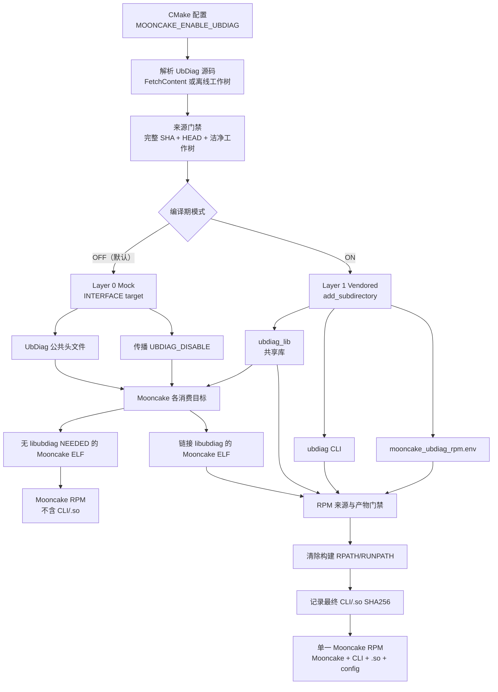
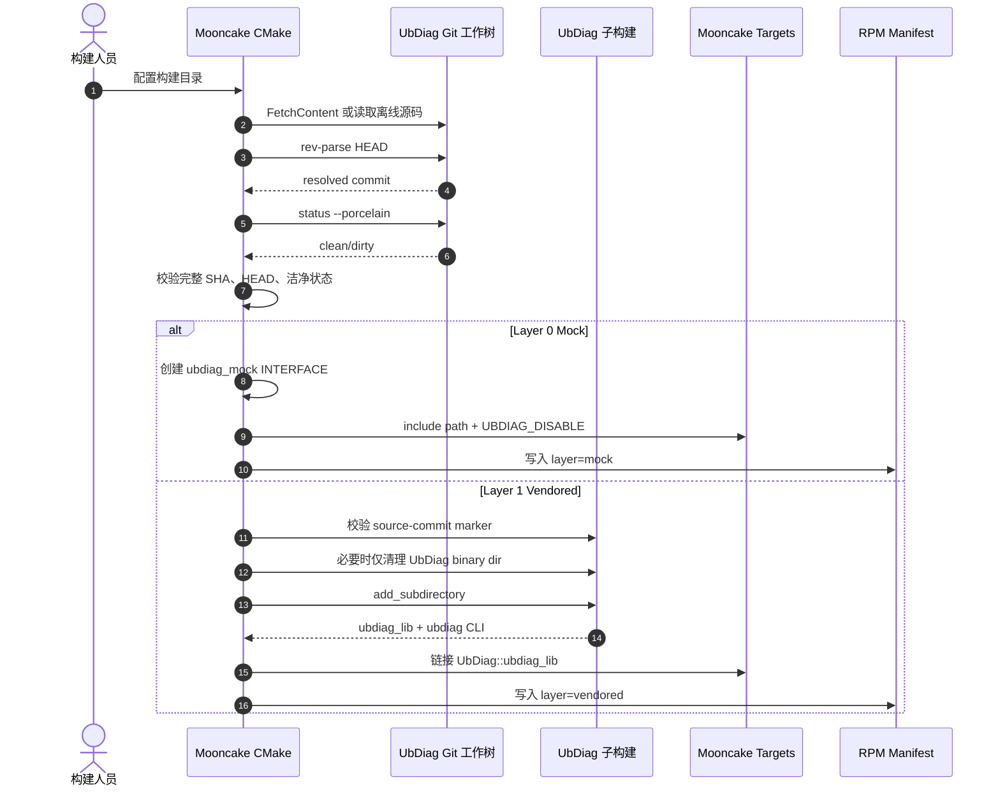
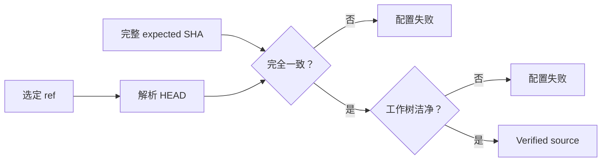
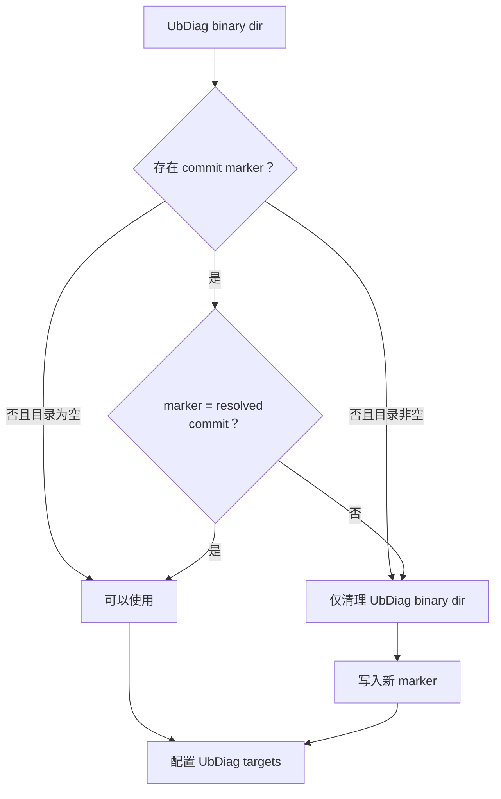
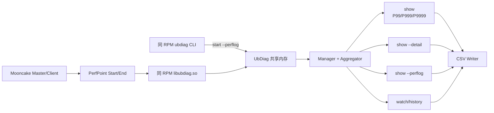
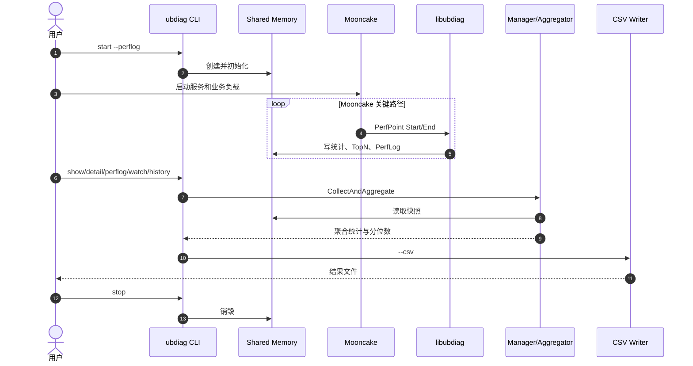
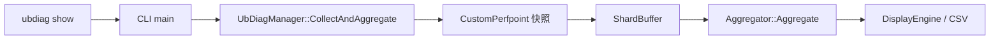
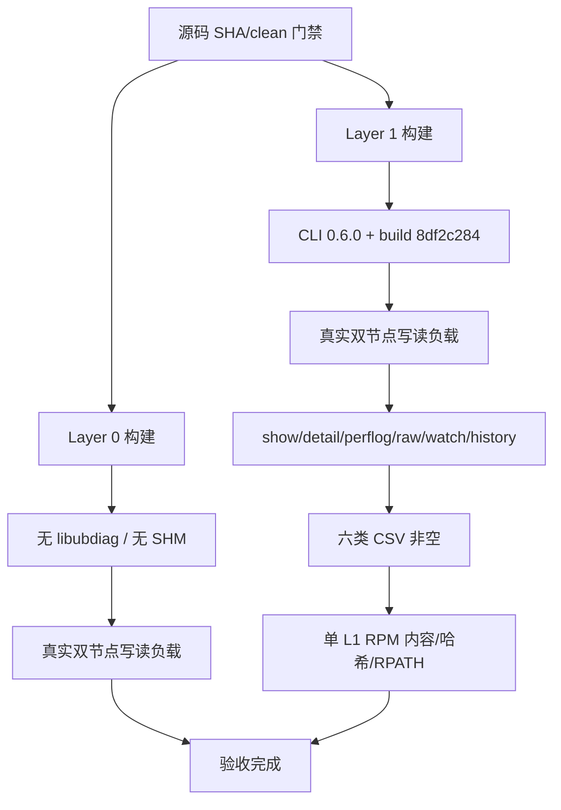

# Mooncake UbDiag 两层分发与 CLI 单 RPM 集成技术交付

本文说明 Mooncake 如何在不改变业务打点调用方式的前提下，提供编译期
Layer 0 Mock 与 Layer 1 Vendored 两种构建模式；并说明 Layer 1 如何将
Mooncake、UbDiag CLI、`libubdiag.so`、配置和来源证明交付在一个 RPM 中。

本文面向架构评审、代码评审、构建发布和后续维护人员。用户操作请参见
[Mooncake UbDiag 两层分发与单 RPM 使用指南](ubdiag_integration_guide.md)。

## 1. 交付范围

本次交付解决四个相互关联的问题：

1. 默认构建不需要 UbDiag 运行时依赖，但 Mooncake 源码继续保留统一
   PerfPoint 调用。
2. 启用诊断时，CLI 与共享库必须来自同一份精确源码和同一次构建。
3. 客户只安装一个 Mooncake RPM，即可获得 Mooncake 与配套 UbDiag。
4. 构建机中已有的其他 UbDiag、陈旧 `_deps` 目录和绝对 RPATH 不能污染
   最终 RPM。

当前基线：

| 项目 | 基线 | 说明 |
|------|------|------|
| Mooncake 集成 | `7f67d6df` | 两层选择、来源门禁、单 RPM、RPATH 清理 |
| UbDiag | `8df2c284` | 0.6.0、P99、PerfLog、CSV、Aggregator 边界修复 |

## 2. 一张图看懂总体架构



最重要的边界是：**两层表示两种编译结果，不表示同时交付两个包。**
一次构建选择一个模式，并只产生该模式对应的 Mooncake RPM。

## 3. 模式能力矩阵

| 能力 | Layer 0 Mock | Layer 1 Vendored |
|------|--------------|-------------------|
| 默认模式 | 是 | 否 |
| 解析并校验精确 UbDiag 源码 | 是 | 是 |
| 编译 `libubdiag.so` | 否 | 是 |
| 编译 `ubdiag` CLI | 否 | 是 |
| Mooncake ELF 依赖 `libubdiag` | 否 | 是 |
| PerfPoint 调用 | `constexpr` 空实现 | 真实采集 |
| P99/P999/P9999 | 不适用 | 支持 |
| PerfLog | 不适用 | 支持 |
| CSV | 不适用 | 支持 |
| RPM 包含 UbDiag | 否 | CLI、共享库、配置、provenance |
| 运行时不执行 `ubdiag start` | 无 UbDiag 运行时 | 诊断不采集，但仍是 L1 二进制 |

## 4. 配置与构建时序



## 5. 源码身份门禁

入口位于
[FindUbDiag.cmake L13-L35](../mooncake-common/FindUbDiag.cmake#L13-L35)。
首先拒绝并非由当前 Mooncake build 创建的同名 target，然后配置仓库、
选定 ref、完整期望提交和可选离线源码目录。

```cmake
if(TARGET UbDiag::ubdiag_lib)
  get_property(_MOONCAKE_UBDIAG_TARGET_OWNER GLOBAL
               PROPERTY MOONCAKE_UBDIAG_TARGET_OWNER)
  if(NOT _MOONCAKE_UBDIAG_TARGET_OWNER STREQUAL "${CMAKE_BINARY_DIR}")
    message(FATAL_ERROR "UbDiag::ubdiag_lib ... was not created by Mooncake")
  endif()
endif()
```

来源校验位于
[FindUbDiag.cmake L39-L93](../mooncake-common/FindUbDiag.cmake#L39-L93)：

1. 期望提交必须是 40 位十六进制 SHA。
2. 源码必须保留 `.git` 元数据和 `CMakeLists.txt`。
3. `git rev-parse HEAD` 必须等于期望提交。
4. `git status --porcelain --untracked-files=all` 必须为空。



这里同时防止两类常见问题：

- tag 被移动后，构建内容悄然变化；
- HEAD 没变，但本地文件被修改或新增，导致 SHA 无法描述真实输入。

## 6. Layer 0：编译期 Mock

Layer 0 实现在
[FindUbDiag.cmake L124-L151](../mooncake-common/FindUbDiag.cmake#L124-L151)。

```cmake
add_library(ubdiag_mock INTERFACE)
target_include_directories(ubdiag_mock INTERFACE ${ubdiag_SOURCE_DIR}/include)
target_compile_definitions(ubdiag_mock INTERFACE UBDIAG_DISABLE)
add_library(UbDiag::ubdiag_lib ALIAS ubdiag_mock)
```

Mooncake 继续链接统一目标 `UbDiag::ubdiag_lib`，但该目标只是 INTERFACE：

- 向消费目标传播同一版本的公共头文件；
- 传播 `UBDIAG_DISABLE`；
- 不创建、链接或打包真实共享库；
- PerfPoint 构造、`Start`、`End` 和 `Abandon` 在头文件中成为空实现。

因此业务源码不需要维护两套调用路径，编译器可以消除空对象及相关操作。

## 7. Layer 1：同源构建 CLI 与共享库

Layer 1 实现在
[FindUbDiag.cmake L154-L228](../mooncake-common/FindUbDiag.cmake#L154-L228)。

### 7.1 子构建版本隔离

`_deps/ubdiag-build/mooncake-source-commit.txt` 记录该子构建对应的源码提交。
如果标记缺失、目录非空但身份未知，或标记与当前源码不一致，只删除
UbDiag binary dir，不清理 Mooncake 其他构建结果。



### 7.2 功能范围

```cmake
set(UBDIAG_BUILD_SHARED ON CACHE BOOL "" FORCE)
set(ENABLE_PERCENTILE ON CACHE BOOL "" FORCE)
set(ENABLE_PERFLOG ON CACHE BOOL "" FORCE)
set(ENABLE_OB_MEMORY OFF CACHE BOOL "" FORCE)
set(ENABLE_OB_CACHE OFF CACHE BOOL "" FORCE)
set(ENABLE_MEMPOINT OFF CACHE BOOL "" FORCE)
set(UBDIAG_ENABLE_CACHEPOINT OFF CACHE BOOL "" FORCE)
```

本次保留 Mooncake 所需的 PerfPoint、P99/P999/P9999、PerfLog 和 CSV，
关闭与当前交付无关的通用观测扩展，减少编译和运行依赖。

UbDiag 的通用 `BUILD_TESTS`、`BUILD_EXAMPLES` 只在函数作用域内关闭，避免
覆盖 Mooncake 顶层同名选项。配置结束后必须同时存在 `ubdiag_lib` 和
`ubdiag` target，否则立即失败。

## 8. Mooncake 消费链路

所有消费方都依赖统一 target，而不直接拼接库路径：

| 文件 | 作用 | 代码位置 |
|------|------|----------|
| `mooncake-transfer-engine/src/CMakeLists.txt` | Transfer Engine 链接统一 UbDiag target | [L50-L64](../mooncake-transfer-engine/src/CMakeLists.txt#L50-L64) |
| `mooncake-store/src/CMakeLists.txt` | Store 引入集成并链接 target | [L253-L255](../mooncake-store/src/CMakeLists.txt#L253-L255) |
| `mooncake-store/src/CMakeLists.txt` | Master/Client 显式链接 | [L275-L309](../mooncake-store/src/CMakeLists.txt#L275-L309) |
| `mooncake-integration/CMakeLists.txt` | Python Store 模块链接 | [L104-L112](../mooncake-integration/CMakeLists.txt#L104-L112) |
| `mooncake-p2p-store/CMakeLists.txt` | 向独立构建脚本传递 active layer | [L1-L13](../mooncake-p2p-store/CMakeLists.txt#L1-L13) |
| `mooncake-p2p-store/build.sh` | 仅 vendored 模式增加 `-lubdiag` | [L41-L53](../mooncake-p2p-store/build.sh#L41-L53) |

统一 target 的价值是把“Mock 传播编译宏”和“Vendored 链接真实库”的差异
封装在 `FindUbDiag.cmake` 内，业务模块只表达“我消费 UbDiag 接口”。

## 9. Manifest 与可复现打包

配置阶段由
[FindUbDiag.cmake L95-L108](../mooncake-common/FindUbDiag.cmake#L95-L108)
生成 `mooncake_ubdiag_rpm.env`：

```text
MOONCAKE_UBDIAG_LAYER
MOONCAKE_UBDIAG_GIT_REPOSITORY
MOONCAKE_UBDIAG_GIT_TAG
MOONCAKE_UBDIAG_EXPECTED_COMMIT
MOONCAKE_UBDIAG_RESOLVED_COMMIT
MOONCAKE_UBDIAG_SOURCE_DIR
```

打包脚本在
[build_rpm.sh L80-L170](../scripts/build_rpm.sh#L80-L170) 中按 allowlist
解析清单，而不是将清单作为 shell 脚本执行。随后重新检查源码 HEAD 与
洁净状态，防止“配置后、打包前”源码发生变化。

```mermaid
flowchart LR
    Config["CMake 配置"] --> Manifest["受限 manifest"]
    Manifest --> Recheck["打包时重新检查 HEAD/clean"]
    Recheck --> Marker["核对 ubdiag-build marker"]
    Marker --> Paths["从当前 build 推导 CLI/.so"]
    Paths --> Compare["复制后逐文件比较"]
    Compare --> Strip["清除 staged RPATH"]
    Strip --> Hash["计算最终文件 SHA256"]
    Hash --> Prov["写入 provenance"]
    Prov --> RPM["生成单一 Mooncake RPM"]
```



### 9.1 L1 单 RPM 内容

Layer 1 打包实现位于
[build_rpm.sh L310-L410](../scripts/build_rpm.sh#L310-L410)。

```text
mooncake-<version>.<arch>.rpm
├── /usr/bin/mooncake_master
├── /usr/bin/mooncake_client
├── /usr/bin/ubdiag
├── /usr/lib64/libubdiag.so
├── /usr/lib64/libubdiag.so.0
├── /usr/lib64/libubdiag.so.0.6.0
├── /etc/ubdiag/ubdiag.conf
└── /usr/share/doc/mooncake/ubdiag-provenance.txt
```

客户不需要安装第二个 UbDiag CLI 包。CLI 与 `.so` 来自同一次
`add_subdirectory` 构建，避免共享内存布局和功能宏不一致。

### 9.2 RPATH 清理

直接复制 build-tree ELF 会保留 `_deps/ubdiag-build/src/sdk` 绝对 RPATH。
在出包机器上测试解包文件时，动态加载器会优先使用原构建目录，而不是
RPM 中的 `.so`；客户环境虽可能因该目录不存在而回落，但交付不能依赖
这种偶然行为。

[RemoveRpath.cmake L1-L9](../cmake/RemoveRpath.cmake#L1-L9) 使用 CMake
标准能力修改暂存 ELF：

```cmake
file(RPATH_REMOVE FILE "${INPUT_FILE}")
```

[build_rpm.sh L64-L78](../scripts/build_rpm.sh#L64-L78) 在修改后再次读取
动态段，只要仍有 `RPATH` 或 `RUNPATH` 就拒绝出包。CLI 和每个依赖
`libubdiag.so` 的 Mooncake ELF 都执行该门禁
（[L516-L540](../scripts/build_rpm.sh#L516-L540)）。

处理顺序特意设计为：

1. 先比较 staged 文件与 build 输出，证明来源未被替换；
2. 再执行 RPATH 这一预期打包变换；
3. 最后对 staged 最终字节计算哈希并写入 provenance。

## 10. 运行时链路





## 11. Aggregator 越界问题与修复

### 11.1 架构位置

该问题不在 Mooncake 传输或打点写入路径，而在 UbDiag CLI 的读取聚合链路：



### 11.2 根因

快照元数据声明的 `numCores`、程序 slot 范围或 `slotIndex` 可能大于实际
`ShardBuffer` 容量。旧聚合器直接信任元数据并访问 `coreStats[j]`，导致
CLI 在真实多核环境读取数据时越界。

### 11.3 解决办法

修复位于 UbDiag
[aggregator.cpp L23-L53](https://github.com/LinQuickDev/ubdiag/blob/8df2c2844d402e2e4dcd5ceab2424e8d36c5f99f/src/manager/aggregator.cpp#L23-L53)：

```cpp
const size_t coreCount =
    std::min(static_cast<size_t>(numCores), srcShards.size());
const uint32_t maxSlots = srcShards.maxSlots();

if (base >= maxSlots) continue;
uint32_t end = base + std::min(count, maxSlots - base);
...
if (slotIdx >= maxSlots) continue;
```

同时将 global 统计数量限制在实际 slot 容量内。修复遵循“读取方不信任
共享内存元数据尺寸”的原则，不改变正常数据的统计语义。

新增测试覆盖：

- 声明核数大于实际 shard 数；
- 程序 slot 范围超过 shard 容量；
- `slotIndex` 非法；
- 原有计数、Min/Max、TopN 和 P99 行为保持。

对应测试见
[test_aggregator.cpp L100-L140](https://github.com/LinQuickDev/ubdiag/blob/8df2c2844d402e2e4dcd5ceab2424e8d36c5f99f/tests/test_aggregator.cpp#L100-L140)。

## 12. 验证闭环



已完成的验证：

| 维度 | 结果 |
|------|------|
| Layer 0 配置与构建 | `UBDIAG_DISABLE` 传播，Mooncake ELF 无 `libubdiag` 依赖 |
| Layer 0 运行 | 双节点真实写/读负载通过，不创建 UbDiag SHM |
| Layer 1 配置与构建 | CLI、共享库与 Mooncake 来自精确 `8df2c284` |
| Layer 1 运行 | 双节点真实写/读负载通过 |
| CLI | summary、detail、PerfLog、raw table、watch、history 均通过 |
| 分位数 | P99、P999、P9999 输出通过 |
| CSV | summary、detail、PerfLog、raw table、watch、history 六类文件落盘 |
| Aggregator 修复 | 真实数据读取不再发生越界崩溃 |
| L1 RPM | 一个 RPM 包含 Mooncake、CLI、`.so`、配置和 provenance |
| RPM 来源 | 完整提交、最终 CLI SHA256、真实 `.so` SHA256 一致 |
| RPM 加载边界 | CLI 与 Mooncake 消费者均无构建目录 RPATH/RUNPATH |

## 13. 风险与项目组说明

| 风险或边界 | 说明 | 建议 |
|------------|------|------|
| 编译期模式不能运行时切换 | L1 不启动 SHM 只是“不采集”，不是 Layer 0 | 发布前明确选择构建模式 |
| CLI 与 `.so` 必须同源 | 混用版本可能导致布局或功能宏不一致 | 只使用同一 RPM 内文件 |
| 离线源码必须保留 Git 信息 | 仅复制源码目录无法完成 SHA/clean 校验 | 使用完整洁净工作树或 bundle |
| 功能裁剪是有意行为 | 内存、Cache、MemPoint 等扩展当前关闭 | 新需求需显式评估依赖后开启 |
| PMU 能力与聚合越界不同 | 平台探测信号不能掩盖后续真实内存越界 | 调试时区分探测信号和最终崩溃栈 |
| build-tree ELF 不等于可交付 ELF | 构建 RPATH 会污染解包验证 | 必须验证最终 RPM 动态段 |
| 标签不能替代完整 SHA | 标签可能移动或指向 annotated object | ref 与 expected commit 同时维护 |

## 14. 代码索引

| 文件 | 核心职责 |
|------|----------|
| [mooncake-common/FindUbDiag.cmake](../mooncake-common/FindUbDiag.cmake) | 来源解析、两层选择、target、子构建身份、manifest |
| [scripts/build_rpm.sh](../scripts/build_rpm.sh) | manifest 解析、来源复核、单 RPM staging、provenance |
| [cmake/RemoveRpath.cmake](../cmake/RemoveRpath.cmake) | 清除最终 ELF 构建 RPATH |
| [docs/ubdiag_integration_guide.md](ubdiag_integration_guide.md) | 用户构建、安装、采集、CSV、排障 |
| [UbDiag aggregator.cpp](https://github.com/LinQuickDev/ubdiag/blob/8df2c2844d402e2e4dcd5ceab2424e8d36c5f99f/src/manager/aggregator.cpp) | CLI 统计聚合与边界防护 |
| [UbDiag test_aggregator.cpp](https://github.com/LinQuickDev/ubdiag/blob/8df2c2844d402e2e4dcd5ceab2424e8d36c5f99f/tests/test_aggregator.cpp) | 聚合边界与统计语义回归测试 |

## 15. 评审总结

本次交付不是简单地“让 Mooncake 能链接 UbDiag”，而是建立了从精确源码、
构建 target、业务 ELF、CLI/共享库、RPM staging、动态加载路径到运行数据
的一条可追溯链路。默认模式保持编译期零运行依赖；启用模式用一个 RPM
交付 Mooncake 与同源 UbDiag，并通过完整 SHA、洁净工作树、子构建 marker、
最终文件哈希和 RPATH 门禁，保证客户拿到的就是当前 Mooncake 构建选择的
UbDiag。
