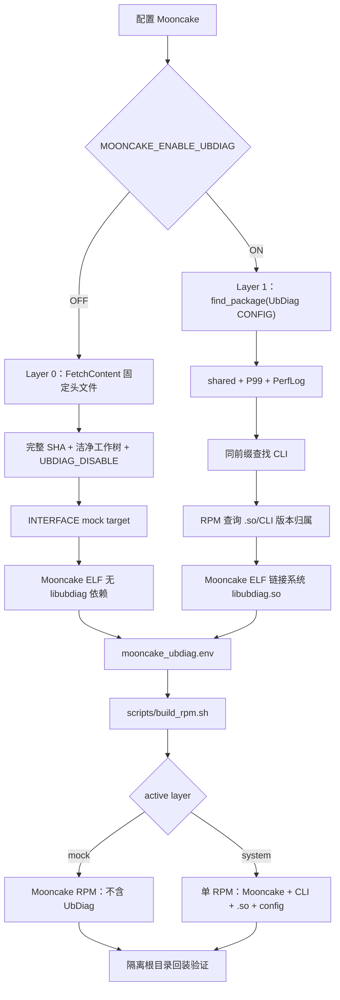
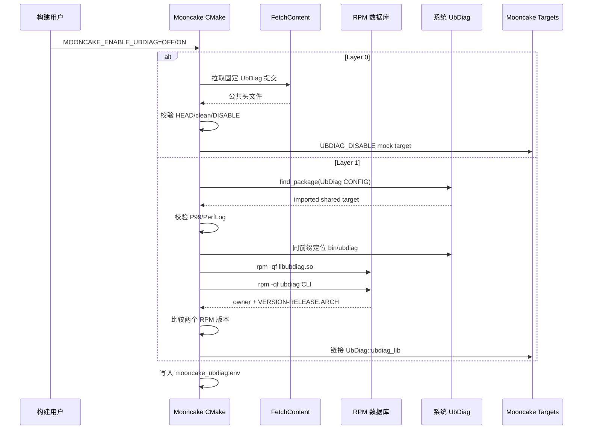
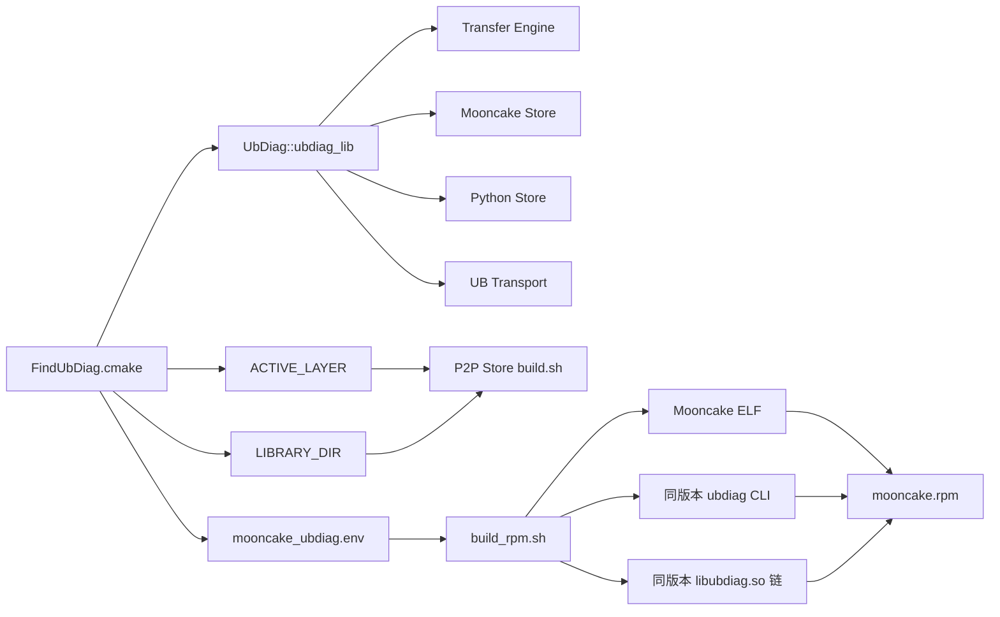

# Mooncake 中 UbDiag 两层分发与单 RPM 集成技术交付

## 1. 目标与责任边界

本实现把 UbDiag 集成固定为编译期两层选择：

- Layer 0 使用固定 UbDiag 公共头文件和 `UBDIAG_DISABLE` 空实现；
- Layer 1 消费用户预装的系统 UbDiag RPM，不下载真实运行时源码；
- Layer 1 从同一安装前缀取得共享库和 CLI，并验证其 RPM 版本一致；
- Mooncake 打包流程将 Mooncake ELF、CLI、`.so` 和可选配置放入一个 RPM；
- Mooncake 不判断某个 UbDiag 版本本身是否存在缺陷，该责任属于 UbDiag
  RPM 的发布和维护方。

“不做身份校验”表示 L1 不锁定 UbDiag tag、提交 SHA 或文件哈希；“同版本
校验”表示 `.so` 与 CLI 必须属于相同 `VERSION-RELEASE.ARCH` 的 UbDiag
RPM。这两项边界互不冲突。

## 2. 总体架构图



## 3. 配置时序图



## 4. 链接与打包链路图



## 5. 核心代码实现

### 5.1 统一消费目标

文件：`mooncake-common/FindUbDiag.cmake`

```cmake
if(TARGET UbDiag::ubdiag_lib)
  get_property(owner GLOBAL PROPERTY MOONCAKE_UBDIAG_TARGET_OWNER)
  if(NOT owner STREQUAL "${CMAKE_BINARY_DIR}")
    message(FATAL_ERROR ...)
  endif()
  return()
endif()
```

业务模块只依赖 `UbDiag::ubdiag_lib`。该目标必须由当前 Mooncake build
创建，避免父工程提前注入同名目标改变实际来源。

### 5.2 Layer 0：头文件空实现

```cmake
FetchContent_Populate(ubdiag
  GIT_REPOSITORY "${MOONCAKE_UBDIAG_GIT_REPOSITORY}"
  GIT_TAG "${MOONCAKE_UBDIAG_GIT_TAG}")

add_library(ubdiag_mock INTERFACE)
target_include_directories(ubdiag_mock INTERFACE
  "${ubdiag_SOURCE_DIR}/include")
target_compile_definitions(ubdiag_mock INTERFACE UBDIAG_DISABLE)
add_library(UbDiag::ubdiag_lib ALIAS ubdiag_mock)
```

Layer 0 保持原有完整 SHA 和洁净工作树检查。这是为了保证空实现头文件
可复现，与 L1 的系统包选择无关。

### 5.3 Layer 1：系统共享库

```cmake
find_package(UbDiag CONFIG QUIET)

get_target_property(imported UbDiag::ubdiag_lib IMPORTED)
get_target_property(type UbDiag::ubdiag_lib TYPE)
```

L1 不设置最低版本，也不触发 FetchContent。系统 package 必须导出导入型
`SHARED_LIBRARY` target；否则无法形成包含真实诊断能力的 Mooncake ELF。

### 5.4 P99 与 PerfLog 编译契约

```cmake
get_target_property(definitions
  UbDiag::ubdiag_lib INTERFACE_COMPILE_DEFINITIONS)

foreach(required UBDIAG_ENABLE_PERCENTILE UBDIAG_ENABLE_PERFLOG)
  list(FIND definitions "${required}" index)
  if(index EQUAL -1)
    message(FATAL_ERROR ...)
  endif()
endforeach()
```

这些 PUBLIC 宏影响消费者编译及共享数据结构，属于 Mooncake 与 UbDiag
之间的接口契约，因此即使不校验 SHA 也必须保留。

### 5.5 `.so` 与 CLI 同版本门禁

CMake 从导入 target 的 `IMPORTED_LOCATION` 得到真实共享库，再从其
`lib/lib64` 目录推导安装前缀，只在 `<prefix>/bin/ubdiag` 查找 CLI。

随后分别执行等价查询：

```bash
rpm -qf --qf '%{NAME}|%{VERSION}-%{RELEASE}.%{ARCH}' \
  /path/to/libubdiag.so
rpm -qf --qf '%{NAME}|%{VERSION}-%{RELEASE}.%{ARCH}' \
  /path/to/ubdiag
```

门禁要求：

- 两个文件均受 RPM 管理；
- 所有者包名包含 `ubdiag`；
- 两条记录的 `VERSION-RELEASE.ARCH` 相同。

允许 CLI 与共享库位于不同 UbDiag 子包，但版本、release 和架构必须相同。
这比执行 `ubdiag --version` 更可靠，因为配置检查不依赖运行时动态加载器。

### 5.6 P2P Store

P2P Store 由独立 Go/cgo 脚本构建，不能直接消费 CMake target。CMake
向脚本传递 active layer 和系统库目录：

- Mock：不增加 `-lubdiag`；
- System：增加 `-L<resolved-lib-dir> -lubdiag`。

## 6. RPM 组装与回装

`scripts/build_rpm.sh` 只读取 CMake 生成的 allowlist 清单，不执行清单
内容，也不重新执行 `which ubdiag`。

System 层打包步骤：

1. 再次查询 `.so` 与 CLI 的 RPM 归属；
2. 要求其所有者和 `VERSION-RELEASE.ARCH` 与配置阶段一致；
3. 复制 CLI；
4. 只复制解析到同一真实库的 `libubdiag.so*` 文件与符号链接；
5. 复制同前缀的可选 `ubdiag.conf`；
6. 检查至少一个 Mooncake ELF 依赖 `libubdiag.so`；
7. 清除 staged ELF 的构建 RPATH/RUNPATH；
8. 构建单一 Mooncake RPM。

Mock 层会反向检查：RPM 中不能出现 CLI、`.so`，Mooncake ELF 也不能存在
`libubdiag.so` 动态依赖。

RPM 生成后，脚本将其安装到隔离的临时根目录，验证核心 Mooncake 二进制
以及 System 层的 CLI/`.so` 均可从 RPM payload 恢复。该步骤使用
`--nodeps --noscripts`，只验证本次包的结构和内容，不替代目标机依赖解析。

## 7. 失败策略

| 条件 | Layer 0 | Layer 1 |
|---|---:|---:|
| 固定源码不可用 | 配置失败 | 不访问源码仓 |
| 系统无 UbDiag RPM | 不受影响 | 配置失败 |
| 只有静态 SDK | 不受影响 | 配置失败 |
| 缺少 P99/PerfLog | 不受影响 | 配置失败 |
| 只有 `.so` 或只有 CLI | 不受影响 | 配置失败 |
| CLI 与 `.so` 不同前缀 | 不受影响 | 配置失败 |
| CLI 与 `.so` RPM 版本不同 | 不受影响 | 配置失败 |
| 配置后升级了系统 UbDiag | 不受影响 | 打包失败，要求重新配置 |
| UbDiag RPM 自身存在功能缺陷 | 不适用 | 归属 UbDiag 发布责任 |

## 8. 验收标准

Layer 0：

- 编译命令包含 `-DUBDIAG_DISABLE`；
- Mooncake ELF 无 `libubdiag.so` 依赖；
- benchmark 读写通过；
- 不创建 UbDiag SHM；
- Mock RPM 不包含任何 UbDiag 运行时产物，并可隔离回装。

Layer 1：

- CMake 显示系统 RPM 版本及库、CLI 路径；
- `.so` 与 CLI 的 RPM `VERSION-RELEASE.ARCH` 一致；
- Mooncake ELF 链接系统 `libubdiag.so`；
- benchmark 读写通过；
- PerfPoint、P99、PerfLog、CSV 功能通过；
- System RPM 同时包含 Mooncake、CLI 与共享库，并可隔离回装。
