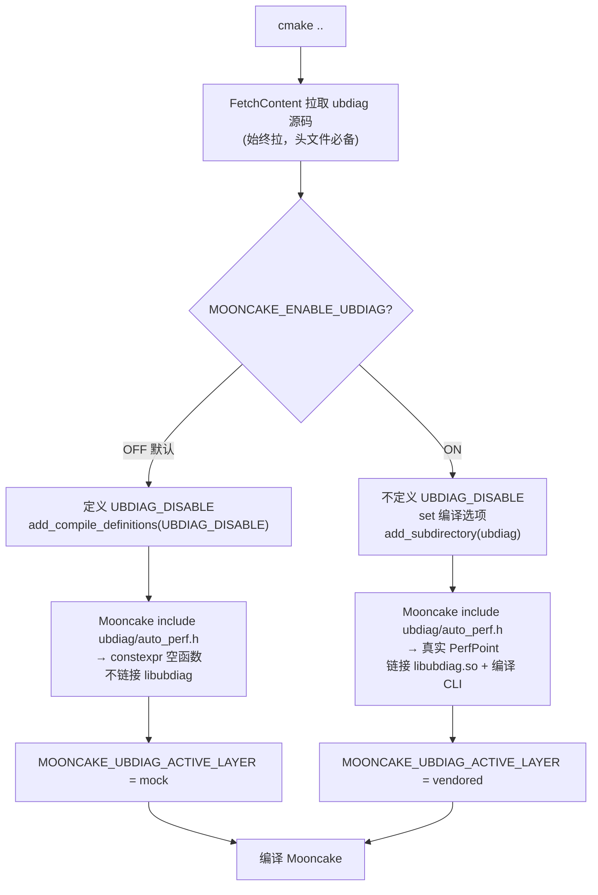
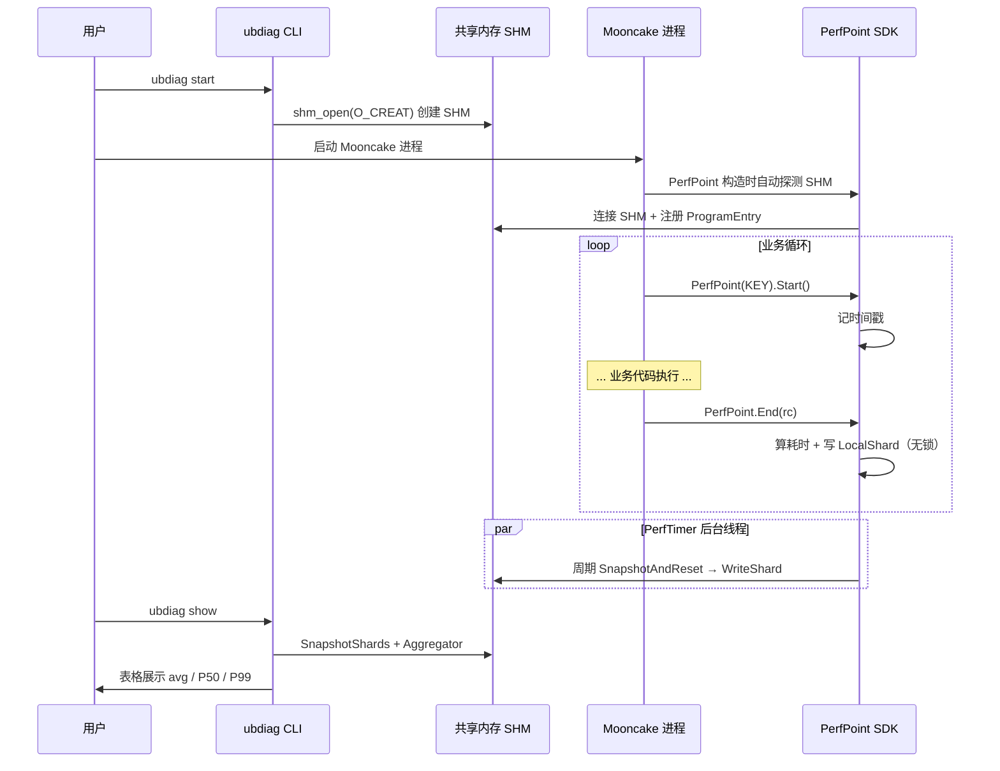
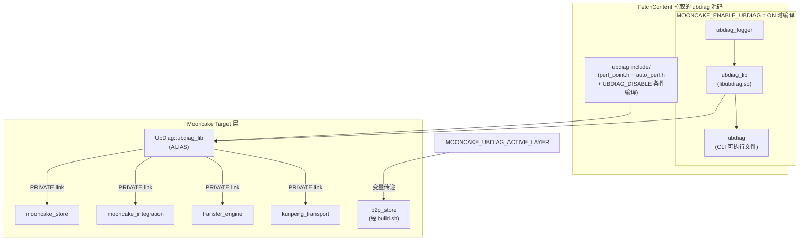

# Mooncake UbDiag 集成重构方案 v1.2

> **基于**：GitHub LinQuickDev/ubdiag `v0.5.1` (`705c6c37`) + GitHub LinQuickDev/Mooncake supercache (`2300894`)
> **核心原则**：ubdiag 侧改，Mooncake 侧尽量不侵入
> **日期**：2026-07-21

---

## 一、架构设计

### 1.1 核心机制：`UBDIAG_DISABLE`

同步到 GitHub 的 ubdiag `v0.5.1` (`705c6c37`) 已内置编译期 mock 机制。`perf_point.h` 和 `auto_perf.h` 通过 `#ifdef UBDIAG_DISABLE` 控制：

```cpp
// perf_point.h (ubdiag master 已有)
#ifdef UBDIAG_DISABLE
    // constexpr 空函数，编译器完全优化掉，零依赖零链接
    constexpr explicit PerfPoint(uint32_t, PerfLevel) noexcept {}
    constexpr void Start() noexcept {}
    constexpr void End(int = 0) noexcept {}
#else
    // 真实声明，链接 libubdiag.so
    explicit PerfPoint(uint32_t slotIndex, PerfLevel level);
    void Start();
    void End(int returnCode = 0);
#endif
```

```cpp
// auto_perf.h (ubdiag master 已有)
#ifndef UBDIAG_DISABLE
#include "ubdiag/perf_manager.h"    // 真实模式：引入 PerfManager
#endif
// ...
#ifndef UBDIAG_DISABLE
// 真实模式：静态初始化器注册 PerfKey 名称数组
static const bool _ubdiag_auto_init_ = []() { ... }();
#endif
```

**验证**：`test_perf_point_disabled.cpp` 用 `static_assert(std::is_empty_v<UbDiag::PerfPoint>)` 确认编译器完全优化掉了空对象。

### 1.2 新的集成架构

```
                 Mooncake CMake 配置
                        │
              ┌─────────┴─────────┐
              │                   │
       MOONCAKE_ENABLE_     MOONCAKE_ENABLE_
       UBDIAG=OFF(默认)     UBDIAG=ON
              │                   │
    ┌─────────┘          ┌────────┘
    │                    │
 FetchContent 拉源码    FetchContent 拉源码
 (始终拉,头文件必备)    (始终拉)
    │                    │
 定义 UBDIAG_DISABLE    不定义 UBDIAG_DISABLE
    │                    │
 Mooncake include       Mooncake include
 ubdiag/auto_perf.h     ubdiag/auto_perf.h
 → constexpr 空函数     → 真实 PerfPoint 声明
    │                    │
 不编译 ubdiag 库       编译 ubdiag 库 + CLI
 不链接 libubdiag       链接 libubdiag.so
    │                    │
 零开销 零依赖          install 库 + CLI
```

### 1.3 为什么不再需要 Mooncake 的 mock 目录

| 当前已有方案 | v1.2 新方案 |
|---|---|
| Mooncake 维护 `mooncake-common/ubdiag-mock/auto_perf.h` | 删除，用 ubdiag 自己的 `auto_perf.h` + `UBDIAG_DISABLE` |
| 手写 mock 可能和真实接口不同步 | 同一个头文件，`#ifdef` 切换，**永远同步** |
| 两种 include 路径（mock vs 真实） | 统一 include ubdiag 源码目录 |
| 需要 CMake 区分 mock/system/submodule 三层 | 只需区分 DISABLE/编译两层 |

### 1.4 构建决策流程图



### 1.5 运行期数据流



### 1.6 Mooncake 插桩点分布

```
Mooncake 代码库（~24 处打点，跨 5 个子模块）
│
├─ mooncake-store/
│   ├─ include/master_perf.h          ← #include "ubdiag/auto_perf.h"
│   ├─ include/rpc_helper.h           ← execute_rpc() 自动包 PerfPoint
│   ├─ src/master_service.cpp         ← 6 处
│   ├─ src/client_service.cpp         ← 4 处
│   ├─ src/real_client.cpp            ← 4 处
│   └─ src/rpc_service.cpp            ← 多处
│
├─ mooncake-integration/
│   ├─ store/mooncake_perf_points.def ← 打点定义（~40 个 PerfKey）
│   └─ store/store_py.cpp             ← 4 处
│
├─ mooncake-transfer-engine/
│   ├─ src/transfer_metadata.cpp      ← 2 处
│   └─ transport/kunpeng_transport/
│       └─ urma/urma_endpoint.cpp     ← 4 处
│
└─ mooncake-p2p-store/
    └─ build.sh                       ← 经 MOONCAKE_UBDIAG_ACTIVE_LAYER 链接
```

### 1.7 CMake Target 依赖关系



### 1.8 当前方案与 v1.2 对比

| 维度 | 当前已有方案 | v1.2 新方案 |
|------|------------|------------|
| **依赖管理** | git submodule `extern/ubdiag/` | FetchContent 拉源码 |
| **变量冲突** | CACHE 变量保存/恢复 workaround | 函数作用域内关闭 UbDiag tests/examples，不改 Mooncake 的同名选项 |
| **include 路径** | CMAKE_SOURCE_DIR 漂移修复 | 对 UbDiag targets 补充真实 FetchContent 源码路径 |
| **系统路径查找** | Layer 2 find_package + CLI 查找 65 行 | 整层删除 |
| **Mock 机制** | mooncake-common/ubdiag-mock/ 手写 56 行 | UBDIAG_DISABLE（ubdiag 自带 constexpr 空函数） |
| **接口同步** | mock 和真实接口可能不同步 | 永远同步（同一个头文件 `#ifdef` 切换） |
| **维护边界** | Mooncake 同时维护分发逻辑和 mock 头文件 | Mooncake 只维护两层解析，mock 实现由 UbDiag 同一套头文件提供 |

---

## 二、项目背景

### 2.1 当前集成方式

Mooncake 通过 git submodule + 三层 FindUbDiag.cmake（239 行）引入 ubdiag。

### 2.2 痛点

| 问题 | 影响 |
|------|------|
| submodule 难管理 | `--recursive` 易漏；指针漂移 |
| 系统路径查找 | 用户需手动安装 ubdiag |
| Mooncake 维护独立 mock 头文件 | 可能和真实接口不同步 |
| CLI 不自动安装 | 用户需单独编译 |
| 三层逻辑 239 行 | 含 50 行变量冲突 workaround |

### 2.3 重构目标

> ubdiag 不再作为 submodule，也不寻找系统路径。拉取 Mooncake 时用 CMake FetchContent 一并拉取 ubdiag 源码。编译时开关可选是否编译 ubdiag，默认用 `UBDIAG_DISABLE` 空函数。启用则编译 ubdiag 并自动安装库 + CLI。客户只需插桩即可打点。

---

## 三、现状全量分析

### 3.1 引用 ubdiag 的文件（15 个，只有 2 个需改）

| 子模块 | 文件 | 需改？ |
|--------|------|:---:|
| mooncake-store（7 个文件） | master_perf.h / rpc_helper.h / CMakeLists / 4 个 .cpp | 不改 |
| mooncake-integration（3 个） | store_py.cpp / perf_points.def / CMakeLists | 不改 |
| mooncake-transfer-engine（2 个） | CMakeLists / transfer_metadata.cpp | 不改 |
| kunpeng_transport（2 个） | CMakeLists / urma_endpoint.cpp | 不改 |
| **mooncake-p2p-store（2 个）** | **CMakeLists / build.sh** | **需适配** |

### 3.2 Mooncake 没有跨线程打点（`global_perf` 零命中）

### 3.3 p2p-store/build.sh 依赖 `MOONCAKE_UBDIAG_ACTIVE_LAYER`

---

## 四、ubdiag master 基线与兼容边界

### 4.1 已具备：`UBDIAG_DISABLE`

同步提交 `705c6c37` 的 `perf_point.h` 和 `auto_perf.h` 已包含编译期空函数实现，两层模式不再依赖 Mooncake 自维护 mock。

### 4.2 当前约束：UbDiag 仍使用 `CMAKE_SOURCE_DIR`

UbDiag 作为 FetchContent 子项目时，`CMAKE_SOURCE_DIR` 会指向 Mooncake 根目录。Mooncake 在 `FetchContent_MakeAvailable` 后为 SDK、Runtime、Manager、Logger 和 CLI target 补充真实源码 include 路径；后续可在 UbDiag 主仓改为 `PROJECT_SOURCE_DIR` 后删除该兼容逻辑。

### 4.3 GitHub 镜像与提交固定

可用 master 原样同步到 `https://github.com/LinQuickDev/ubdiag.git` 并标记为 `v0.5.1`；该 tag 固定指向 `705c6c37da45df2be4bc64c134dca0b7f30b2113`，避免认证依赖和 master 漂移。

### 4.4 通用构建选项隔离

真实模式通过函数作用域临时关闭 UbDiag 的 `BUILD_TESTS` 和 `BUILD_EXAMPLES`，函数返回后 Mooncake 的同名构建选项保持原值；DISABLE 模式只 populate 源码，不配置任何 UbDiag target。

---

## 五、Mooncake 侧 FindUbDiag.cmake

```cmake
# mooncake-common/FindUbDiag.cmake v2 — 基于 UBDIAG_DISABLE 的两层集成
#
# Usage:
#   include(${CMAKE_SOURCE_DIR}/mooncake-common/FindUbDiag.cmake)
#   target_link_libraries(your_target PRIVATE UbDiag::ubdiag_lib)

if(TARGET UbDiag::ubdiag_lib)
  return()
endif()

option(MOONCAKE_ENABLE_UBDIAG "编译 ubdiag 真实库(否则用 UBDIAG_DISABLE 空函数)" OFF)
set(MOONCAKE_UBDIAG_GIT_REPOSITORY
    "https://github.com/LinQuickDev/ubdiag.git" CACHE STRING "ubdiag Git repository")
set(MOONCAKE_UBDIAG_GIT_TAG
    "v0.5.1"
    CACHE STRING "ubdiag 版本(tag/branch/commit)")
set(MOONCAKE_UBDIAG_SOURCE_DIR "" CACHE PATH "本地 ubdiag 源码(离线用)")

# ===== 始终 FetchContent 拉取 ubdiag 源码(头文件必备) =====
include(FetchContent)

# ===== Layer 0: DISABLE 模式(默认) =====
if(NOT MOONCAKE_ENABLE_UBDIAG)
  # 只拉源码(取头文件),不把 ubdiag 子项目加入构建树
  if(MOONCAKE_UBDIAG_SOURCE_DIR)
    set(ubdiag_SOURCE_DIR "${MOONCAKE_UBDIAG_SOURCE_DIR}")
  else()
    FetchContent_Populate(ubdiag
      GIT_REPOSITORY ${MOONCAKE_UBDIAG_GIT_REPOSITORY}
      GIT_TAG ${MOONCAKE_UBDIAG_GIT_TAG}
      SOURCE_DIR "${FETCHCONTENT_BASE_DIR}/ubdiag-src"
      BINARY_DIR "${FETCHCONTENT_BASE_DIR}/ubdiag-build"
      SUBBUILD_DIR "${FETCHCONTENT_BASE_DIR}/ubdiag-subbuild")
  endif()

  # INTERFACE target 同时传播头文件路径和 UBDIAG_DISABLE
  add_library(ubdiag_mock INTERFACE)
  target_include_directories(ubdiag_mock INTERFACE ${ubdiag_SOURCE_DIR}/include)
  target_compile_definitions(ubdiag_mock INTERFACE UBDIAG_DISABLE)
  add_library(UbDiag::ubdiag_lib ALIAS ubdiag_mock)

  set(MOONCAKE_UBDIAG_ACTIVE_LAYER "mock" CACHE STRING "" FORCE)
  message(STATUS "UbDiag: UBDIAG_DISABLE(空函数,零依赖)")
  return()
endif()

# ===== Layer 1: 编译真实 ubdiag =====
if(MOONCAKE_UBDIAG_SOURCE_DIR)
  FetchContent_Declare(ubdiag SOURCE_DIR ${MOONCAKE_UBDIAG_SOURCE_DIR})
else()
  FetchContent_Declare(ubdiag
    GIT_REPOSITORY ${MOONCAKE_UBDIAG_GIT_REPOSITORY}
    GIT_TAG ${MOONCAKE_UBDIAG_GIT_TAG})
endif()

set(UBDIAG_BUILD_SHARED ON CACHE BOOL "" FORCE)
set(ENABLE_PERCENTILE ON CACHE BOOL "" FORCE)
set(ENABLE_PERFLOG ON CACHE BOOL "" FORCE)
set(ENABLE_OB_MEMORY OFF CACHE BOOL "" FORCE)
set(ENABLE_OB_CACHE OFF CACHE BOOL "" FORCE)
set(ENABLE_MEMPOINT OFF CACHE BOOL "" FORCE)
set(UBDIAG_ENABLE_CACHEPOINT OFF CACHE BOOL "" FORCE)

function(_mooncake_make_ubdiag_available)
  set(BUILD_TESTS OFF)
  set(BUILD_EXAMPLES OFF)
  FetchContent_MakeAvailable(ubdiag)
  set(ubdiag_SOURCE_DIR "${ubdiag_SOURCE_DIR}" PARENT_SCOPE)
endfunction()
_mooncake_make_ubdiag_available()

# 为 UbDiag targets 补充真实 FetchContent 源码 include 路径后创建统一别名
add_library(UbDiag::ubdiag_lib ALIAS ubdiag_lib)
set(MOONCAKE_UBDIAG_ACTIVE_LAYER "vendored" CACHE STRING "" FORCE)
```

**关键改进**：
- **始终 FetchContent 拉源码**（即使 DISABLE 模式，因为需要 ubdiag 的头文件）
- DISABLE 模式不编译库，只取 `include/` 目录的头文件
- 不再需要 `mooncake-common/ubdiag-mock/` 目录
- `target_compile_definitions(... INTERFACE UBDIAG_DISABLE)` 让所有消费者使用 constexpr 空函数

---

## 六、Mooncake 侧改动汇总

| 文件 | 改动 |
|------|------|
| `mooncake-common/FindUbDiag.cmake` | 新增两层解析、版本固定、能力裁剪与统一 target |
| `mooncake-transfer-engine/src/CMakeLists.txt` | 从系统 `find_package` 切换到统一解析入口 |
| `mooncake-store/src/CMakeLists.txt` | 从系统 `find_package` 切换到统一解析入口 |
| `mooncake-integration/CMakeLists.txt` | 从系统 `find_package` 切换到统一解析入口 |
| `mooncake-p2p-store/CMakeLists.txt` | 将解析出的 active layer 传给 Go/C++ 混合构建脚本 |
| `mooncake-p2p-store/build.sh` | vendored 层链接 `libubdiag`，mock 层保持零链接 |
| `docs/ubdiag_mooncake_integration_v1.2.md` | 记录架构、构建链路、能力边界和风险 |

---

## 七、兼容性确认

| 维度 | 确认 |
|------|------|
| 插桩代码 | 零改动（`#include "ubdiag/auto_perf.h"` + `PerfPoint` 接口完全一致） |
| CMake target | `UbDiag::ubdiag_lib` 名不变 |
| DISABLE 模式 | `constexpr` 空函数，编译器优化掉，零开销（`static_assert(std::is_empty_v<PerfPoint>)` 验证） |
| MOONCAKE_UBDIAG_ACTIVE_LAYER | 变量名不变，值 `"mock"`/`"vendored"` |

---

## 八、技术约束与风险

| 约束 | 评估 |
|------|------|
| CMake 版本 | FetchContent_MakeAvailable 需 3.14+，Mooncake 要求 3.16，满足 |
| DISABLE 模式 FetchContent | 只拉源码不编译，配置时间略增（首次 git clone），无编译开销 |
| 离线 | `MOONCAKE_UBDIAG_SOURCE_DIR` 指定本地目录 |
| install 冲突 | 低风险（namespace 不同），需实测 |
| OB 裁剪 | 默认 OFF，跳过 libbpf 依赖 |

---

## 九、实施顺序

### Step 1：同步 UbDiag master

1. 确认 AtomGit/GitCode 同源 master 为 `705c6c37`。
2. 将原始 master 历史推送到 `LinQuickDev/ubdiag:master`，并将可用 master 标记为 `v0.5.1`。
3. Mooncake 固定拉取 `v0.5.1`；验证脚本再校验其解析后的精确提交。
4. 保留原始 UbDiag 作者和提交历史。

### Step 2：Mooncake 侧适配

1. 新增 `mooncake-common/FindUbDiag.cmake` 两层解析入口。
2. 将 Store、Transfer Engine、Integration 的系统 `find_package` 替换为统一入口。
3. 向 P2P Store 构建脚本传递 `MOONCAKE_UBDIAG_ACTIVE_LAYER`。
4. 验证 DISABLE 模式无 `libubdiag` 依赖及 `UbDiag::` 实现/引用符号。
5. 验证 `-DMOONCAKE_ENABLE_UBDIAG=ON` 同步构建库、CLI 并正常采集数据。

---

## 十、版本说明

v1.2 基于 ubdiag master 的 `UBDIAG_DISABLE` 编译期 mock 机制，将 Mooncake 的 ubdiag 集成从 git submodule + 三层 fallback 重构为 FetchContent + 两层模式。后续迭代版本号沿用 v1.3、v1.4……。

---

## 附录 A：用户操作手册

### A.1 快速开始

```bash
git clone https://github.com/LinQuickDev/Mooncake.git
cd Mooncake && mkdir build && cd build
cmake ..        # FetchContent 拉 ubdiag 源码,定义 UBDIAG_DISABLE
make -j$(nproc) # PerfPoint 是 constexpr 空函数,零开销
```

### A.2 启用真实打点

```bash
cmake .. -DMOONCAKE_ENABLE_UBDIAG=ON   # 编译 ubdiag 库 + CLI
make -j$(nproc)
sudo cmake --install .                  # 安装 libubdiag.so + ubdiag CLI

ubdiag start
./mooncake_master ...
ubdiag show
ubdiag stop
```

### A.3 离线编译

```bash
git clone https://github.com/LinQuickDev/ubdiag.git /path/to/ubdiag
cmake .. -DMOONCAKE_UBDIAG_SOURCE_DIR=/path/to/ubdiag
make -j$(nproc)
```

### A.4 使用 UbDiag 打点

```bash
ubdiag start                    # 创建 SHM
./mooncake_master ...           # Mooncake 进程自动打点
ubdiag show                     # 汇总
ubdiag show --detail            # 按核详情
ubdiag watch                    # 持续监控
ubdiag show --sort total:desc   # 按耗时排序
ubdiag show --csv ./results     # 导出 CSV 到目录
ubdiag history -n 10            # 历史快照
ubdiag stop                     # 销毁 SHM
```

### A.5 输出说明

```
Module.Point           Ticks    Good    Bad   Avg(ns)    P99(ns)
─────────────────────────────────────────────────────────────────
store_py.Get           1234    1234       0      8543      15234
master.PutAllocateMem   234     234       0     45678      89234
```

### A.6 排查

| 现象 | 解决 |
|------|------|
| show 全 N/A | 先 `ubdiag start` 再启动 Mooncake |
| P99 显示 N/A | 采样次数需 100~10000 |
| undefined reference | 确认 `-DMOONCAKE_ENABLE_UBDIAG=ON` |
| already running | 先 `ubdiag stop` |

### A.7 新增打点

```cpp
// 定义 PerfKey（mooncake-integration/store/mooncake_perf_points.def）
PERF_KEY_DEF(MY_NEW_OP, "my_module.cpp::doWork", "MyOp")

// 插桩
#define UBDIAG_PERF_DEF_FILE "mooncake_perf_points.def"
#define UBDIAG_PROGRAM_NAME "mooncake_store"
#include "ubdiag/auto_perf.h"

void doWork() {
    UbDiag::PerfPoint pt(PerfKey::MY_NEW_OP, UbDiag::PerfLevel::MODULE);
    pt.Start();
    // ... 业务代码 ...
    pt.End(0);
}
```

### A.8 CMake 选项速查

| 选项 | 默认 | 说明 |
|------|------|------|
| `MOONCAKE_ENABLE_UBDIAG` | OFF | OFF=UBDIAG_DISABLE 空函数；ON=编译真实 ubdiag |
| `MOONCAKE_UBDIAG_GIT_REPOSITORY` | `https://github.com/LinQuickDev/ubdiag.git` | 默认源码镜像，避免 AtomGit 认证依赖 |
| `MOONCAKE_UBDIAG_GIT_TAG` | `v0.5.1` | 固定到 GitHub 镜像的可用版本 tag；解析提交为 `705c6c37...` |
| `MOONCAKE_UBDIAG_SOURCE_DIR` | 空 | 本地源码（离线用） |
| `ENABLE_PERCENTILE` | ON | P99 计算 |
| `ENABLE_PERFLOG` | ON | PerfLog 日志 |
| `ENABLE_OB_MEMORY` | OFF | OB 内存追踪 |
| `ENABLE_OB_CACHE` | OFF | OB 缓存命中率 |
| `ENABLE_MEMPOINT` | OFF | MemPoint 内存观测 |
| `UBDIAG_ENABLE_CACHEPOINT` | OFF | CachePoint 函数级缓存观测 |
| `UBDIAG_ENABLE_INSTALL` | ON | 安装 ubdiag 到系统 |

### A.9 一键严格验证

`scripts/verify_ubdiag_v12.sh` 会调用根目录的 4 个 helper：

| 脚本 | 验证内容 |
|---|---|
| `run_mooncake_store_master.sh` | 使用真实受支持参数启动 Mooncake master |
| `run_mooncake_store_client.sh` | 使用指定协议和设备启动 Mooncake client |
| `write.sh` | 执行 `stress_cluster_bench` 写流程并要求退出码为 0 |
| `read.sh` | 执行 `stress_cluster_bench` 读流程并要求退出码为 0 |

一键脚本分别在 DISABLE 和 vendored 构建上运行完整 benchmark。vendored
模式还会要求 UbDiag P99 表格非空，并将 `show`、`detail`、`core`、
`watch`、`history` CSV 落盘；任一环节失败都会返回非零，不再输出假成功。

已经完成两层编译时可传 `REUSE_BUILD=1`，脚本只增量补齐缺失的 client 或
benchmark target，不重复全量编译。
