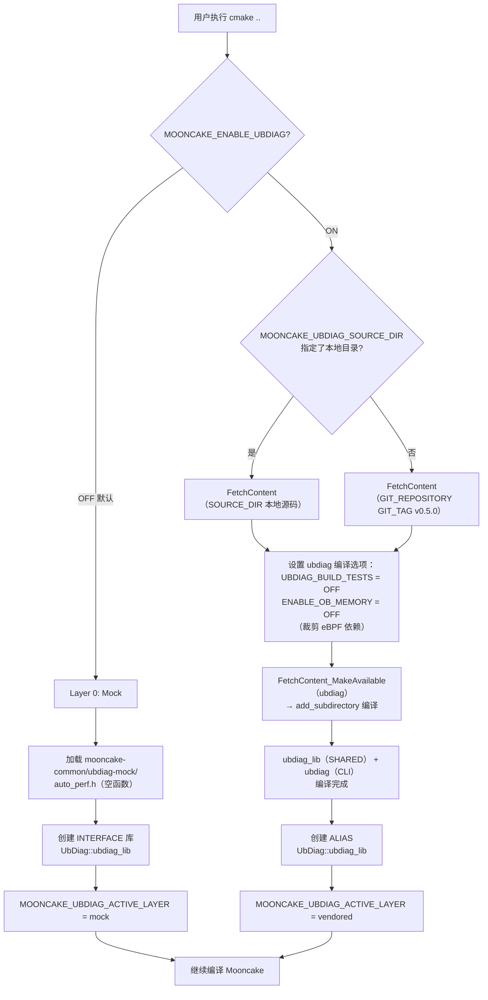
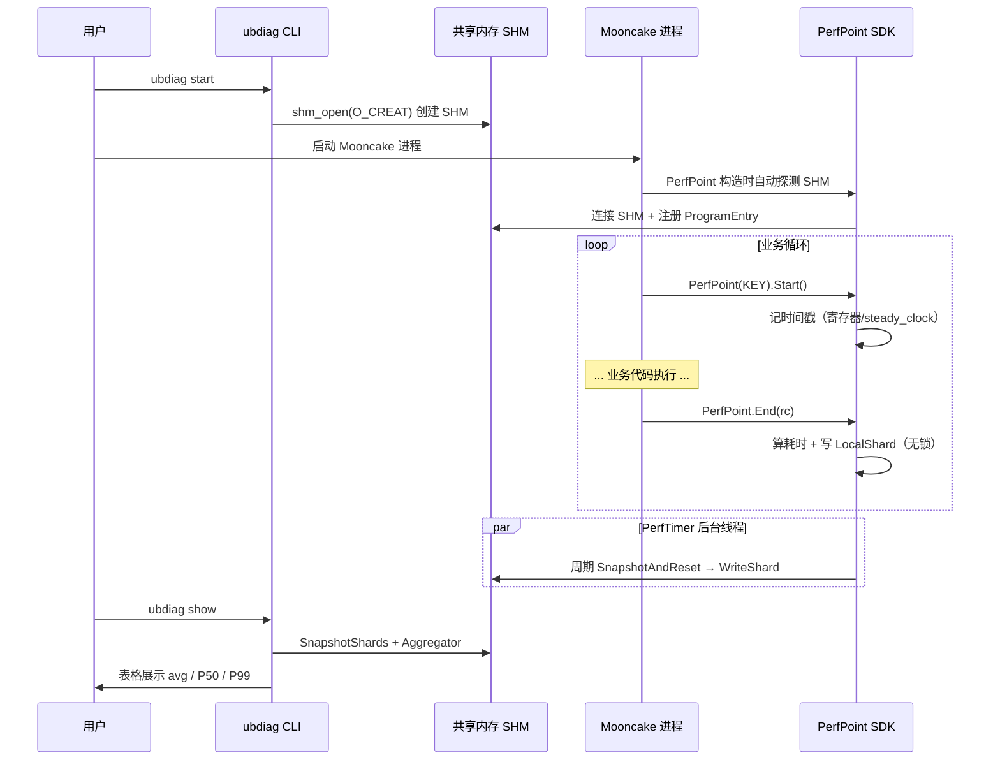

# Mooncake UbDiag 集成重构方案 v1.2（完整独立版）

> **基于**：atomgit liusiyu60/ubdiag master (d7e53c6) + GitHub LinQuickDev/Mooncake supercache (2300894)
> **基线分支**：qinyufei63/Mooncake `supercache_dev_ubdiag` (43329007)
> **核心原则**：ubdiag 侧改，Mooncake 侧尽量不侵入
> **日期**：2026-07-21
> **本文件自包含，无需参考 v1.0/v1.1**

---

## 一、架构设计

### 1.1 新的集成架构（两层：mock / FetchContent）

```
旧（三层 fallback）                         新（两层 + FetchContent）
┌─────────────────────────┐               ┌──────────────────────────┐
│ Layer 1: submodule      │               │ Layer 0: Mock(默认)       │
│  extern/ubdiag/         │               │  mooncake-common/         │
│  add_subdirectory       │    ──→       │  ubdiag-mock/             │
├─────────────────────────┤               │  (空函数 PerfPoint)       │
│ Layer 2: system         │               ├──────────────────────────┤
│  find_package(UbDiag)   │               │ Layer 1: FetchContent     │
├─────────────────────────┤               │  -DMOONCAKE_ENABLE_       │
│ Layer 3: mock           │               │  UBDIAG=ON 时触发         │
│  ubdiag-mock/           │               │  拉源码+编译+安装         │
└─────────────────────────┘               └──────────────────────────┘
```

简化为两层（去掉 submodule + system 查找）：
- **Layer 0（mock，默认）**：header-only 空函数，零依赖，开箱即编译
- **Layer 1（FetchContent，可选）**：从 atomgit 拉源码 + add_subdirectory 编译 + 自动安装

### 1.2 为什么用 FetchContent 而不是 submodule

| 维度 | git submodule | CMake FetchContent |
|------|:---:|:---:|
| `git clone --recursive` 依赖 | 必须 | 不需要 |
| 离线环境 | 可能漏 | 可配 `MOONCAKE_UBDIAG_SOURCE_DIR` 指定本地目录 |
| CMake 原生管理 | 外部 | 内部 |
| 版本锁定 | git 指针 | `GIT_TAG` 锁 tag |
| 可选依赖适配 | 不适合 | 适合（默认 mock 不拉，开关打开才拉） |

### 1.3 构建决策流程图



### 1.4 运行期数据流（启用 ubdiag 时）



### 1.5 Mooncake 插桩点分布

```
Mooncake 代码库
│
├─ mooncake-store/
│   ├─ include/
│   │   ├─ master_perf.h          ← #include "ubdiag/auto_perf.h"（master 进程入口）
│   │   └─ rpc_helper.h           ← execute_rpc() 模板：自动包 PerfPoint
│   ├─ src/
│   │   ├─ master_service.cpp     ← 6 处打点：PUT_ALLOCATE / SNAPSHOT_LOCK / ...
│   │   ├─ client_service.cpp     ← 4 处打点：GET_SINGLE_FIND / TRANSFER_READ / ...
│   │   ├─ real_client.cpp        ← 4 处打点：PUT_INTERNAL_ALLOC / MEM_COPY / ...
│   │   └─ rpc_service.cpp        ← 多处：MASTER_RPC_GET_REPLICA / PUT_START / ...
│   │
├─ mooncake-integration/
│   ├─ store/
│   │   ├─ mooncake_perf_points.def  ← 打点定义（~40 个 PerfKey）
│   │   └─ store_py.cpp              ← 4 处打点
│   │
├─ mooncake-transfer-engine/
│   ├─ src/
│   │   └─ transfer_metadata.cpp     ← 2 处打点：UB_HANDSHAKE_ENCODE / DECODE
│   └─ transport/kunpeng_transport/
│       └─ urma/urma_endpoint.cpp    ← 4 处打点：UB_ENDPOINT_CONSTRUCT / ...
│
└─ mooncake-p2p-store/
    └─ build.sh                      ← 经 MOONCAKE_UBDIAG_ACTIVE_LAYER 链接
```

### 1.6 v1.1 → v1.2 对比

```
v1.1（100 行 FindUbDiag.cmake）              v1.2（50 行 FindUbDiag.cmake）
┌──────────────────────────────┐             ┌──────────────────────────────┐
│  变量保存/恢复（50 行）       │             │  （删除）                     │
│  BUILD_TESTS 冲突 workaround │             │  ubdiag 改名后无冲突          │
├──────────────────────────────┤             ├──────────────────────────────┤
│  include 路径修复（12 行）    │             │  （删除）                     │
│  CMAKE_SOURCE_DIR 漂移 fix  │             │  ubdiag 改用 PROJECT_SOURCE_DIR│
├──────────────────────────────┤             ├──────────────────────────────┤
│  RPM manifest（20 行）       │             │  简化为 set 变量              │
│  CLI 查找（15 行）           │             │  ubdiag install 自动装 CLI    │
│  system 查找（40 行）        │             │  整个 Layer 2 删除            │
├──────────────────────────────┤             ├──────────────────────────────┤
│  FetchContent + 编译          │             │  FetchContent + 编译          │
└──────────────────────────────┘             └──────────────────────────────┘
      绕过 ubdiag 的 CMake 缺陷                     ubdiag 自己修好了
```

---

## 二、项目背景

### 2.1 当前集成方式

Mooncake 通过 **git submodule** 引入 ubdiag，再用三层 fallback 的 `FindUbDiag.cmake`（239 行）处理编译：

```
Layer 1 (submodule):  extern/ubdiag/ 存在 → add_subdirectory
Layer 2 (system):     find_package(UbDiag) 查找系统安装
Layer 3 (mock):       mooncake-common/ubdiag-mock/ 空函数
```

### 2.2 痛点

| 问题 | 影响 |
|------|------|
| submodule 难管理 | `git clone` 必须 `--recursive`；指针漂移导致版本不一致 |
| 系统路径查找 | 用户需手动安装 ubdiag 到 `/usr/local`，增加部署成本 |
| mock 头文件维护 | 手写的 mock 可能和真实 ubdiag 接口不同步 |
| CLI 不自动安装 | 用户想打点还要单独编译安装 ubdiag CLI |
| 三层逻辑复杂 | FindUbDiag.cmake 239 行，含 50 行变量冲突 workaround + 12 行 include 修复 |

### 2.3 重构目标

> ubdiag 不再作为 submodule，也不寻找系统路径。拉取 Mooncake 时用 CMake FetchContent 一并拉取 ubdiag 源码。编译时开关可选是否编译 ubdiag，默认 mock（空函数）。不 mock 则一起编译 ubdiag 并自动安装库 + 同版本 CLI。客户只需自己插桩即可打点。

---

## 三、现状全量分析（基于代码实读）

### 3.1 引用 ubdiag 的完整文件清单（15 个文件，5 个子模块）

| 子模块 | 文件 | 引用方式 | 是否需改 |
|--------|------|---------|:---:|
| **mooncake-store** | `include/master_perf.h` | `#include "ubdiag/auto_perf.h"` | 不改 |
| | `include/rpc_helper.h` | `UbDiag::PerfPoint` + `PerfLevel::SUB_SYSTEM` | 不改 |
| | `src/CMakeLists.txt` | `include(FindUbDiag.cmake)` + link | 不改 |
| | `src/client_service.cpp` | 4 处 PerfPoint 打点 | 不改 |
| | `src/master_service.cpp` | 6 处打点 | 不改 |
| | `src/real_client.cpp` | 4 处打点 | 不改 |
| | `src/rpc_service.cpp` | 多处 `PerfKey::MASTER_RPC_*` | 不改 |
| **mooncake-integration** | `store/store_py.cpp` | 4 处打点 | 不改 |
| | `store/mooncake_perf_points.def` | 打点定义（~40 个 PerfKey） | 不改 |
| | `CMakeLists.txt` | `include(FindUbDiag.cmake)` | 不改 |
| **mooncake-transfer-engine** | `src/CMakeLists.txt` | `include(FindUbDiag.cmake)` + link | 不改 |
| | `src/transfer_metadata.cpp` | 2 处打点 | 不改 |
| **kunpeng_transport** | `CMakeLists.txt` | link `UbDiag::ubdiag_lib` | 不改 |
| | `urma/urma_endpoint.cpp` | 4 处打点 | 不改 |
| **mooncake-p2p-store** | `CMakeLists.txt` | 传 `MOONCAKE_UBDIAG_ACTIVE_LAYER` 给 build.sh | 需适配 |
| | `build.sh` | 根据 layer 选 `-lubdiag` 路径 | 需适配 |

**结论**：15 个文件中**只有 2 个需要改**（p2p-store），其余 13 个完全不动。

### 3.2 现有 .gitmodules

```
[submodule "extern/pybind11"]        ← Mooncake 原有，保留
[submodule "extern/yalantinglibs"]   ← Mooncake 原有，保留
[submodule "extern/ubdiag"]          ← 要删除
  url = atomgit.com/liusiyu60/ubdiag
  branch = fix/shm-probe-fastpath
```

### 3.3 跨线程打点

全量搜索 Mooncake 代码 `global_perf` **零命中**。所有打点都是普通 `PerfPoint(KEY, level)` 模式。mock 不需要补 `global_perf_t`。

### 3.4 p2p-store 的特殊编译方式

p2p-store 不用 CMake 编译，用自定义 `build.sh`。它通过 `MOONCAKE_UBDIAG_ACTIVE_LAYER` 变量决定链接路径。重构后必须保持这个变量。

---

## 四、ubdiag 侧升级（6 项，全部在 ubdiag 仓库改）

### 4.1 P0：`CMAKE_SOURCE_DIR` → `PROJECT_SOURCE_DIR`

**问题**：ubdiag 被其他项目 `add_subdirectory` 时，`CMAKE_SOURCE_DIR` 指向宿主根目录而非 ubdiag 目录，include 路径全部错位。

**改法**：全部 CMakeLists 里 `CMAKE_SOURCE_DIR` 改为 `PROJECT_SOURCE_DIR`（根目录）或 `CMAKE_CURRENT_SOURCE_DIR`（子目录）。

| 文件 | 改动 |
|------|------|
| `CMakeLists.txt`（根） | `CMAKE_SOURCE_DIR` → `PROJECT_SOURCE_DIR` |
| `src/sdk/CMakeLists.txt` | `${CMAKE_SOURCE_DIR}/include` → `${PROJECT_SOURCE_DIR}/include` |
| `src/manager/CMakeLists.txt` | 同上 |
| `src/runtime/CMakeLists.txt` | 同上 |
| `src/runtime/ebpf/CMakeLists.txt` | `${CMAKE_SOURCE_DIR}/...` → `${CMAKE_CURRENT_SOURCE_DIR}/...` |
| `src/cli/CMakeLists.txt` | 同上 |

### 4.2 P0：`BUILD_TESTS`/`BUILD_EXAMPLES` 加命名空间前缀

**问题**：ubdiag 的 `option(BUILD_TESTS ...)` 和 Mooncake 的同名冲突。

**改法**：
```cmake
option(UBDIAG_BUILD_TESTS "Build UbDiag unit tests" OFF)
option(UBDIAG_BUILD_EXAMPLES "Build UbDiag examples" OFF)
```
同步改 `build.sh`。

### 4.3 P0：打 tag

在 atomgit 上打 tag `v0.5.0`，Mooncake FetchContent 锁定到该 tag。

### 4.4 P1：install 规则条件化

```cmake
option(UBDIAG_ENABLE_INSTALL "Enable install targets" ON)
if(UBDIAG_ENABLE_INSTALL)
    install(TARGETS ubdiag_lib ...)
    install(TARGETS ubdiag ...)
endif()
```

### 4.5 P1：`UBDIAG_HAS_*` 特性检测宏

```cmake
if(ENABLE_OB_MEMORY AND PLATFORM_LINUX)
    target_compile_definitions(ubdiag_lib PUBLIC UBDIAG_ENABLE_OB_MEMORY UBDIAG_HAS_OB_MEMORY)
endif()
```

### 4.6 P2：标准 `UbDiagConfig.cmake`

新建 `cmake/UbDiagConfig.cmake.in` + `configure_package_config_file()`。

---

## 五、ubdiag 侧改动汇总

| 文件 | 改动 | 优先级 |
|------|------|:---:|
| `CMakeLists.txt`（根） | `CMAKE_SOURCE_DIR`→`PROJECT_SOURCE_DIR`；`BUILD_TESTS`→`UBDIAG_BUILD_TESTS`；install 条件化；Config.cmake | P0+P1 |
| `src/sdk/CMakeLists.txt` | `${CMAKE_SOURCE_DIR}`→`${PROJECT_SOURCE_DIR}`；`UBDIAG_HAS_*` 宏 | P0+P1 |
| `src/manager/CMakeLists.txt` | `CMAKE_SOURCE_DIR`→`CMAKE_CURRENT_SOURCE_DIR` | P0 |
| `src/runtime/CMakeLists.txt` | 同上 | P0 |
| `src/runtime/ebpf/CMakeLists.txt` | 同上 | P0 |
| `src/cli/CMakeLists.txt` | 同上 | P0 |
| `build.sh` | `-t`→`UBDIAG_BUILD_TESTS`；`-e`→`UBDIAG_BUILD_EXAMPLES` | P0 |
| `cmake/UbDiagConfig.cmake.in` | **新建** | P2 |
| atomgit tag | 打 `v0.5.0` | P0 |

---

## 六、Mooncake 侧最终版 FindUbDiag.cmake（~50 行）

```cmake
# mooncake-common/FindUbDiag.cmake v2 — 两层集成
#
# Usage:
#   include(${CMAKE_SOURCE_DIR}/mooncake-common/FindUbDiag.cmake)
#   target_link_libraries(your_target PRIVATE UbDiag::ubdiag_lib)

if(TARGET UbDiag::ubdiag_lib)
  return()
endif()

option(MOONCAKE_ENABLE_UBDIAG "编译 ubdiag 真实库(否则用 mock)" OFF)
set(MOONCAKE_UBDIAG_GIT_TAG "v0.5.0" CACHE STRING "ubdiag 版本")
set(MOONCAKE_UBDIAG_SOURCE_DIR "" CACHE PATH "本地 ubdiag 源码(离线用)")

# ===== Layer 0: Mock（默认） =====
if(NOT MOONCAKE_ENABLE_UBDIAG)
  add_library(ubdiag_mock INTERFACE)
  target_include_directories(ubdiag_mock INTERFACE
      ${CMAKE_SOURCE_DIR}/mooncake-common/ubdiag-mock)
  add_library(UbDiag::ubdiag_lib ALIAS ubdiag_mock)
  set(MOONCAKE_UBDIAG_ACTIVE_LAYER "mock" CACHE STRING "" FORCE)
  message(STATUS "UbDiag: mock(空函数)")
  return()
endif()

# ===== Layer 1: FetchContent（可选） =====
include(FetchContent)

if(MOONCAKE_UBDIAG_SOURCE_DIR AND EXISTS "${MOONCAKE_UBDIAG_SOURCE_DIR}/CMakeLists.txt")
  FetchContent_Declare(ubdiag SOURCE_DIR ${MOONCAKE_UBDIAG_SOURCE_DIR})
else()
  FetchContent_Declare(ubdiag
      GIT_REPOSITORY https://atomgit.com/liusiyu60/ubdiag.git
      GIT_TAG ${MOONCAKE_UBDIAG_GIT_TAG})
endif()

set(UBDIAG_BUILD_TESTS OFF CACHE BOOL "" FORCE)
set(UBDIAG_BUILD_EXAMPLES OFF CACHE BOOL "" FORCE)
set(UBDIAG_BUILD_SHARED ON CACHE BOOL "" FORCE)
set(ENABLE_PERCENTILE ON CACHE BOOL "" FORCE)
set(ENABLE_PERFLOG ON CACHE BOOL "" FORCE)
set(ENABLE_OB_MEMORY OFF CACHE BOOL "" FORCE)
set(ENABLE_OB_CACHE OFF CACHE BOOL "" FORCE)
set(ENABLE_MEMPOINT OFF CACHE BOOL "" FORCE)
set(UBDIAG_ENABLE_INSTALL ON CACHE BOOL "" FORCE)

FetchContent_MakeAvailable(ubdiag)

if(TARGET ubdiag_lib)
  add_library(UbDiag::ubdiag_lib ALIAS ubdiag_lib)
  set(MOONCAKE_UBDIAG_ACTIVE_LAYER "vendored" CACHE STRING "" FORCE)
  message(STATUS "UbDiag: FetchContent ${MOONCAKE_UBDIAG_GIT_TAG}")
endif()
```

---

## 七、Mooncake 侧改动汇总（最小侵入）

| 文件 | 改动 | 行数变化 |
|------|------|---------|
| `mooncake-common/FindUbDiag.cmake` | 重写（239行→50行） | -189 |
| `mooncake-p2p-store/build.sh` | case 路径适配（3行） | ±3 |
| `.gitmodules` | 删 ubdiag 条目 | -3 |
| `extern/ubdiag/` | git rm | — |
| **其余 13 个文件** | **零改动** | 0 |

p2p-store/build.sh 改动：

```bash
# 旧:
case "$UBDIAG_LAYER" in
    submodule) UBDIAG_LIB_DIR="$BUILD_DIR/extern/ubdiag_build/src/sdk" ;;
    system)    EXT_LDFLAGS+=" -lubdiag" ;;
    mock)      echo "skipping -lubdiag" ;;

# 新:
case "$UBDIAG_LAYER" in
    vendored)  UBDIAG_LIB_DIR="$BUILD_DIR/_deps/ubdiag-build/src/sdk" ;;
    mock)      echo "skipping -lubdiag" ;;
```

---

## 八、兼容性确认

- **插桩代码**：零改动（`#include "ubdiag/auto_perf.h"` + `PerfPoint` 接口不变）
- **CMake target**：`UbDiag::ubdiag_lib` 名不变
- **`MOONCAKE_UBDIAG_ACTIVE_LAYER`**：变量名不变，值变为 `"vendored"`/`"mock"`

---

## 九、技术约束与风险

| 约束 | 评估 |
|------|------|
| CMake 版本 | FetchContent_MakeAvailable 需 3.14+，Mooncake 要求 3.16，满足 |
| install 冲突 | 低风险（namespace 不同），需实测 |
| OB 裁剪 | 默认 OFF，跳过 libbpf 依赖 |
| FetchContent 缓存 | 首次联网拉取，之后增量不重复拉 |
| 离线 | `MOONCAKE_UBDIAG_SOURCE_DIR` 指定本地目录 |

---

## 十、实施顺序

### Step 1：ubdiag 侧升级（atomgit ubdiag 仓库）

1. `CMAKE_SOURCE_DIR` → `PROJECT_SOURCE_DIR` / `CMAKE_CURRENT_SOURCE_DIR`
2. `BUILD_TESTS` → `UBDIAG_BUILD_TESTS`；`BUILD_EXAMPLES` → `UBDIAG_BUILD_EXAMPLES`
3. install 规则加 `UBDIAG_ENABLE_INSTALL`
4. 加 `UBDIAG_HAS_*` 宏
5. 新建 `cmake/UbDiagConfig.cmake.in`
6. 打 tag `v0.5.0`
7. 验证：`bash build.sh` 仍编译通过

### Step 2：Mooncake 侧适配（qinyufei63/Mooncake）

1. 删 `.gitmodules` 的 ubdiag 条目 + `extern/ubdiag/`
2. 重写 `FindUbDiag.cmake`
3. 改 `p2p-store/build.sh`
4. 验证：mock 模式编译通过
5. 验证：`-DMOONCAKE_ENABLE_UBDIAG=ON` 编译+安装通过

---

## 十一、版本演进路线

```
v1.0（初版）       → 方向确定
v1.1（校正版）     → 全量代码读取，修正遗漏
v1.2（升级优化版） → ubdiag 侧 6 项升级 + Mooncake 50 行最终版（本文档）
v1.3（实施版）     → 按本文档 Step 1 + Step 2 执行
```

---

## 十二、待确认

1. **tag 名**：用 `v0.5.0` 还是自定义？
2. **ubdiag 侧改动审批**：需走 PR 流程吗？
3. **CI 验证**：ubdiag 改完 CMake 后自己的 `bash build.sh` 是否仍编译通过？
4. **build.sh 的 `-t`/`-e`**：改名后旧命令是否仍有效？
5. **网络依赖**：atomgit 在某些环境访问慢，是否提供 GitHub mirror？

---

## 附录 A：用户操作手册

### A.1 快速开始（默认 Mock 模式）

不需要安装任何额外依赖，克隆即可编译：

```bash
git clone https://github.com/LinQuickDev/Mooncake.git
cd Mooncake
mkdir build && cd build
cmake ..
make -j$(nproc)
```

此时 Mooncake 代码中所有 `PerfPoint` 打点均为空函数（no-op），零性能开销，零额外依赖。

### A.2 启用真实 UbDiag 打点

#### A.2.1 编译（联网环境）

```bash
git clone https://github.com/LinQuickDev/Mooncake.git
cd Mooncake
mkdir build && cd build

# 启用 ubdiag：FetchContent 自动从 atomgit 拉取 ubdiag 源码并编译
cmake .. -DMOONCAKE_ENABLE_UBDIAG=ON

# 编译 Mooncake + ubdiag（含 CLI）
make -j$(nproc)

# 安装到系统（需要 root）
sudo cmake --install .
```

安装后系统新增：
- `/usr/local/bin/ubdiag` — CLI 工具
- `/usr/local/lib/libubdiag.so` — SDK 动态库
- `/usr/local/include/ubdiag/` — 头文件

#### A.2.2 编译（离线环境）

```bash
# 在有网络的机器上
git clone https://atomgit.com/liusiyu60/ubdiag.git /path/to/ubdiag

# 拷贝到离线机器，编译 Mooncake 时指定本地路径
cmake .. -DMOONCAKE_ENABLE_UBDIAG=ON \
         -DMOONCAKE_UBDIAG_SOURCE_DIR=/path/to/ubdiag
make -j$(nproc)
sudo cmake --install .
```

#### A.2.3 指定 ubdiag 版本

```bash
# 锁定到特定 tag
cmake .. -DMOONCAKE_ENABLE_UBDIAG=ON \
         -DMOONCAKE_UBDIAG_GIT_TAG=v0.5.0

# 或锁定到特定 commit
cmake .. -DMOONCAKE_ENABLE_UBDIAG=ON \
         -DMOONCAKE_UBDIAG_GIT_TAG=d7e53c6
```

### A.3 使用 UbDiag 打点

#### A.3.1 启动监控

```bash
# 1. 创建共享内存
ubdiag start

# 2. 启动 Mooncake 进程（自动打点，无需额外操作）
./mooncake_master --metadata_server=... &
./mooncake_store --metadata_server=... &

# 3. 查看性能数据
ubdiag show                    # 汇总视图
ubdiag show --detail           # 按 CPU 核心详情
ubdiag watch                   # 持续监控（类似 top）
ubdiag show --sort total:desc  # 按总耗时降序

# 4. 查看 P99 分位数
ubdiag show                    # P99/P999/P9999 列

# 5. 导出 CSV
ubdiag show --csv -o perf_data.csv

# 6. 查看历史快照
ubdiag history                 # 所有历史 dump
ubdiag history -n 10           # 最近 10 条
ubdiag history -i 0            # 最新一条详情

# 7. 销毁共享内存
ubdiag stop
```

#### A.3.2 理解输出

```
Module.Point           Ticks    Good    Bad   Avg(ns)    P99(ns)
─────────────────────────────────────────────────────────────────
store_py.Get           1234    1234       0      8543      15234
store_py.GetBatch       567     567       0     12345      28901
real_client.GetBuffer   890     890       0      6712      11234
master.PutAllocateMem   234     234       0     45678      89234
```

| 列 | 含义 |
|---|---|
| Module.Point | 模块名.点位名（来自 `mooncake_perf_points.def`） |
| Ticks | 总调用次数 |
| Good | 返回码 = 0 的次数（成功） |
| Bad | 返回码 ≠ 0 的次数（失败） |
| Avg(ns) | 平均耗时（纳秒） |
| P99(ns) | 第 99 百分位耗时（需采样 ≥ 100 次才有效） |

#### A.3.3 排查问题

| 现象 | 原因 | 解决 |
|------|------|------|
| `ubdiag show` 全是 N/A | Mooncake 进程没启动或没连上 SHM | 确认 `ubdiag start` 已执行；确认编译时 `-DMOONCAKE_ENABLE_UBDIAG=ON` |
| P99 列显示 N/A | 采样次数 < 100 或 > 10000 | 正常运行一段时间让采样积累 |
| 编译报错 `undefined reference to UbDiag::PerfPoint` | Mooncake 没找到 ubdiag 库 | 检查 CMake 输出是否有 `UbDiag: FetchContent` 日志 |
| `ubdiag start` 报 `already running` | SHM 已存在 | 先 `ubdiag stop` 再 `ubdiag start` |
| Mooncake 启动报 `failed to connect to shared memory` | `ubdiag start` 没执行 | 先 `ubdiag start` 再启动 Mooncake |

### A.4 在 Mooncake 代码中新增打点

#### A.4.1 定义新的 PerfKey

编辑 `mooncake-integration/store/mooncake_perf_points.def`：

```
// 格式：PERF_KEY_DEF(枚举名, "源文件::函数", "点位简称")
PERF_KEY_DEF(MY_NEW_OPERATION, "my_module.cpp::doSomething", "MyOp")
```

#### A.4.2 在代码中插入打点

```cpp
// 在 .cpp 文件顶部（已有则跳过）
#define UBDIAG_PERF_DEF_FILE "mooncake_perf_points.def"
#define UBDIAG_PROGRAM_NAME "mooncake_store"
#include "ubdiag/auto_perf.h"

// 在要测量的代码处
void doSomething() {
    UbDiag::PerfPoint pt(PerfKey::MY_NEW_OPERATION, UbDiag::PerfLevel::MODULE);
    pt.Start();
    // ... 要测量的代码 ...
    pt.End(0);   // 0 = 成功，非 0 = 失败
}
```

#### A.4.3 使用 RPC 模板自动打点

```cpp
// 6 参数版本（带打点）
execute_rpc("MyRpc", PerfKey::MY_RPC, rpc_callable, log_callable,
            inc_req, inc_fail);

// 5 参数版本（不打点，向后兼容）
execute_rpc("MyRpc", rpc_callable, log_callable, inc_req, inc_fail);
```

### A.5 常用 CMake 选项速查

| 选项 | 默认 | 说明 |
|------|------|------|
| `MOONCAKE_ENABLE_UBDIAG` | OFF | OFF=mock 空函数；ON=编译真实 ubdiag |
| `MOONCAKE_UBDIAG_GIT_TAG` | v0.5.0 | ubdiag 版本（tag/branch/commit） |
| `MOONCAKE_UBDIAG_SOURCE_DIR` | 空 | 本地 ubdiag 源码目录（离线用） |
| `ENABLE_PERCENTILE` | ON | P99/P999/P9999 计算（ubdiag 子项目） |
| `ENABLE_PERFLOG` | ON | PerfLog 探针日志（ubdiag 子项目） |
| `ENABLE_OB_MEMORY` | OFF | OB 内存追踪（需要 libbpf，默认关） |
| `ENABLE_OB_CACHE` | OFF | OB 缓存命中率（需要 libbpf，默认关） |
| `ENABLE_MEMPOINT` | OFF | MemPoint 点位级内存（需要 sys/sdt.h，默认关） |
| `UBDIAG_ENABLE_INSTALL` | ON | 是否安装 ubdiag 到系统 |
