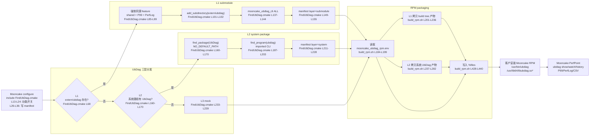
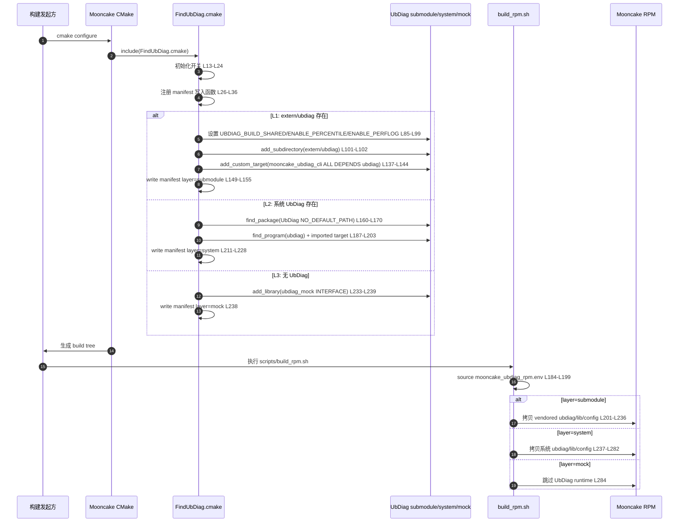
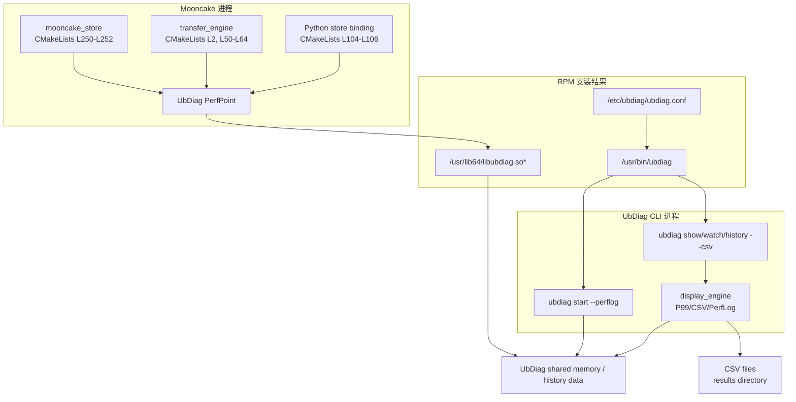

# ubdiag在mooncake中的三层分发与CLI集成实现

## 1. 文档目标

本文说明 Mooncake 中 UbDiag 的三层分发机制，以及本次在三层分发基础上补齐 UbDiag CLI 与 RPM 交付闭环的实现方式。读者可以通过本文回答以下问题：

- Mooncake 为什么需要 UbDiag 三层分发。
- L1、L2、L3 分别从哪里获得 UbDiag，以及各自边界是什么。
- UbDiag CLI 如何与 `libubdiag.so` 保持同源或同层一致。
- CMake 如何把分发决策传递给 RPM 打包脚本。
- 客户拿到 Mooncake RPM 后，如何直接使用 `ubdiag` 对 Mooncake 打点分析并导出 CSV。

本文中的代码路径和行号基于 `docs/supercache_ubdiag` 分支。

## 2. 背景与问题

Mooncake 通过 UbDiag PerfPoint 对关键路径做运行时打点。原有三层分发已经可以让 Mooncake 在不同环境下链接到 `UbDiag::ubdiag_lib`：

| 层级 | 来源 | 目的 |
|---|---|---|
| L1 submodule | `extern/ubdiag` | Mooncake 自带 UbDiag 源码，适合随 Mooncake 一起构建和交付 |
| L2 system package | 客户机本地 `/usr/lib64/cmake`、`/usr/local/lib64/cmake` 等系统路径 | 客户本地已经安装 UbDiag 时，Mooncake 只消费客户提供的系统包 |
| L3 mock | `mooncake-common/ubdiag-mock` | 没有 UbDiag 时仍能编译 Mooncake，PerfPoint 退化为 no-op |

原问题在 L1 交付链路上：Mooncake RPM 中只保证了 SDK 侧的链接关系，没有保证 UbDiag CLI 随 Mooncake 一起构建和打包。客户如果想用 `ubdiag show/watch/history --csv` 分析 Mooncake 打点数据，还需要额外拿一个与 `.so` 匹配的 UbDiag CLI 包。

本次改动的目标是：

> Mooncake 只出一个 RPM 包。客户想使用 UbDiag 时，安装 Mooncake RPM 后即可获得与 Mooncake 链接的 `libubdiag.so` 同源或同层一致的 `ubdiag` CLI，不再额外提供 UbDiag CLI 包。

同时保持三层分发原则不变：

- L1：Mooncake 自带 submodule，Mooncake 负责构建 CLI 和 `.so`。
- L2：来源必须是客户本地系统路径，Mooncake 不提供 L2 system package，只消费并打包客户已有 UbDiag。
- L3：mock fallback，不提供 UbDiag runtime 能力。

## 3. 术语表

| 名称 | 含义 |
|---|---|
| PerfPoint | Mooncake 使用的 UbDiag 打点 API，用于写入性能统计数据 |
| Percentile | UbDiag 的 P99/P999/P9999 统计能力 |
| PerfLog | UbDiag 记录最近打点样本的能力，通过 `ubdiag start --perflog` 打开 |
| CSV export | UbDiag CLI 的 `--csv [dir]` 输出能力，把 show/watch/history/perflog 结果落盘 |
| manifest | CMake 生成的 `${CMAKE_BINARY_DIR}/mooncake_ubdiag_rpm.env`，记录当前 UbDiag layer 和 runtime 路径 |
| 同源构建 | L1 下 `ubdiag` CLI 和 `libubdiag.so` 来自同一个 `extern/ubdiag` build tree |
| 同层一致 | L2 下 CLI 和 `.so` 都来自客户本地系统 UbDiag，而不是 Mooncake 自带一份 CLI |

## 4. 总体框架图



## 5. 构建时序图



## 6. 运行链路图



运行链路的关键点：

- Mooncake 业务模块只依赖统一 target `UbDiag::ubdiag_lib`，不关心实际来自 L1、L2 还是 L3。
- L1/L2 下 RPM 都能提供 `/usr/bin/ubdiag`，CLI 读取 Mooncake 写入的 UbDiag 数据。
- `--csv` 是 CLI 层能力，`--perflog` 需要 L1 或 L2 的 UbDiag 构建时具备 `UBDIAG_ENABLE_PERFLOG`。
- L3 只有 mock，不提供 `ubdiag` CLI 和 runtime 分析能力。

## 7. 源码地图

| 模块 | 文件 | 行号 | 作用 |
|---|---|---:|---|
| 三层分发入口 | [mooncake-common/FindUbDiag.cmake](../mooncake-common/FindUbDiag.cmake#L13-L24) | L13-L24 | Mooncake 侧 UbDiag 功能开关 |
| RPM manifest | [mooncake-common/FindUbDiag.cmake](../mooncake-common/FindUbDiag.cmake#L26-L36) | L26-L36 | 写出 CMake 到 RPM 的 layer/CLI/lib/config 协议 |
| L1 submodule | [mooncake-common/FindUbDiag.cmake](../mooncake-common/FindUbDiag.cmake#L68-L155) | L68-L155 | submodule 检测、feature 强制、CLI target、manifest |
| L2 system | [mooncake-common/FindUbDiag.cmake](../mooncake-common/FindUbDiag.cmake#L160-L228) | L160-L228 | 查找系统 UbDiag、导入系统 CLI、manifest |
| L3 mock | [mooncake-common/FindUbDiag.cmake](../mooncake-common/FindUbDiag.cmake#L233-L239) | L233-L239 | no-op fallback |
| RPM 打包 | [scripts/build_rpm.sh](../scripts/build_rpm.sh#L184-L285) | L184-L285 | 读取 manifest，并按 layer 拷贝 CLI/lib/config |
| RPM 文件列表 | [scripts/build_rpm.sh](../scripts/build_rpm.sh#L428-L440) | L428-L440 | 把 `UBDIAG_RPM_FILES` 写入 `%files` |
| UbDiag feature | [extern/ubdiag/CMakeLists.txt](../extern/ubdiag/CMakeLists.txt#L11-L18) | L11-L18 | UbDiag P99、PerfLog、shared 开关 |
| UbDiag 宏定义 | [extern/ubdiag/CMakeLists.txt](../extern/ubdiag/CMakeLists.txt#L44-L49) | L44-L49 | 打开 `UBDIAG_ENABLE_PERCENTILE`、`UBDIAG_ENABLE_PERFLOG` |
| UbDiag CLI target | [extern/ubdiag/src/cli/CMakeLists.txt](../extern/ubdiag/src/cli/CMakeLists.txt#L1-L16) | L1-L16 | 构建 `ubdiag` executable，包含 `csv_writer.cpp` |
| CLI 参数 | [extern/ubdiag/src/cli/cli_config.cpp](../extern/ubdiag/src/cli/cli_config.cpp#L458-L464) | L458-L464 | help 中声明 `--perflog`、`--csv` |
| CLI 参数解析 | [extern/ubdiag/src/cli/cli_config.cpp](../extern/ubdiag/src/cli/cli_config.cpp#L768-L780) | L768-L780 | 解析 `--csv [dir]`、`--perflog` |
| CLI 展示 | [extern/ubdiag/src/cli/display_engine.cpp](../extern/ubdiag/src/cli/display_engine.cpp#L236-L262) | L236-L262 | P99/P999/P9999 展示列和数据 |
| PerfLog/CSV | [extern/ubdiag/src/cli/display_engine.cpp](../extern/ubdiag/src/cli/display_engine.cpp#L668-L824) | L668-L824 | PerfLog 展示和 CSV 落盘 |
| Store 链接 | [mooncake-store/src/CMakeLists.txt](../mooncake-store/src/CMakeLists.txt#L250-L252) | L250-L252 | `mooncake_store` 链接 `UbDiag::ubdiag_lib` |
| Transfer 链接 | [mooncake-transfer-engine/src/CMakeLists.txt](../mooncake-transfer-engine/src/CMakeLists.txt#L2-L64) | L2, L50-L64 | `transfer_engine` 引入并链接 UbDiag |
| Python binding | [mooncake-integration/CMakeLists.txt](../mooncake-integration/CMakeLists.txt#L104-L106) | L104-L106 | Python store binding 链接 UbDiag |

## 8. 三层分发实现

### 8.1 顶层开关

Mooncake 在 [FindUbDiag.cmake L13-L24](../mooncake-common/FindUbDiag.cmake#L13-L24) 中定义 UbDiag 集成开关：

```cmake
option(MOONCAKE_UBDIAG_BUILD_CLI
  "Enable UbDiag CLI integration for vendored or system UbDiag" ON)
option(MOONCAKE_UBDIAG_L1_SHARED
  "Build vendored UbDiag as libubdiag.so so Mooncake and the CLI use one SDK" ON)
option(MOONCAKE_UBDIAG_ENABLE_PERCENTILE
  "Enable vendored UbDiag P99/P999/P9999 percentile calculation for Mooncake PerfPoint" ON)
option(MOONCAKE_UBDIAG_ENABLE_PERFLOG
  "Enable vendored UbDiag PerfLog timestamp logging for Mooncake PerfPoint" ON)
option(MOONCAKE_UBDIAG_PERFPOINT_ONLY
  "Disable vendored UbDiag OB/MemPoint/CachePoint extensions; keep Mooncake PerfPoint/P99/PerfLog/CSV" ON)
```

其中 `MOONCAKE_UBDIAG_PERFPOINT_ONLY=ON` 不是“只保留 PerfPoint 一个功能”。它表示关闭 Mooncake 当前不需要的 OB/MemPoint/CachePoint 扩展，保留 Mooncake 需要的 PerfPoint、P99/P999/P9999、PerfLog 和 CSV CLI 能力。

### 8.2 RPM manifest 协议

[FindUbDiag.cmake L26-L36](../mooncake-common/FindUbDiag.cmake#L26-L36) 将 CMake 分发决策写入 build tree：

```cmake
function(_mooncake_ubdiag_write_rpm_manifest layer cli_path library_path config_path)
  set(_manifest "${CMAKE_BINARY_DIR}/mooncake_ubdiag_rpm.env")
  file(WRITE "${_manifest}" "MOONCAKE_UBDIAG_LAYER=${layer}\n")
  file(APPEND "${_manifest}" "MOONCAKE_UBDIAG_CLI_PATH=${cli_path}\n")
  file(APPEND "${_manifest}" "MOONCAKE_UBDIAG_LIBRARY_PATH=${library_path}\n")
  file(APPEND "${_manifest}" "MOONCAKE_UBDIAG_CONFIG_PATH=${config_path}\n")
endfunction()
```

manifest 是 CMake 和 RPM 打包脚本之间的稳定协议，避免 `build_rpm.sh` 通过猜测目录判断当前使用哪一层 UbDiag。

manifest 典型内容：

```bash
MOONCAKE_UBDIAG_LAYER=submodule
MOONCAKE_UBDIAG_CLI_PATH=/path/to/build/extern/ubdiag_build/src/cli/ubdiag
MOONCAKE_UBDIAG_LIBRARY_PATH=/path/to/build/extern/ubdiag_build/src/sdk/libubdiag.so
MOONCAKE_UBDIAG_CONFIG_PATH=/path/to/Mooncake/extern/ubdiag/config/ubdiag.conf.example
```

### 8.3 L1 submodule

L1 触发条件是 [FindUbDiag.cmake L68](../mooncake-common/FindUbDiag.cmake#L68)：

```cmake
if(EXISTS "${CMAKE_SOURCE_DIR}/extern/ubdiag/CMakeLists.txt")
```

命中 L1 后，Mooncake 先在 [FindUbDiag.cmake L85-L99](../mooncake-common/FindUbDiag.cmake#L85-L99) 强制 UbDiag submodule 的关键 feature：

```cmake
set(UBDIAG_BUILD_SHARED ON CACHE BOOL "Build vendored UbDiag as a shared library" FORCE)
set(ENABLE_PERCENTILE ON CACHE BOOL "Enable vendored UbDiag percentile calculation" FORCE)
set(ENABLE_PERFLOG ON CACHE BOOL "Enable vendored UbDiag PerfLog support" FORCE)
set(ENABLE_OB_MEMORY OFF CACHE BOOL "Disable vendored UbDiag eBPF memory observation" FORCE)
set(ENABLE_OB_CACHE OFF CACHE BOOL "Disable vendored UbDiag cache observation" FORCE)
set(ENABLE_MEMPOINT OFF CACHE BOOL "Disable vendored UbDiag MemPoint observation" FORCE)
set(UBDIAG_ENABLE_CACHEPOINT OFF CACHE BOOL "Disable vendored UbDiag CachePoint observation" FORCE)
```

然后通过 [FindUbDiag.cmake L101-L102](../mooncake-common/FindUbDiag.cmake#L101-L102) 引入 submodule：

```cmake
add_subdirectory(${CMAKE_SOURCE_DIR}/extern/ubdiag
                 ${CMAKE_BINARY_DIR}/extern/ubdiag_build EXCLUDE_FROM_ALL)
```

由于 `EXCLUDE_FROM_ALL` 会避免 UbDiag 的所有 target 自动进入 Mooncake 默认构建，本次新增 [FindUbDiag.cmake L137-L144](../mooncake-common/FindUbDiag.cmake#L137-L144)，显式把 CLI target 纳入默认构建：

```cmake
if(TARGET ubdiag)
  target_include_directories(ubdiag PRIVATE
    ${_MOONCAKE_UBDIAG_SOURCE_DIR}/include
    ${_MOONCAKE_UBDIAG_SOURCE_DIR}/src
    ${_MOONCAKE_UBDIAG_SOURCE_DIR}/src/cli)
  if(MOONCAKE_UBDIAG_BUILD_CLI AND NOT TARGET mooncake_ubdiag_cli)
    add_custom_target(mooncake_ubdiag_cli ALL DEPENDS ubdiag)
  endif()
endif()
```

最后 [FindUbDiag.cmake L149-L155](../mooncake-common/FindUbDiag.cmake#L149-L155) 建立统一链接 target，并写出 L1 manifest：

```cmake
add_library(UbDiag::ubdiag_lib ALIAS ubdiag_lib)
_mooncake_ubdiag_write_rpm_manifest(
  "submodule"
  "${CMAKE_BINARY_DIR}/extern/ubdiag_build/src/cli/ubdiag"
  "${CMAKE_BINARY_DIR}/extern/ubdiag_build/src/sdk/libubdiag.so"
  "${CMAKE_SOURCE_DIR}/extern/ubdiag/config/ubdiag.conf.example")
```

L1 的关键收益是同源性：`ubdiag` CLI 和 `libubdiag.so` 都来自同一个 `extern/ubdiag` build tree，feature flag、共享内存布局和数据解析逻辑保持一致。

### 8.4 L2 system package

L2 只消费客户本地系统路径，不提供 Mooncake 自带的 L2 system package。[FindUbDiag.cmake L160-L170](../mooncake-common/FindUbDiag.cmake#L160-L170) 使用显式标准路径查找：

```cmake
find_package(UbDiag QUIET
    NO_DEFAULT_PATH
    PATHS
      /usr/lib64/cmake
      /usr/local/lib64/cmake
      /usr/lib/cmake
      /usr/local/lib/cmake)
```

找到 `UbDiag::ubdiag_lib` 后，CMake 会基于系统 lib 路径推导 CLI 和 config hint，再用 [FindUbDiag.cmake L187-L203](../mooncake-common/FindUbDiag.cmake#L187-L203) 查找并导入系统 CLI：

```cmake
find_program(MOONCAKE_UBDIAG_SYSTEM_CLI
             NAMES ubdiag
             HINTS ${_MOONCAKE_UBDIAG_CLI_HINTS}
             PATHS /usr/bin /usr/local/bin
             NO_DEFAULT_PATH)
add_executable(UbDiag::ubdiag_cli IMPORTED GLOBAL)
set_target_properties(UbDiag::ubdiag_cli PROPERTIES
                      IMPORTED_LOCATION "${_MOONCAKE_UBDIAG_SYSTEM_CLI}")
```

随后 [FindUbDiag.cmake L211-L228](../mooncake-common/FindUbDiag.cmake#L211-L228) 写出 L2 manifest：

```cmake
_mooncake_ubdiag_write_rpm_manifest(
  "system"
  "${_MOONCAKE_UBDIAG_SYSTEM_CLI}"
  "${_MOONCAKE_UBDIAG_SYSTEM_LIBRARY}"
  "${_MOONCAKE_UBDIAG_SYSTEM_CONFIG}")
```

L2 的关键边界是客户本地性：Mooncake 只是识别和消费客户环境中的 UbDiag，不把自己的 UbDiag submodule 当作 L2 system package 提供。

### 8.5 L3 mock

当 L1 和 L2 都不可用时，[FindUbDiag.cmake L233-L239](../mooncake-common/FindUbDiag.cmake#L233-L239) 退化为 mock：

```cmake
add_library(ubdiag_mock INTERFACE)
target_include_directories(
  ubdiag_mock INTERFACE ${CMAKE_SOURCE_DIR}/mooncake-common/ubdiag-mock)
add_library(UbDiag::ubdiag_lib ALIAS ubdiag_mock)
_mooncake_ubdiag_write_rpm_manifest("mock" "" "" "")
```

L3 只保证 Mooncake 可编译，不提供 `ubdiag` CLI、`libubdiag.so` 或 runtime 分析能力。

## 9. CLI 集成实现

### 9.1 UbDiag submodule 的能力开关

UbDiag submodule 自身在 [extern/ubdiag/CMakeLists.txt L11-L18](../extern/ubdiag/CMakeLists.txt#L11-L18) 提供关键开关：

```cmake
option(ENABLE_PERCENTILE "Enable P99/P999/P9999 percentile calculation" OFF)
option(ENABLE_PERFLOG "Enable PerfLog timestamp logging" OFF)
option(UBDIAG_BUILD_SHARED "Build ubdiag_lib as shared library (.so) instead of static (.a)" OFF)
```

开启后会在 [extern/ubdiag/CMakeLists.txt L44-L49](../extern/ubdiag/CMakeLists.txt#L44-L49) 写入编译宏：

```cmake
if(ENABLE_PERCENTILE)
    add_compile_definitions(UBDIAG_ENABLE_PERCENTILE)
endif()
if(ENABLE_PERFLOG)
    add_compile_definitions(UBDIAG_ENABLE_PERFLOG)
endif()
```

SDK 侧根据 [extern/ubdiag/src/sdk/CMakeLists.txt L9-L20](../extern/ubdiag/src/sdk/CMakeLists.txt#L9-L20) 决定构建 shared 或 static，并把 percentile 宏暴露给 `ubdiag_lib`。

### 9.2 CLI target

UbDiag CLI 在 [extern/ubdiag/src/cli/CMakeLists.txt L1-L16](../extern/ubdiag/src/cli/CMakeLists.txt#L1-L16) 中定义：

```cmake
set(CLI_SOURCES
    "${CMAKE_CURRENT_SOURCE_DIR}/main.cpp"
    "${CMAKE_CURRENT_SOURCE_DIR}/cli_config.cpp"
    "${CMAKE_CURRENT_SOURCE_DIR}/csv_writer.cpp"
    "${CMAKE_CURRENT_SOURCE_DIR}/display_engine.cpp"
    ...
)

add_executable(ubdiag ${CLI_SOURCES})
target_link_libraries(ubdiag PRIVATE ubdiag_manager_lib)
```

这里有两个重要点：

- `csv_writer.cpp` 被编进 `ubdiag` CLI，因此 CSV export 是 CLI 原生能力。
- `ubdiag` 通过 `ubdiag_manager_lib` 间接使用 SDK/runtime 能力，必须与 `.so` 的 feature flag 保持一致。

### 9.3 CLI 参数与展示能力

CLI help 在 [cli_config.cpp L458-L464](../extern/ubdiag/src/cli/cli_config.cpp#L458-L464) 声明 `--perflog` 和 `--csv`：

```cpp
"  --perflog              Enable perflog timestamp logging (start)\n"
"  --csv [dir]            Export output as CSV files (default: ./results)\n"
```

参数解析在 [cli_config.cpp L768-L780](../extern/ubdiag/src/cli/cli_config.cpp#L768-L780) 完成：

```cpp
} else if (arg == "--csv") {
  cfg.SetFlag(UserFlag::CSV_OUTPUT);
  ...
} else if (arg == "--perflog") {
#ifdef UBDIAG_ENABLE_PERFLOG
  cfg.SetFlag(UserFlag::PERFLOG);
#else
  result.error = "--perflog is not available (build with -s on)";
#endif
}
```

P99/P999/P9999 展示由 [display_engine.cpp L236-L262](../extern/ubdiag/src/cli/display_engine.cpp#L236-L262) 承接：

```cpp
#ifdef UBDIAG_ENABLE_PERCENTILE
  table.AddColumn("P99(ns)", 12, true);
  table.AddColumn("P999(ns)", 12, true);
  table.AddColumn("P9999(ns)", 12, true);
#endif
```

PerfLog 和 CSV 落盘由 [display_engine.cpp L668-L824](../extern/ubdiag/src/cli/display_engine.cpp#L668-L824) 承接，关键行为是读取 PerfLog 样本、建立 CSV session、写 header 和 row。

## 10. RPM 打包实现

### 10.1 读取 manifest

[scripts/build_rpm.sh L184-L199](../scripts/build_rpm.sh#L184-L199) 读取 CMake 输出：

```bash
local UBDIAG_RPM_MANIFEST="${PLATFORM_BUILD_DIR}/mooncake_ubdiag_rpm.env"
local MOONCAKE_UBDIAG_LAYER=""
local MOONCAKE_UBDIAG_CLI_PATH=""
local MOONCAKE_UBDIAG_LIBRARY_PATH=""
local MOONCAKE_UBDIAG_CONFIG_PATH=""

if [ -f "${UBDIAG_RPM_MANIFEST}" ]; then
    echo "Reading UbDiag RPM manifest: ${UBDIAG_RPM_MANIFEST}"
    . "${UBDIAG_RPM_MANIFEST}"
fi
```

### 10.2 L1 打包 submodule 产物

[scripts/build_rpm.sh L201-L236](../scripts/build_rpm.sh#L201-L236) 在 `layer=submodule` 时拷贝 vendored build output：

```bash
cp "${UBDIAG_BUILD_DIR}/src/cli/ubdiag" .../usr/bin/
for ubdiag_lib in "${UBDIAG_BUILD_DIR}"/src/sdk/libubdiag.so*; do
    cp "${ubdiag_lib}" .../usr/${LIB_DIR}/
done
cp extern/ubdiag/config/ubdiag.conf.example .../etc/ubdiag/ubdiag.conf
```

L1 打包结果：

| RPM 路径 | 来源 |
|---|---|
| `/usr/bin/ubdiag` | `${PLATFORM_BUILD_DIR}/extern/ubdiag_build/src/cli/ubdiag` |
| `/usr/lib64/libubdiag.so*` | `${PLATFORM_BUILD_DIR}/extern/ubdiag_build/src/sdk/libubdiag.so*` |
| `/etc/ubdiag/ubdiag.conf` | `extern/ubdiag/config/ubdiag.conf.example` |

### 10.3 L2 打包系统产物

[scripts/build_rpm.sh L237-L282](../scripts/build_rpm.sh#L237-L282) 在 `layer=system` 时使用 manifest 记录的客户本地系统路径：

```bash
cp "${MOONCAKE_UBDIAG_CLI_PATH}" .../usr/bin/ubdiag
for ubdiag_lib in "${UBDIAG_SYSTEM_LIB_DIR}"/libubdiag.so*; do
    cp -P "${ubdiag_lib}" .../usr/${LIB_DIR}/
done
cp "${MOONCAKE_UBDIAG_CONFIG_PATH}" .../etc/ubdiag/ubdiag.conf
```

L2 打包结果来自客户本地系统 UbDiag，而不是 Mooncake submodule：

| RPM 路径 | 来源 |
|---|---|
| `/usr/bin/ubdiag` | `MOONCAKE_UBDIAG_CLI_PATH` |
| `/usr/lib64/libubdiag.so*` | `MOONCAKE_UBDIAG_LIBRARY_PATH` 所在目录 |
| `/etc/ubdiag/ubdiag.conf` | `MOONCAKE_UBDIAG_CONFIG_PATH` |

### 10.4 写入 RPM `%files`

[scripts/build_rpm.sh L428-L440](../scripts/build_rpm.sh#L428-L440) 将动态 UbDiag 文件列表写入 RPM：

```spec
%files
/usr/bin/mooncake_master
/usr/bin/mooncake_client
...
${UBDIAG_RPM_FILES}
/usr/include/mooncake/*.h
```

## 11. Mooncake 业务模块链接方式

Mooncake 业务侧统一消费 `UbDiag::ubdiag_lib`，不关心实际命中 L1、L2 还是 L3。

| 模块 | 代码位置 | 行为 |
|---|---|---|
| Store | [mooncake-store/src/CMakeLists.txt L250-L252](../mooncake-store/src/CMakeLists.txt#L250-L252) | include `FindUbDiag.cmake` 并链接 `UbDiag::ubdiag_lib` |
| Transfer Engine | [mooncake-transfer-engine/src/CMakeLists.txt L2、L50-L64](../mooncake-transfer-engine/src/CMakeLists.txt#L2-L64) | 顶部 include，target 链接 `UbDiag::ubdiag_lib` |
| Python store binding | [mooncake-integration/CMakeLists.txt L104-L106](../mooncake-integration/CMakeLists.txt#L104-L106) | Python store 模块链接 `UbDiag::ubdiag_lib` |

统一 target 的好处是：

- L1/L2/L3 的切换集中在 `FindUbDiag.cmake`。
- 业务模块不需要写 if/else。
- L3 mock 可以保障无 UbDiag 环境的编译兼容。

## 12. 能力矩阵

| 能力 | L1 submodule | L2 system | L3 mock |
|---|---|---|---|
| Mooncake 编译 | 支持 | 支持 | 支持 |
| Mooncake PerfPoint | 支持 | 取决于系统 UbDiag | no-op |
| `libubdiag.so*` 进入 Mooncake RPM | 支持，来自 submodule build tree | 支持，来自客户系统路径 | 不支持 |
| `ubdiag` CLI 进入 Mooncake RPM | 支持，来自 submodule build tree | 支持，来自客户系统路径 | 不支持 |
| CLI 和 `.so` 一致性 | 同源构建 | 同层系统包 | 不适用 |
| P99/P999/P9999 | L1 强制打开 | 取决于系统 UbDiag 编译方式 | 不支持 |
| PerfLog | L1 强制打开，运行时需 `--perflog` | 取决于系统 UbDiag 编译方式 | 不支持 |
| CSV export | CLI 内置 | 取决于系统 CLI | 不支持 |
| 是否提供 L2 package | 不适用 | Mooncake 不提供，只消费客户本地系统路径 | 不适用 |

## 13. 客户/验证使用方式

### 13.1 L1 submodule 场景

适用场景：客户拉取带 `extern/ubdiag` submodule 的 Mooncake 源码并自行出 RPM，或研发侧提供含 submodule 构建产物的 RPM。

预期：

```bash
rpm -ql mooncake | grep -E 'ubdiag|libubdiag'
/usr/bin/ubdiag
/usr/lib64/libubdiag.so
/etc/ubdiag/ubdiag.conf
```

运行：

```bash
ubdiag start --perflog
./mooncake_benchmark_or_service
ubdiag show --csv ./results
ubdiag history --csv ./results
```

### 13.2 L2 system 场景

适用场景：客户不拉 `extern/ubdiag`，但客户机本地系统路径已经安装 UbDiag。

关键要求：

- 系统 CMake package 位于 `/usr/lib64/cmake`、`/usr/local/lib64/cmake`、`/usr/lib/cmake`、`/usr/local/lib/cmake`。
- 系统 CLI 位于 `/usr/bin`、`/usr/local/bin` 或由系统 lib prefix 推导出的 `bin` 目录。
- 系统 `libubdiag.so*` 与 CLI 应来自同一套 UbDiag 安装。

预期 CMake 日志：

```text
UbDiag: using system package (CLI=/usr/bin/ubdiag)
```

### 13.3 L3 mock 场景

适用场景：无 submodule、无系统 UbDiag，或强制验证 mock。

预期：

- Mooncake 可以编译。
- RPM 不包含 `/usr/bin/ubdiag`。
- RPM 不包含 `libubdiag.so*`。
- 不提供 UbDiag runtime 分析能力。

## 14. 验证标准

最终验证需要在 245/247 容器环境完成，本地 WSL2 缺少 URMA/RDMA，不能作为 Mooncake benchmark 的最终结论环境。

| 验证项 | L1 | L2 | L3 |
|---|---|---|---|
| CMake 命中层级符合预期 | `UbDiag: using submodule` | `UbDiag: using system package` | `UbDiag: using mock` |
| Mooncake 编译通过 | 必须 | 必须 | 必须 |
| RPM 文件检查 | 包含 CLI/lib/config | 包含系统 CLI/lib/config | 不包含 UbDiag runtime |
| Mooncake benchmark | 必须跑通 | 必须跑通 | 只验证无 UbDiag 环境下功能退化 |
| `ubdiag start --perflog` | 必须可用 | 取决于系统 UbDiag | 不适用 |
| CSV 落盘 | `show/watch/history --csv` 必须落盘 | 取决于系统 UbDiag | 不适用 |

验收输出建议包括：

- CMake 配置日志。
- RPM 文件列表。
- Mooncake benchmark 结果。
- `ubdiag show/watch/history --csv` 生成的 CSV 文件目录。
- 如果启用 PerfLog，保留 `ubdiag show --perflog` 或对应 CSV 输出。

## 15. 风险与边界

| 风险/边界 | 说明 | 建议对外口径 |
|---|---|---|
| L2 能力取决于客户系统 UbDiag | Mooncake 只能消费客户本地系统 UbDiag，不能给系统 UbDiag 补编译宏 | L2 只保证“同层打包”，不保证替客户系统 UbDiag 打开 P99/PerfLog |
| CLI 与 `.so` 必须一致 | 如果 CLI 和 lib 来自不同版本，可能出现共享内存布局或 feature flag 不一致 | L1 用同源构建解决，L2 要求客户系统路径中 CLI/lib 属于同一安装 |
| L3 不提供诊断能力 | L3 只是编译 fallback | L3 只保证 Mooncake 编译和 no-op PerfPoint，不承诺 UbDiag 分析 |
| 不打包 UbDiag headers/CMake metadata | RPM 只交付 Mooncake runtime 使用所需文件 | 避免 Mooncake RPM 变成 L2 system package 提供方 |
| 本地 WSL2 验证不足 | Mooncake benchmark 依赖 URMA/RDMA | 最终以 245/247 容器验证为准 |

## 16. 总结

本次实现没有改变 Mooncake UbDiag 三层分发的基本设计，而是在 L1 和 L2 上补齐了 CLI 与 RPM 交付闭环：

- L1：`extern/ubdiag` 同源构建 `libubdiag.so` 和 `ubdiag` CLI，Mooncake RPM 直接带上二者。
- L2：客户本地系统路径已有 UbDiag 时，Mooncake 自动识别系统 CLI/lib/config 并打入 RPM，但不提供 L2 system package。
- L3：保留 mock fallback，保证无 UbDiag 环境也能编译 Mooncake。

最终效果是：客户拿到 Mooncake RPM 后，在具备 L1 或 L2 UbDiag runtime 的场景下，可以直接使用 `ubdiag` 对 Mooncake 打点进行 P99、PerfLog 和 CSV 落盘分析，无需额外匹配 UbDiag CLI 包。
